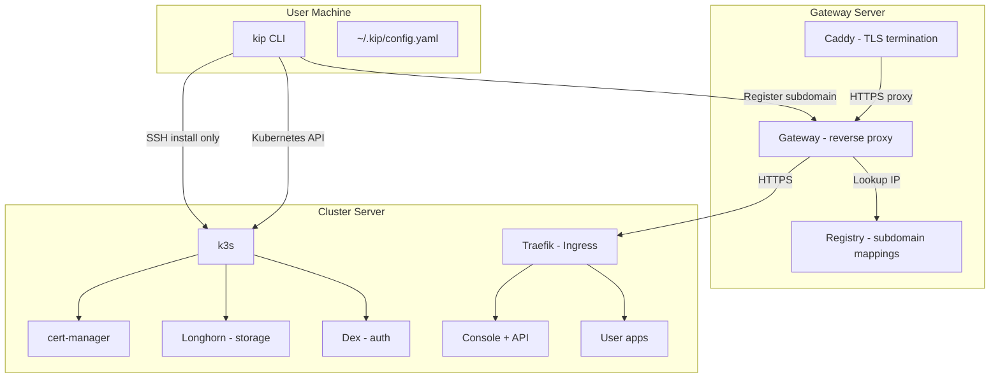
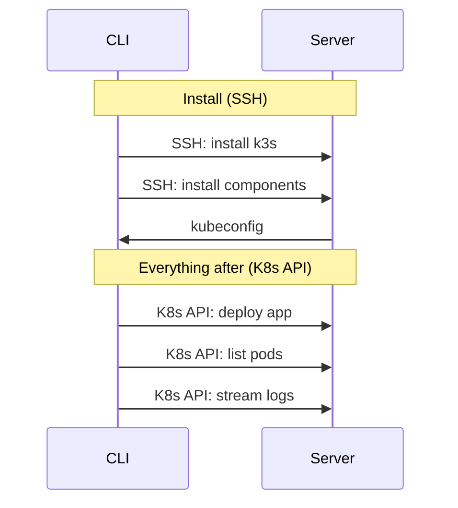
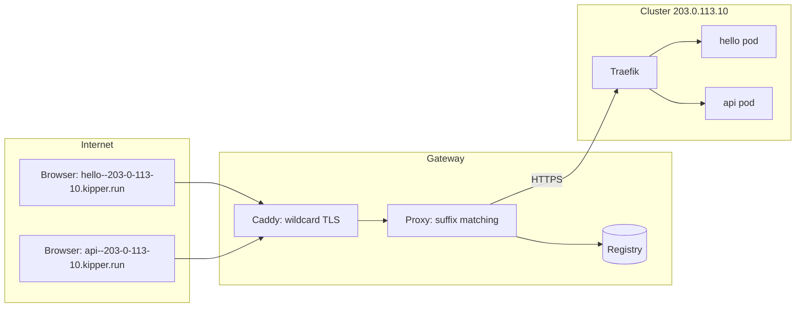
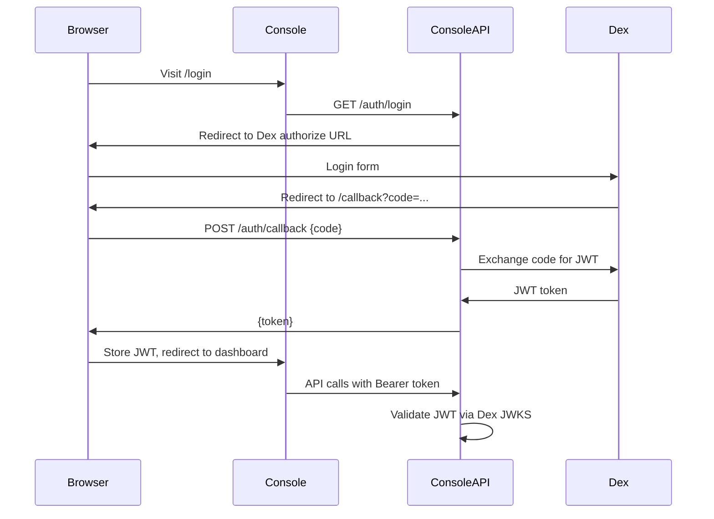
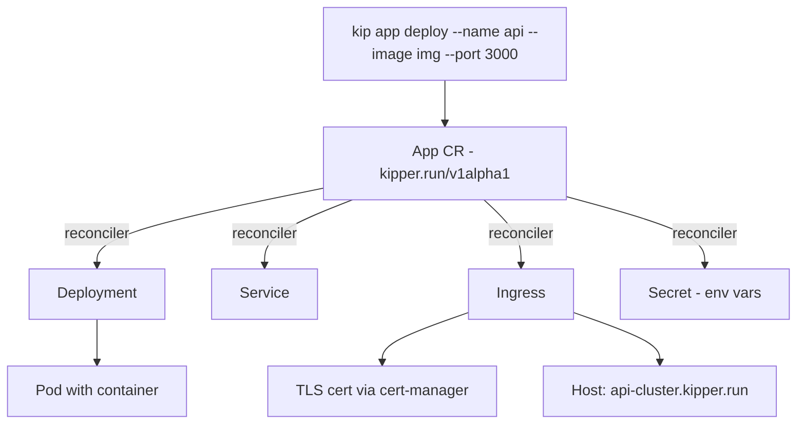

# Architecture

This document explains how Kipper works internally. It is aimed at contributors and anyone who wants to understand the system before diving into the code.

## System overview



## Two modes of operation

**During install:** The CLI connects to the server via SSH, runs commands remotely to install k3s and all components, then fetches the kubeconfig. SSH is only used during installation. Each kip release installs one pinned k3s version, so every cluster built with the same kip runs the same Kubernetes version, and worker nodes always join with the exact version the control plane runs.

The built-in image registry (Zot) is installed with authentication and TLS from a cluster-internal CA. Builds push with a write credential, nodes pull with a separate read-only credential, and anonymous access is refused. The install verifies this before finishing: a registry that accepts unauthenticated requests fails the install.

**Operator identity.** The Kubernetes API server authenticates operators through the cluster's own identity provider (Dex). Each person logs in with `kip auth login` and holds a token valid for a few minutes, renewed silently from their session; project membership maps onto namespaced Kubernetes roles (viewer, deployer, owner), and the API audit log attributes every action to the person who made it, shipped to Loki and queryable in Grafana. The k3s admin certificate never leaves the server in this model: it is the break-glass credential, retrieved over SSH from `/etc/rancher/k3s/k3s.yaml` when the identity provider itself is unavailable, and it is the reason a Dex outage degrades cluster access rather than bricking it. The API server reaches Dex through a loopback pin on the server itself, so cluster authentication keeps working when public DNS or the external network path do not; automatic certificate renewal is the one external dependency that remains load-bearing.

**After install:** All operations go through the Kubernetes API using the kubeconfig stored locally. The CLI never uses SSH again.



## Repository structure

```
kipper/
├── kip/                    # CLI tool (Go)
│   ├── cmd/                # Cobra commands
│   └── internal/
│       ├── ssh/            # SSH client for remote execution
│       ├── k8s/            # Kubernetes API client
│       ├── installer/      # Cluster bootstrap logic
│       ├── deployer/       # App deployment (Deployment + Service + Ingress)
│       ├── service/        # Stateful service management (StatefulSet + PVC)
│       ├── infra/          # InfraProvider interface + BareMetalProvider
│       ├── git/            # GitProvider interface (GitHub, GitLab)
│       ├── domain/         # Gateway client (subdomain registration)
│       ├── config/         # Config file management
│       └── ai/             # AI provider interface (future)
│
├── console/                # Web console (Vue 3 + TypeScript)
│   └── src/
│       ├── api/            # Typed Axios client
│       ├── stores/         # Pinia stores (auth, cluster, apps, projects)
│       ├── composables/    # useDarkMode, useLogStream, useToast
│       ├── components/     # AppDetail panel, ToastContainer
│       ├── views/          # Dashboard, Projects, Apps, Services, Routes, Users, Login
│       └── layouts/        # Sidebar layout with dark mode toggle
│
├── console-api/            # Console backend (Go + Chi)
│   ├── api/v1alpha1/       # CRD type definitions (kipper.run/v1alpha1)
│   ├── controllers/        # CRD reconcilers (controller-runtime)
│   ├── controller/         # Resource auto-tuning controller
│   ├── handlers/           # REST endpoints
│   ├── middleware/          # JWT auth, logging
│   └── ws/                 # WebSocket log streaming
│
├── gateway/                # Subdomain gateway (Go)
│   └── registry/           # In-memory + file-backed subdomain store
│
└── docs/                   # This documentation (VitePress)
```

## Gateway architecture

The gateway is a lightweight reverse proxy that manages `*.kipper.run` subdomain routing.



- A wildcard DNS record (`*.kipper.run`) points all subdomains to the gateway
- Caddy terminates TLS using a Let's Encrypt wildcard certificate
- The proxy extracts the cluster identifier from the part of the subdomain after the last `--` (e.g. `hello--203-0-113-10` → cluster `203-0-113-10`); registered cluster names can never contain `--`, so an app route can never be claimed as someone else's cluster name
- It looks up the cluster IP in the registry and proxies the request
- The original Host header is preserved so Traefik on the cluster can route to the correct app
- The hop to the cluster is HTTPS too, verified against a pinned certificate. The cluster serves a stable Kipper-managed certificate for `*.kipper.run` hosts, and the gateway checks every connection against the pinned SHA-256 of its public key. The cluster asserts that fingerprint through its daily heartbeat, authenticated by the registration token, so someone on the network path between gateway and cluster can never swap in their own certificate

### Subdomain scheme

All subdomains are single-level to work with wildcard certificates:

| URL | Cluster | App |
|---|---|---|
| `203-0-113-10.kipper.run` | 203-0-113-10 | (cluster itself) |
| `console--203-0-113-10.kipper.run` | 203-0-113-10 | console |
| `hello--203-0-113-10.kipper.run` | 203-0-113-10 | hello |
| `api--203-0-113-10.kipper.run` | 203-0-113-10 | api |

## Authentication flow



## App deployment internals

When you run `kip app deploy`, Kipper creates an App Custom Resource. A controller-runtime reconciler watches App CRs and ensures the underlying Kubernetes resources exist and match:



This pattern applies to all Kipper resource types. The CLI and console API create CRs, and reconcilers handle the native Kubernetes resources. This enables GitOps. You can apply CRs directly with `kubectl apply` or sync them via ArgoCD/Flux.

## Infrastructure provider interface

Kipper is designed to support multiple infrastructure providers through the `InfraProvider` interface:

```go
type InfraProvider interface {
    Provision(ctx context.Context, spec MachineSpec) ([]Machine, error)
    Destroy(ctx context.Context, machineIDs []string) error
    GetLoadBalancer(ctx context.Context, spec LBSpec) (*LoadBalancer, error)
    StorageClass() string
    Name() string
}
```

Kipper currently ships `BareMetalProvider`, which targets any Linux server reachable over SSH. The interface is provider-agnostic so additional providers can be added without changing core install or deploy logic.
