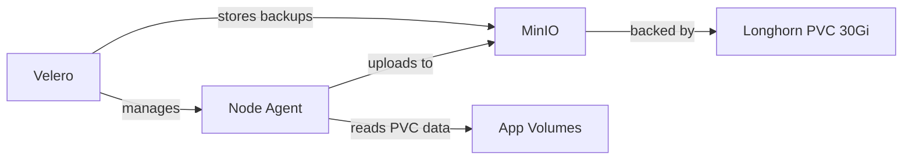
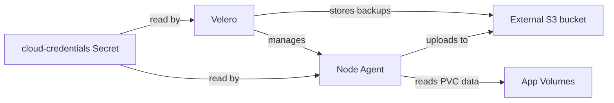

# Backup & Restore

Kipper includes automatic backup and restore powered by [Velero](https://velero.io). Every cluster gets daily backups of all Kubernetes resources and persistent volume data (databases, file storage) out of the box.

There are two storage modes:

- **In-cluster MinIO (default).** Zero configuration, no external account required. Backups live on Longhorn-backed storage on the same host as the cluster.
- **External S3-compatible storage** (AWS S3, Cloudflare R2, self-hosted MinIO, B2, Wasabi, Spaces). Backups live off-cluster and survive a `kip cluster uninstall` or a host failure.

For any cluster that holds data you cannot afford to lose, configure external storage at install time. See [External backup storage](/en/installation#external-backup-storage) on the installation page for the flags.

## Automatic backups

A daily backup runs at 3:00 AM and is retained for 7 days. This is configured during `kip install` and runs automatically.

```bash
kip backup schedules
```

```
  NAME           SCHEDULE       STATUS    LAST BACKUP
  daily-full     0 3 * * *      Enabled   2026-03-18T03:00:00Z
```

## Manual backups

### Back up everything (user namespaces)

```bash
kip backup create
```

This skips the system namespaces (`kube-system`, `kube-public`, `kube-node-lease`, `traefik`, `longhorn-system`, `keda`, `monitoring`, `velero`) and captures everything else. The exclusion is the same one the daily and weekly schedules use. Skipping `velero` is load-bearing: if Velero is asked to back up its own namespace, it tries to capture the MinIO PVC that hosts its backup bucket and the backup hangs forever.

### Back up the system namespaces too

```bash
kip backup create everything --include-system
```

You almost never want this. Use it only when you have a specific reason to capture system namespaces, for example a disaster-recovery snapshot of an entire cluster you are about to retire.

Even here, cert-manager's transient issuance objects (CertificateRequests, Orders, Challenges) stay out of the backup. cert-manager recreates them on demand, and restoring them stops certificates renewing, so they are always excluded.

### Back up a specific project

```bash
kip backup create --project blog --environment test
```

### Back up with a custom name

```bash
kip backup create pre-migration --project blog
```

### List backups

```bash
kip backup list
```

```
  NAME                          STATUS       NAMESPACES          CREATED
  daily-full-20260318030000     Completed    all except system   2026-03-18 03:00
  pre-migration                 Completed    blog-test     2026-03-18 14:30
  manual-20260318-153000        Completed    all except system   2026-03-18 15:30
```

`all except system` means the system-namespace exclusion was applied. `all` means `--include-system` was passed, so no namespace was skipped. A namespace name means the backup was scoped via `--project`.

## Restoring from a backup

### Restore to the same namespace

```bash
kip backup restore pre-migration
```

### Restore to a different namespace

Useful for testing a restore without affecting the live environment:

```bash
kip backup restore pre-migration --namespace-mapping blog-test:blog-restored
```

## What gets backed up

| Resource | Backed up? | How |
|---|---|---|
| Deployments, Services, Ingresses | Yes | Kubernetes resource definitions |
| ConfigMaps, Secrets | Yes | Kubernetes resource definitions |
| Environment variables and app secrets | Yes | Stored as Kubernetes Secrets |
| PostgreSQL data | Yes | PVC data via Kopia file-system backup |
| Redis data | Yes | PVC data via Kopia file-system backup |
| Longhorn volumes | Yes | Full file-system backup of volume contents |

## Architecture

### In-cluster MinIO (default)



- **Velero** orchestrates backups and restores
- **Node Agent** (DaemonSet) reads actual file data from persistent volumes using Kopia
- **MinIO** provides S3-compatible storage inside the cluster
- **Longhorn** provides durable storage for MinIO itself

### External S3-compatible storage



- **External bucket** lives in AWS S3, Cloudflare R2, self-hosted MinIO, B2, Wasabi, DigitalOcean Spaces, or any other S3-compatible service
- **cloud-credentials Secret** in the `velero` namespace holds the access key, written from the credentials file you passed at install time
- The Velero HelmChart references the Secret by name; the credentials never appear in any HelmChart CR or kubectl-apply output
- Local `~/.kip/config.yaml` records mode + bucket + region + endpoint, never the keys

To rotate keys later, run `kip install` again with the updated credentials file pointing at the same host. That replaces the Secret in place. Note it re-runs the rest of the install too, which is not free: see [what an upgrade moves](/en/installation#what-an-upgrade-moves-and-what-it-does-not).

## Retention

Default retention is 7 days (`168h`). To create a backup with custom retention:

```bash
kip backup create --ttl 720h  # 30 days
```

## Limitations

- **In-cluster mode**: backups are stored inside the cluster, so a host loss or `kip cluster uninstall` takes the backups with it. Configure [external backup storage](#external-s3-compatible-storage) for clusters that hold data you care about.
- Database backups capture the file-system state of the PVC. For the most consistent database backups, consider running `pg_dump` before the backup or using the database's native backup tools alongside Velero.
- Backup storage mode is chosen at install time, and there is no command that migrates a running cluster from one mode to another. **Do not uninstall in order to switch.** In in-cluster mode the backups live on the cluster, so `kip cluster uninstall` removes them along with everything else, and a backup taken just beforehand is gone before you can restore it. Re-running `kip install` with `--backup-storage-bucket` does repoint Velero at external storage, but it leaves your existing backups behind and re-runs the rest of the install, so it is a deliberate change rather than a migration. The route that keeps your data is to install a second cluster with external storage and move workloads onto it. See [One-shot decision](/en/installation#one-shot-decision).
