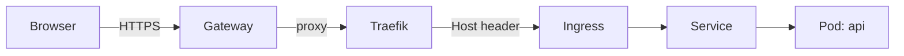
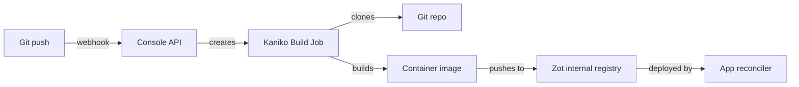

# Deploying Apps

Kipper deploys applications as Kubernetes Deployments with a Service and Ingress, all created automatically from a single command.

## Three ways to deploy

Deploy from an image or a Git repository. Add a webhook to automate updates from your existing CI workflow.

| Mechanism | When to use | Command |
|---|---|---|
| **Container image** | You build images in your own CI and just want Kipper to roll them out. | `kip app deploy --name api --image ghcr.io/acme/api:1.2.3 --port 3000` |
| **Git source** | You want Kipper to build the image in-cluster from a git repo every time you push. | `kip app deploy --name api --git https://github.com/acme/api --port 3000` |
| **CI webhook** | You want your existing CI to push deploys to Kipper without anyone running `kip` by hand. Works on top of either of the above. | See [Webhooks](./webhooks.md) |

The web console's Deploys tab shows all three as side-by-side cards, so you can see what's currently active and what's still available to wire up.

## From a container image

```bash
kip app deploy --name api --image ghcr.io/acme/api:latest --port 3000
```

```
  Deploying api...
  ✔  Deployment created
  ✔  Service created
  ✔  Ingress created
  ✔  Live at https://api--203-0-113-10.kipper.run
```

### What this creates



Behind the scenes, Kipper creates an `App` Custom Resource (`kipper.run/v1alpha1`). A reconciler then ensures the underlying Kubernetes resources exist:

1. **Deployment:** runs your container with the specified number of replicas
2. **Service:** internal load balancer that routes traffic to your pods
3. **Ingress:** external hostname with automatic TLS via cert-manager

All three are owned by the App CR. Deleting the app cascades to all related resources automatically.

### All flags

```bash
kip app deploy \
  --name api \
  --image ghcr.io/acme/api:latest \
  --port 3000 \
  --replicas 2 \
  --project staging \
  --env LOG_LEVEL=info \
  --env API_URL=https://api.example.com \
  --secret API_KEY
```

| Flag | Required | Default | Description |
|---|---|---|---|
| `--name` | Yes | — | Application name |
| `--image` | Yes | — | Container image to deploy |
| `--port` | Yes | — | Port the application listens on |
| `--replicas` | No | 1 | Number of pod replicas |
| `--project` | No | `default` | Project namespace to deploy into |
| `--env` | No | — | Environment variable (repeatable). For non-sensitive config only; credentials go in `--secret` |
| `--secret` | No | — | Secret (repeatable). `KEY=VALUE` inline, or a bare `KEY` for a hidden prompt that stays out of shell history. See [secrets](/en/secrets) |
| `--route` | No | — | Path route group (e.g. `blog/api/users`) |
| `--profile` | No | `standard` | Resource profile: `lightweight`, `standard`, `compute-heavy`, `memory-heavy`, `jvm` |
| `--cpu` / `--memory` | No | — | Explicit CPU/memory limit (sets the `custom` profile) |

Secrets passed at deploy time are written before the app starts, so the first pod boot already sees them. A key set via `--secret` behaves exactly like one set with `kip app secret set` afterwards: masked in the console and CLI listings, kept out of `kip export`, with the previous value retained for `kip app secret rollback`. Passing the same key through both `--env` and `--secret` fails the deploy.

Pick `--profile jvm` for Java, Spring, and other slow-boot runtimes: it gives the pod a high CPU ceiling for cold-start JIT compilation without reserving a full core permanently. `--profile` and `--cpu`/`--memory` are mutually exclusive: explicit values mean the `custom` profile, and switching an app to a named profile replaces them with the profile's defaults. See [Resource Management](/en/resource-management) for what each profile allocates.

## From a Git repository

Deploy directly from source code. Kipper clones your repo, builds a container image using your Dockerfile, pushes it to the internal registry, and deploys.

```bash
kip app deploy --name api --git https://github.com/acme/api.git --port 3000
```

```
  Deploying api...
  ✔  Deployment created
  ✔  Service created
  ✔  Git source configured: https://github.com/acme/api.git (main)
     Configure a webhook or run 'kip app rebuild api' to trigger the first build
```

### Triggering builds

**Manual rebuild:**

```bash
kip app rebuild api --project blog --environment test
```

**Automatic builds via webhook:**

Configure your Git provider to send push events to the webhook URL. Kipper validates the token and triggers a build automatically.

**Streaming build logs:**

```bash
kip app build-logs api --project blog --environment test
```

### How it works



1. A webhook or manual `kip app rebuild` triggers a build
2. Kipper creates a Kubernetes Job with two containers:
   - **clone**: fetches your repo (single branch, depth 1)
   - **build**: Kaniko builds the Dockerfile and pushes the image
3. On success, the App CR's image is updated to the new Zot registry tag
4. The App reconciler rolls out the new Deployment

### Git deploy flags

| Flag | Required | Default | Description |
|---|---|---|---|
| `--git` | Yes | — | Git repository URL |
| `--branch` | No | `main` | Branch to build from |
| `--port` | Yes | — | Port the application listens on |
| `--project` | No | `default` | Project namespace |
| `--environment` | No | — | Target environment |
| `--build-memory` | No | `2Gi` | Memory limit for the in-cluster build |
| `--build-cpu` | No | `2` | CPU limit for the in-cluster build |

### Builds that need more memory

Kipper builds your image in-cluster and gives each build 2Gi of memory by default. That covers most apps. Some builds need more: a server-rendered frontend build (Nuxt, Next, a large webpack or Vite bundle) runs the whole thing in one Node process and can use 4Gi or more. When a build runs out of memory it fails and Kipper says so plainly, with the OOM in the build message.

Give that app's build more room when you deploy it:

```bash
kip app deploy --name website \
  --git https://github.com/acme/website.git \
  --build-memory 6Gi \
  --port 3000 \
  --project acme --environment prod
```

The setting sticks to the app, so redeploys and rebuilds keep it. In a `kipper.yaml` it lives under the git source:

```yaml
git:
  url: https://github.com/acme/website.git
  branch: main
  buildResources:
    memory: 6Gi
    cpu: "2"
```

To raise the default for every build on a cluster instead of per app, set `BUILD_MEMORY_LIMIT` (and optionally `BUILD_CPU_LIMIT`) on the console-api. A per-app setting always wins over the cluster default.

### Private repositories

For private repos, pass your Git access token when deploying:

```bash
kip app deploy --name api \
  --git https://github.com/acme/private-api.git \
  --git-token ghp_xxxxxxxxxxxx \
  --port 3000 \
  --project blog \
  --environment test
```

```
  Deploying api...
  ✔  Git credentials stored
  ✔  Deployment created
  ✔  Service created
  ✔  Git source configured: https://github.com/acme/private-api.git (main)
```

The token is stored as a Kubernetes Secret named after the token and the repository host it is for, so rotating it writes a new one and the app moves onto it in a single step. Kipper removes the one it moved off. At build time git receives the token through a credential helper bound to the repository's host, so it never appears in the App CR, the clone URL, or the built image.

| Flag | Description |
|---|---|
| `--git-token` | Personal access token for HTTPS clone (GitHub PAT, GitLab PAT, etc.) |

::: tip
For GitLab, create a token with `read_repository` scope. For GitHub, a fine-grained PAT with `Contents: Read` is sufficient.
:::

### Registry credentials

Registry credentials let apps and functions run images from a private registry, for example `ghcr.io` or a company-internal one. In the web console open **Settings → Container Registries** and add the login:

| Field | Value |
|---|---|
| Server | `ghcr.io` |
| Username | your registry username |
| Password / Token | an access token for that registry |

The credential is stored once in `kipper-system`. Each credential carries an allow-list of projects, and a fresh credential starts with an empty list, so grant the projects that may use it:

```bash
kip registry add --server ghcr.io --allow-project acme
```

When a workload in an allowed project uses an image from that registry, Kipper stages a pull secret in the workload's namespace, scoped to that single registry, and removes it again when the image stops needing it. Workloads in other projects pull anonymously.

Builds are separate. The build container runs your Dockerfile's `RUN` steps, so registry credentials stay out of it, and base images in a `FROM` line are pulled anonymously. Docker Hub rate-limits anonymous pulls per IP, and every build on the cluster shares one egress IP, so a busy cluster can see builds fail with `toomanyrequests` until the window resets. Private base images are unsupported at build time. Publish shared base images to a registry the build can reach anonymously.

### Build status

The **Source** tab in the web console shows the current build status, commit SHA, timestamps, and error messages. You can also trigger rebuilds and cancel active builds from there.

Build states are `Pending`, `Building`, `Succeeded`, `Failed`, and `Discarded`. A **Discarded** build used source settings that no longer match the app. This can happen when you edit the repository, branch, Dockerfile, build context, or build arguments during a build. Source edits alone do not trigger a build; start a new build to deploy the current source.

### Moving an app off git

Detach the Git source when you want an external pipeline to manage the app's image. Otherwise, a later Kipper build can replace that image:

```bash
kip app git remove checkout --project shop --environment production
```

```
  ✔  checkout no longer builds from git
     It keeps running the image it has. Deploy a new one with
     'kip app update checkout --image <image>' or from your pipeline.
```

The app keeps running the image it has. The stored access token and the last build's status go with the source. The Git source card in the console has a Remove button that does the same thing.

See the [Source tab](/en/deploying-apps#from-a-git-repository) in the web console for a visual overview.

## Routing

<span id="path-based-routing-microservices"></span>

See [Route groups](/en/routing#route-groups-path-based-routing) to serve several apps under one hostname.

## Scaling

```bash
# Scale up
kip app scale api --replicas 3

# Scale down
kip app scale api --replicas 1

# Stop without deleting (zero replicas)
kip app scale api --replicas 0
```

The `READY` column in `kip app list` shows progress during scaling (e.g. `2/3` means 2 of 3 replicas are healthy). Kubernetes distributes traffic across all healthy replicas automatically.

Scaling is also available in the web console via the Scale tab in the app detail panel.

## Autoscaling

Kipper supports automatic horizontal scaling based on CPU and memory usage.

```bash
# Scale between 1 and 5 replicas, targeting 70% CPU
kip app autoscale api --min 1 --max 5 --cpu 70

# Scale based on both CPU and memory
kip app autoscale api --min 2 --max 10 --cpu 80 --memory 80

# Check current autoscaling status
kip app autoscale api --status

# Disable autoscaling (return to fixed replicas)
kip app autoscale api --off
```

When autoscaling is enabled, Kubernetes automatically adds replicas when CPU or memory exceeds the target and removes them when usage drops. The `--min` and `--max` flags set the boundaries.

Autoscaling is also configurable from the web console via the Scale tab. Toggle the autoscaling switch and set your thresholds.

::: tip Resource requests required
For CPU-based autoscaling to work, your deployment must have CPU resource requests set. Kipper sets sensible defaults, but if you override them, ensure requests are defined.
:::

## App connections and internal paths

<span id="linking-apps"></span>
<span id="internal-linking-backend-to-backend"></span>
<span id="linking-across-projects"></span>
<span id="public-linking-frontend-to-backend"></span>
<span id="env-var-naming"></span>
<span id="managing-links"></span>
<span id="route-groups-path-based-routing"></span>
<span id="creating-a-route-group"></span>
<span id="what-a-path-prefix-publishes"></span>
<span id="what-the-refusal-reaches-and-what-it-does-not"></span>
<span id="paths-your-own-app-keeps-to-itself"></span>
<span id="letting-one-path-back-through"></span>
<span id="looking-at-a-refused-path-yourself"></span>
<span id="moving-the-endpoints-instead"></span>
<span id="cli-equivalent"></span>
<span id="editing-and-deleting"></span>
<span id="environment-aware-domains"></span>

See [Routing & App Links](/en/routing) for app connections, route groups, and internal path protection.

## Managing apps

### List all apps

```bash
kip app list --project staging
```

```
  NAME                 STATUS     IMAGE                             READY
  api                  running    ghcr.io/acme/api:latest           2/2
  frontend             running    ghcr.io/acme/frontend:latest      1/1
```

In the web console, every app row on the **Projects** screen shows the app's public URL with an open-in-new-tab link, so you can reach a running app without opening its detail panel.

### Stream logs

```bash
kip app logs api
```

Streams logs from the first running pod with 100 lines of history. Press Ctrl+C to stop.

### Update an app image

```bash
kip app update api --image ghcr.io/acme/api:v2.1.0
```

Changes the container image and triggers a rolling update. Use this when you have a new version of your application to deploy.

For apps within a project environment:

```bash
kip app update api --image ghcr.io/acme/api:v2.1.0 --project blog --environment test
```

::: tip Rollback history
Kipper keeps the 3 most recent versions of each deployment. Kubernetes can roll back to any of these if a new version fails to start. The previous 2 versions are retained automatically, and older ones are cleaned up to save resources.
:::

### Restart an app

```bash
kip app restart api
```

Triggers a rolling restart. Pods are replaced one at a time with zero downtime. Useful when you need to pick up new environment variables or pull a fresh `:latest` image.

### Delete an app

```bash
kip app delete api
```

Removes the Deployment, Service, Ingress, and all associated Secrets.

## Browsing files

See [Browsing Files](/en/files) for uploading, downloading, and editing files inside running containers.

## AI diagnostics

See [Observability](/en/observability#ai-log-analysis) for AI-powered log analysis and diagnostics.

## Instance ID header

When you're running multiple replicas of an app, it's useful to know which pod handled a particular request. Kipper can add an `X-Instance-ID` response header to every HTTP response, identifying the pod that served it.

This is enabled by default for all apps with a route. You can toggle it off in the app's **Settings** tab under "Instance ID header".

### How it works

Kipper injects a lightweight reverse proxy sidecar container into each pod. The sidecar sits in front of your app and adds the header transparently. Your app doesn't need any code changes.

The request flow looks like this:

```
Client → Traefik → Service:8080 → Sidecar(:18080) → Your app(:8080)
```

The sidecar listens on an offset port (your app's port + 10000). The Kubernetes Service routes traffic to the sidecar via `targetPort`, and the sidecar forwards it to your app on localhost. Your app keeps listening on its original port and never knows the sidecar is there.

The header value is a short hash of the pod name (8 hex characters). It doesn't reveal the full pod name or any infrastructure details. For example:

```
X-Instance-ID: f1582f7c
```

You can match this ID to a specific pod in the live logs viewer. The live logs tab lets you pick individual pods, so once you see which instance handled a failing request, you can jump straight to that pod's logs.

### When to disable it

Most apps should leave this on. You might turn it off if:

- Your app already adds its own instance tracking header
- You want to avoid the ~5MB memory overhead of the sidecar container per pod
- Your security policy doesn't allow extra response headers

