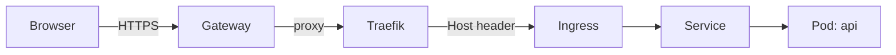
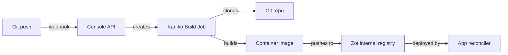
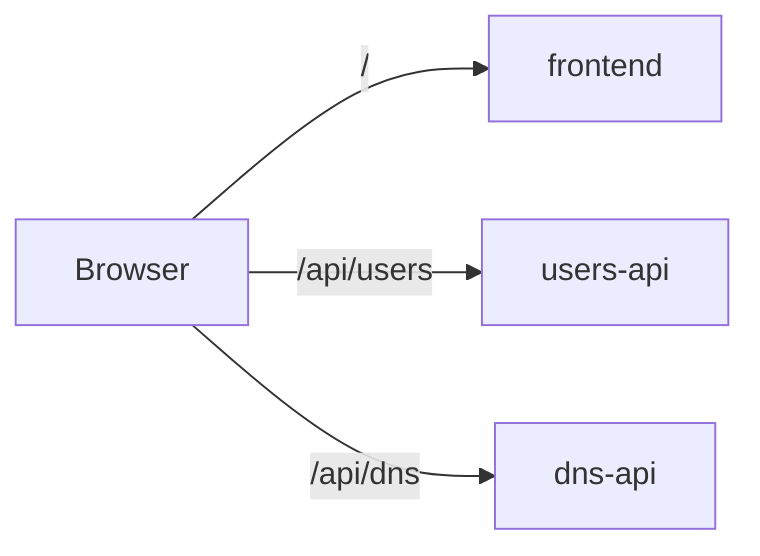

# Deploying Apps

Kipper deploys applications as Kubernetes Deployments with a Service and Ingress, all created automatically from a single command.

## Three ways to deploy

An app can receive new versions through any of three independent mechanisms. Pick whichever fits how your team already works.

| Mechanism | When to use | Command |
|---|---|---|
| **Container image** | You build images in your own CI and just want Kipper to roll them out. | `kip app deploy --name api --image ghcr.io/acme/api:1.2.3 --port 3000` |
| **Git source** | You want Kipper to build the image in-cluster from a git repo every time you push. | `kip app deploy --name api --git https://github.com/acme/api --port 3000` |
| **CI webhook** | You want your existing CI to push deploys to Kipper without anyone running `kip` by hand. Works on top of either of the above. | See [Webhooks](./webhooks.md) |

The web console's Deploys tab shows all three as side-by-side cards, so you can see what's currently active and what's still available to wire up.

## From a container image

```bash
kip app deploy --name api --image ghcr.io/acme/api:latest --port 3000
```

```
  Deploying api...
  ✔  Deployment created
  ✔  Service created
  ✔  Ingress created
  ✔  Live at https://api--203-0-113-10.kipper.run
```

### What this creates



Behind the scenes, Kipper creates an `App` Custom Resource (`kipper.run/v1alpha1`). A reconciler then ensures the underlying Kubernetes resources exist:

1. **Deployment:** runs your container with the specified number of replicas
2. **Service:** internal load balancer that routes traffic to your pods
3. **Ingress:** external hostname with automatic TLS via cert-manager

All three are owned by the App CR. Deleting the app cascades to all related resources automatically.

### All flags

```bash
kip app deploy \
  --name api \
  --image ghcr.io/acme/api:latest \
  --port 3000 \
  --replicas 2 \
  --project staging \
  --env LOG_LEVEL=info \
  --env API_URL=https://api.example.com \
  --secret API_KEY
```

| Flag | Required | Default | Description |
|---|---|---|---|
| `--name` | Yes | — | Application name |
| `--image` | Yes | — | Container image to deploy |
| `--port` | Yes | — | Port the application listens on |
| `--replicas` | No | 1 | Number of pod replicas |
| `--project` | No | `default` | Project namespace to deploy into |
| `--env` | No | — | Environment variable (repeatable). For non-sensitive config only; credentials go in `--secret` |
| `--secret` | No | — | Secret (repeatable). `KEY=VALUE` inline, or a bare `KEY` for a hidden prompt that stays out of shell history. See [secrets](/en/secrets) |
| `--route` | No | — | Path route group (e.g. `blog/api/users`) |
| `--profile` | No | `standard` | Resource profile: `lightweight`, `standard`, `compute-heavy`, `memory-heavy`, `jvm` |
| `--cpu` / `--memory` | No | — | Explicit CPU/memory limit (sets the `custom` profile) |

Secrets passed at deploy time are written before the app starts, so the first pod boot already sees them. A key set via `--secret` behaves exactly like one set with `kip app secret set` afterwards: masked in the console and CLI listings, kept out of `kip export`, with the previous value retained for `kip app secret rollback`. Passing the same key through both `--env` and `--secret` fails the deploy.

Pick `--profile jvm` for Java, Spring, and other slow-boot runtimes: it gives the pod a high CPU ceiling for cold-start JIT compilation without reserving a full core permanently. `--profile` and `--cpu`/`--memory` are mutually exclusive — explicit values mean the `custom` profile, and switching an app to a named profile replaces them with the profile's defaults. See [Resource Management](/en/resource-management) for what each profile allocates.

## From a Git repository

Deploy directly from source code. Kipper clones your repo, builds a container image using your Dockerfile, pushes it to the internal registry, and deploys.

```bash
kip app deploy --name api --git https://github.com/acme/api.git --port 3000
```

```
  Deploying api...
  ✔  Deployment created
  ✔  Service created
  ✔  Git source configured: https://github.com/acme/api.git (main)
     Configure a webhook or run 'kip app rebuild api' to trigger the first build
```

### Triggering builds

**Manual rebuild:**

```bash
kip app rebuild api --project blog --environment test
```

**Automatic builds via webhook:**

Configure your Git provider to send push events to the webhook URL. Kipper validates the token and triggers a build automatically.

**Streaming build logs:**

```bash
kip app build-logs api --project blog --environment test
```

### How it works



1. A webhook or manual `kip app rebuild` triggers a build
2. Kipper creates a Kubernetes Job with two containers:
   - **clone**: fetches your repo (single branch, depth 1)
   - **build**: Kaniko builds the Dockerfile and pushes the image
3. On success, the App CR's image is updated to the new Zot registry tag
4. The App reconciler rolls out the new Deployment

### Git deploy flags

| Flag | Required | Default | Description |
|---|---|---|---|
| `--git` | Yes | — | Git repository URL |
| `--branch` | No | `main` | Branch to build from |
| `--port` | Yes | — | Port the application listens on |
| `--project` | No | `default` | Project namespace |
| `--environment` | No | — | Target environment |
| `--build-memory` | No | `2Gi` | Memory limit for the in-cluster build |
| `--build-cpu` | No | `2` | CPU limit for the in-cluster build |

### Builds that need more memory

Kipper builds your image in-cluster and gives each build 2Gi of memory by default. That covers most apps. Some builds need more: a server-rendered frontend build (Nuxt, Next, a large webpack or Vite bundle) runs the whole thing in one Node process and can use 4Gi or more. When a build runs out of memory it fails and Kipper says so plainly, with the OOM in the build message.

Give that app's build more room when you deploy it:

```bash
kip app deploy --name website \
  --git https://github.com/acme/website.git \
  --build-memory 6Gi \
  --port 3000 \
  --project acme --environment prod
```

The setting sticks to the app, so redeploys and rebuilds keep it. In a `kipper.yaml` it lives under the git source:

```yaml
git:
  url: https://github.com/acme/website.git
  branch: main
  buildResources:
    memory: 6Gi
    cpu: "2"
```

To raise the default for every build on a cluster instead of per app, set `BUILD_MEMORY_LIMIT` (and optionally `BUILD_CPU_LIMIT`) on the console-api. A per-app setting always wins over the cluster default.

### Private repositories

For private repos, pass your Git access token when deploying:

```bash
kip app deploy --name api \
  --git https://github.com/acme/private-api.git \
  --git-token ghp_xxxxxxxxxxxx \
  --port 3000 \
  --project blog \
  --environment test
```

```
  Deploying api...
  ✔  Git credentials stored
  ✔  Deployment created
  ✔  Service created
  ✔  Git source configured: https://github.com/acme/private-api.git (main)
```

The token is stored as a Kubernetes Secret (`api-git-credentials`). At build time git receives it through a credential helper bound to the repository's host, so the token never appears in the App CR, the clone URL, or the built image.

| Flag | Description |
|---|---|
| `--git-token` | Personal access token for HTTPS clone (GitHub PAT, GitLab PAT, etc.) |

::: tip
For GitLab, create a token with `read_repository` scope. For GitHub, a fine-grained PAT with `Contents: Read` is sufficient.
:::

### Registry credentials

Registry credentials let apps and functions run images from a private registry, for example `ghcr.io` or a company-internal one. In the web console open **Settings → Container Registries** and add the login:

| Field | Value |
|---|---|
| Server | `ghcr.io` |
| Username | your registry username |
| Password / Token | an access token for that registry |

The credential is stored once in `kipper-system`. Each credential carries an allow-list of projects, and a fresh credential starts with an empty list, so grant the projects that may use it:

```bash
kip registry add --server ghcr.io --allow-project acme
```

When a workload in an allowed project uses an image from that registry, Kipper stages a pull secret in the workload's namespace, scoped to that single registry, and removes it again when the image stops needing it. Workloads in other projects pull anonymously.

Builds are separate. The build container runs your Dockerfile's `RUN` steps, so registry credentials stay out of it, and base images in a `FROM` line are pulled anonymously. Docker Hub rate-limits anonymous pulls per IP, and every build on the cluster shares one egress IP, so a busy cluster can see builds fail with `toomanyrequests` until the window resets. Private base images are unsupported at build time. Publish shared base images to a registry the build can reach anonymously.

### Build status

The **Source** tab in the web console shows the current build status, commit SHA, timestamps, and error messages. You can also trigger rebuilds and cancel active builds from there.

See the [Source tab](/en/deploying-apps#from-a-git-repository) in the web console for a visual overview.

## Path-based routing (microservices)

For microservices architectures, multiple services can share a single domain with different path prefixes. Use the `--route` flag:

```bash
kip app deploy --name frontend --image registry.git.example.com/frontend:latest --port 80 --route blog/
kip app deploy --name users-api --image registry.git.example.com/users-api:latest --port 3000 --route blog/api/users
kip app deploy --name dns-api --image registry.git.example.com/dns-api:latest --port 3001 --route blog/api/dns
```

All three share the same subdomain (`blog--<cluster>.kipper.run` on a free kipper.run cluster, `blog.<your-domain>` on a custom domain) but route by path:



Services in the same route group share a single Ingress and TLS certificate. Traefik handles the path-based routing, so no separate API gateway is needed.

Without `--route`, each app gets its own subdomain (the default behaviour).

## Scaling

```bash
# Scale up
kip app scale api --replicas 3

# Scale down
kip app scale api --replicas 1

# Stop without deleting (zero replicas)
kip app scale api --replicas 0
```

The `READY` column in `kip app list` shows progress during scaling (e.g. `2/3` means 2 of 3 replicas are healthy). Kubernetes distributes traffic across all healthy replicas automatically.

Scaling is also available in the web console via the Scale tab in the app detail panel.

## Autoscaling

Kipper supports automatic horizontal scaling based on CPU and memory usage.

```bash
# Scale between 1 and 5 replicas, targeting 70% CPU
kip app autoscale api --min 1 --max 5 --cpu 70

# Scale based on both CPU and memory
kip app autoscale api --min 2 --max 10 --cpu 80 --memory 80

# Check current autoscaling status
kip app autoscale api --status

# Disable autoscaling (return to fixed replicas)
kip app autoscale api --off
```

When autoscaling is enabled, Kubernetes automatically adds replicas when CPU or memory exceeds the target and removes them when usage drops. The `--min` and `--max` flags set the boundaries.

Autoscaling is also configurable from the web console via the Scale tab. Toggle the autoscaling switch and set your thresholds.

::: tip Resource requests required
For CPU-based autoscaling to work, your deployment must have CPU resource requests set. Kipper sets sensible defaults, but if you override them, ensure requests are defined.
:::

## Linking apps

When one app needs to call another, link them to inject the target's URL as an environment variable.

### Internal linking (backend-to-backend)

By default, links use the Kubernetes internal DNS. Fast, secure, and no external networking required:

```bash
kip app link domain-service api-gateway
```

```
  ✔  Linked domain-service → api-gateway
     DOMAIN_SERVICE_URL=http://domain-service.blog-test.svc.cluster.local:8081
```

### Linking across projects

Apps in different projects are isolated from each other by default. A workload can reach the internet
and its own project, and nothing else on the cluster — not by service name, not by pod address, and
not through a public route. That is what keeps one project's database out of another project's reach.

It takes two steps, because it takes two projects. **The project being reached decides first**, since
a link goes past the ingress and so past anything enforced on a public route — an API key, forward
auth, a rate limit. The project asking cannot grant itself that.

Whoever owns the target project allows the caller in:

```bash
kip project allow-links hrportal --project docuseal
```

```
  ✔  hrportal may link to docuseal
     Apps in docuseal can now be linked to, one at a time, with:
       kip app link docuseal/<app> <their-app> --project hrportal
```

Then the calling side names the app it needs:

```bash
kip app link docuseal/docuseal hrportal-backend --environment test
```

```
  ✔  Linked docuseal → hrportal-backend
     DOCUSEAL_URL=http://docuseal.docuseal-test.svc.cluster.local:3000
     Egress opened to docuseal in docuseal-test
```

`--environment` names the environment the target runs in. Without it the target resolves to the
project's default namespace, so `docuseal/docuseal` would be looked for in `docuseal` rather than
`docuseal-test`. The same flag picks the calling app's environment when `--project` is set, so a
caller and a target in differently named environments cannot both be addressed in one command yet.

Consent is per project pair and granted once. Each individual link still names the app it reaches, and
opens nothing else: not the rest of that project, and not the target's own outbound traffic. If the
target changes its port the allowance follows it, and if the target is deleted the allowance goes with
it.

`DOCUSEAL_URL` is not stored on your app. The link is what is recorded, and the address is worked out
from it every time the app is reconciled, so a target that moves to another port takes its callers
with it rather than leaving them dialling a number that was right once. Your app's pods restart onto
the new address by themselves. You will not find the variable in the environment editor for the same
reason: that page is what you typed, and this is not. It shows under Linked apps instead, with the
address your app is currently given.

You also need read access to the target's project. The CLI looks the target app up with your own
credentials, so a project you cannot see reports the app as not found even after its owner has
consented — ask them for a role in it, or have someone who holds one create the link.

Run it in the other order and the link is recorded but carries no traffic, and the command says so
rather than leaving you to find out. It starts working the moment consent is granted.

Check a link is doing what it says:

```bash
kip app links hrportal-backend --project hrportal --environment test
```

```
  Links for hrportal-backend in hrportal-test

  ✔  docuseal in docuseal-test
       DOCUSEAL_URL=http://docuseal.docuseal-test.svc.cluster.local:3000
       consent      docuseal allows hrportal
       target       serving on port 3000
       allowance    egress to docuseal on port 13000, which is where its Service sends 3000
       address      in the running pod
       connection   reachable — nc connected to docuseal.docuseal-test.svc.cluster.local:3000 from hrportal-backend-7999dfd5-29qhl
```

A link is several things at once, and this reports each of them in the order the traffic depends
on it. The last line is the one that matters: it opens the connection from inside your app's own
pod, which is the only place the allowance applies and so the only place worth testing from.

The two port numbers differing is correct. The address names the port the target's Service
publishes, which is what your app dials; the allowance names the port its pods listen on, which is
10000 higher whenever the target serves a public route and so runs the instance-id proxy.

If your app's image carries no tool to open a connection with — a distroless image has no shell at
all — the last line says the check could not be run rather than claiming the link is shut. Those
are different answers and only one of them is worth acting on.

See who may link to a project:

```bash
kip project links --project docuseal
```

Withdraw it with `kip project allow-links hrportal --project docuseal --remove`. Each calling app is
reconciled as the consent changes and loses the egress it was granted. If one of those notifications
is dropped — a cache error at the wrong moment, a controller restart — the app is swept within thirty
minutes and loses it then, so the outside edge of a withdrawal is half an hour rather than instant.

Two environments of the same project reach each other without any of this. The project already owns
both ends, so there is nobody else to ask.

Both apps are on the same cluster, so this is a direct pod-to-pod call. It does not go out to the
internet and back through the gateway, which means no public DNS, no second TLS handshake, and one
less thing to be down.

### Public linking (frontend-to-backend)

Frontend apps run in the browser and cannot reach internal cluster URLs. Use `--public` to inject the target's public HTTPS URL instead:

```bash
kip app link domain-service webapp --public
```

```
  ✔  Linked domain-service → webapp
     DOMAIN_SERVICE_URL=https://domain-service-test--203-0-113-10.kipper.run
```

The target app must have a public route configured. If it doesn't, the command will tell you to create one first.

### Env var naming

The env var name is derived from the target app name, uppercased with hyphens converted to underscores and `_URL` appended:

| Target app | Env var |
|---|---|
| `domain-service` | `DOMAIN_SERVICE_URL` |
| `dns-service` | `DNS_SERVICE_URL` |
| `email-service` | `EMAIL_SERVICE_URL` |
| `payments` | `PAYMENTS_URL` |

### Managing links

Link multiple apps:

```bash
kip app link domain-service webapp --public
kip app link identity-service webapp --public
kip app link exchange-service webapp --public
```

Remove a link:

```bash
kip app unlink domain-service webapp
```

For a cross-project link, unlinking also withdraws the egress:

```bash
kip app unlink docuseal/docuseal hrportal-backend
```

```
  ✔  Unlinked docuseal from hrportal-backend
     Removed DOCUSEAL_URL
     Egress to docuseal withdrawn
```

Deleting an app removes any egress its own links opened, and closes the paths other apps had to it: a
link whose target is gone opens nothing on the next reconcile, so its callers lose the address along
with the allowance. The link stays declared until someone runs `kip app unlink`, and the caller
reports it as a `LinksOpen` condition in the meantime, which is what tells you a dependency you still
declare is not there any more.

In the web console, links are managed from the app's Env tab. Select an app from the dropdown, check "public" if needed, and click Link. Existing links appear with an unlink button.

## Route groups (path-based routing)

For microservices architectures, multiple apps can share a single domain with different path prefixes. Requests are routed by path, and the path prefix is automatically stripped before reaching the backend.

### Creating a route group

From the **Routes** page in the web console, click **+ Create route**:

1. Set the domain (or leave empty for auto-generated)
2. Add path mappings, where each path points to an app
3. Save

```
Domain: webapp-test--203-0-113-10.kipper.run

/              → webapp
/domains-api   → domain-service
/identity-api  → identity-service
/exchange-api  → exchange-service
```

All apps share one TLS certificate. Traefik routes by path prefix and strips it before forwarding, so `domain-service` receives `/api/v1/...` not `/domains-api/api/v1/...`.

### CLI equivalent

```bash
kip app deploy --name webapp --image registry.git.example.com/webapp:latest --port 3000 --route blog/
kip app deploy --name domain-service --image registry.git.example.com/domain:latest --port 8080 --route blog/domains-api
```

### Editing and deleting

Click the pencil icon on any route group to add, remove, or change path mappings. Click the trash icon to remove all routes in the group.

### Environment-aware domains

Auto-generated domains include the environment name to prevent collisions:

| App | Environment | Domain |
|---|---|---|
| `webapp` | `test` | `webapp-test--203-0-113-10.kipper.run` |
| `webapp` | `acc` | `webapp-acc--203-0-113-10.kipper.run` |
| `webapp` | `prod` | `webapp-prod--203-0-113-10.kipper.run` |

## Managing apps

### List all apps

```bash
kip app list --project staging
```

```
  NAME                 STATUS     IMAGE                             READY
  api                  running    ghcr.io/acme/api:latest           2/2
  frontend             running    ghcr.io/acme/frontend:latest      1/1
```

In the web console, every app row on the **Projects** screen shows the app's public URL with an open-in-new-tab link, so you can reach a running app without opening its detail panel.

### Stream logs

```bash
kip app logs api
```

Streams logs from the first running pod with 100 lines of history. Press Ctrl+C to stop.

### Update an app image

```bash
kip app update api --image ghcr.io/acme/api:v2.1.0
```

Changes the container image and triggers a rolling update. Use this when you have a new version of your application to deploy.

For apps within a project environment:

```bash
kip app update api --image ghcr.io/acme/api:v2.1.0 --project blog --environment test
```

::: tip Rollback history
Kipper keeps the 3 most recent versions of each deployment. Kubernetes can roll back to any of these if a new version fails to start. The previous 2 versions are retained automatically, and older ones are cleaned up to save resources.
:::

### Restart an app

```bash
kip app restart api
```

Triggers a rolling restart. Pods are replaced one at a time with zero downtime. Useful when you need to pick up new environment variables or pull a fresh `:latest` image.

### Delete an app

```bash
kip app delete api
```

Removes the Deployment, Service, Ingress, and all associated Secrets.

## Browsing files

See [Browsing Files](/en/files) for uploading, downloading, and editing files inside running containers.

## AI diagnostics

See [Observability](/en/observability#ai-log-analysis) for AI-powered log analysis and diagnostics.

## Instance ID header

When you're running multiple replicas of an app, it's useful to know which pod handled a particular request. Kipper can add an `X-Instance-ID` response header to every HTTP response, identifying the pod that served it.

This is enabled by default for all apps with a route. You can toggle it off in the app's **Settings** tab under "Instance ID header".

### How it works

Kipper injects a lightweight reverse proxy sidecar container into each pod. The sidecar sits in front of your app and adds the header transparently. Your app doesn't need any code changes.

The request flow looks like this:

```
Client → Traefik → Service:8080 → Sidecar(:18080) → Your app(:8080)
```

The sidecar listens on an offset port (your app's port + 10000). The Kubernetes Service routes traffic to the sidecar via `targetPort`, and the sidecar forwards it to your app on localhost. Your app keeps listening on its original port and never knows the sidecar is there.

The header value is a short hash of the pod name (8 hex characters). It doesn't reveal the full pod name or any infrastructure details. For example:

```
X-Instance-ID: f1582f7c
```

You can match this ID to a specific pod in the live logs viewer. The live logs tab lets you pick individual pods, so once you see which instance handled a failing request, you can jump straight to that pod's logs.

### When to disable it

Most apps should leave this on. You might turn it off if:

- Your app already adds its own instance tracking header
- You want to avoid the ~5MB memory overhead of the sidecar container per pod
- Your security policy doesn't allow extra response headers

