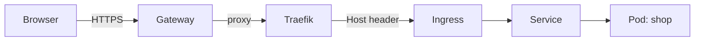
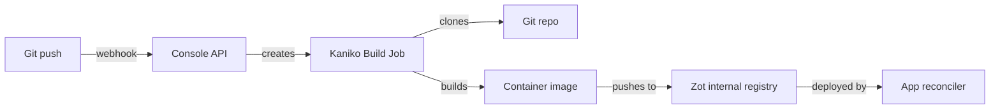

# Deploying Apps

Kipper deploys applications as Kubernetes Deployments with a Service and Ingress, all created automatically from a single command.

## Three ways to deploy

Deploy from an image or a Git repository. Add a webhook to automate updates from your existing CI workflow.

| Mechanism | When to use | Command |
|---|---|---|
| **Container image** | You build images in your own CI and just want Kipper to roll them out. | `kip app deploy --name api --image ghcr.io/acme/api:1.2.3 --port 3000` |
| **Git source** | You want Kipper to build the image in-cluster from a git repo every time you push. | `kip app deploy --name api --git https://github.com/acme/api --port 3000` |
| **CI webhook** | You want your existing CI to push deploys to Kipper without anyone running `kip` by hand. Works on top of either of the above. | See [Webhooks](./webhooks.md) |

The web console's Deploys tab shows all three as side-by-side cards, so you can see what's currently active and what's still available to wire up.

## From a container image

```bash
kip app deploy --name shop --image ghcr.io/acme/shop:latest --port 3000
```

```
  Deploying shop...
  ✔  Deployment created
  ✔  Service created
  ✔  Public URL: https://shop--203-0-113-10.kipper.run
```

The last line shows the app's public URL once its route is published. If the [route name](#route-names) or hostname is taken or reserved, kip prints `✗  Public URL unavailable:` with the reason; choose another app name or hostname. A pending or unconfirmed URL means you should try it again shortly. Route publication is separate from app health; use `kip app list` to check whether the app is ready.

### What this creates


```mermaid
flowchart LR
    Browser -->|HTTPS| Gateway
    Gateway -->|proxy| Traefik
    Traefik -->|Host header| Ingress
    Ingress --> Service
    Service --> Pod[Pod: shop]
```

Behind the scenes, Kipper creates an `App` Custom Resource (`kipper.run/v1alpha1`). A reconciler then ensures the underlying Kubernetes resources exist:

1. **Deployment:** runs your container with the specified number of replicas
2. **Service:** internal load balancer that routes traffic to your pods
3. **Ingress:** external hostname with automatic TLS via cert-manager

All three are owned by the App CR. Deleting the app cascades to all related resources automatically.

### All flags

```bash
kip app deploy \
  --name api \
  --image ghcr.io/acme/api:latest \
  --port 3000 \
  --replicas 2 \
  --project staging \
  --env LOG_LEVEL=info \
  --env API_URL=https://api.example.com \
  --secret API_KEY
```

| Flag | Required | Default | Description |
|---|---|---|---|
| `--name` | Yes | — | Application name |
| `--image` | Yes | — | Container image to deploy |
| `--port` | Yes | — | Port the application listens on |
| `--replicas` | No | 1 | Number of pod replicas |
| `--project` | No | `default` | Project namespace to deploy into |
| `--env` | No | — | Environment variable (repeatable). For non-sensitive config only; credentials go in `--secret` |
| `--secret` | No | — | Secret (repeatable). `KEY=VALUE` inline, or a bare `KEY` for a hidden prompt that stays out of shell history. See [secrets](/en/secrets) |
| `--route` | No | — | Path route group (e.g. `blog/api/users`) |
| `--profile` | No | `standard` | Resource profile: `lightweight`, `standard`, `compute-heavy`, `memory-heavy`, `jvm` |
| `--cpu` / `--memory` | No | — | Fixed CPU/memory size: sets request and limit to the same value and selects the `custom` profile |
| `--health` and `--health-*` | No | automatic | How Kipper checks whether a pod is ready for traffic. See [Health checks and rollouts](#health-checks-and-rollouts) |

Secrets passed at deploy time are written before the app starts, so the first pod boot already sees them. A key set via `--secret` behaves exactly like one set with `kip app secret set` afterwards: masked in the console and CLI listings, kept out of `kip export`, with the previous value retained for `kip app secret rollback`. Passing the same key through both `--env` and `--secret` fails the deploy.

Use `--profile jvm` for Java, Spring and other runtimes with high startup CPU demand. It allows bursts of CPU during startup without reserving a full core permanently. At deploy time, choose either `--profile` or explicit `--cpu`/`--memory` values, which select the `custom` profile.

Explicit values set a fixed size. Switching to a named profile later preserves those values, which take precedence over the profile defaults. Use `kip app update <app> --tuning auto` to return CPU and memory to automatic sizing. See [Resource Management](/en/resource-management#your-own-values) for fixed sizes, ranges and profiles.

## From a Git repository

Deploy directly from source code. Kipper clones your repo, builds a container image using your Dockerfile, pushes it to the internal registry, and deploys.

```bash
kip app deploy --name api --git https://github.com/acme/api.git --port 3000
```

```
  Deploying api...
  ✔  Deployment created
  ✔  Service created
  ✔  Git source configured: https://github.com/acme/api.git (main)
     Configure a webhook or run 'kip app rebuild api' to trigger the first build
```

### Triggering builds

**Manual rebuild:**

```bash
kip app rebuild api --project blog --environment test
```

**Automatic builds via webhook:**

Configure your Git provider to send push events to the webhook URL. Kipper validates the token and triggers a build automatically.

**Streaming build logs:**

```bash
kip app build-logs api --project blog --environment test
```

### How it works


```mermaid
flowchart LR
    Push[Git push] -->|webhook| API[Console API]
    API -->|creates| Job[Kaniko Build Job]
    Job -->|clones| Repo[Git repo]
    Job -->|builds| Image[Container image]
    Image -->|pushes to| Registry[Zot internal registry]
    Registry -->|deployed by| App[App reconciler]
```

1. A webhook or manual `kip app rebuild` triggers a build
2. Kipper creates a Kubernetes Job with two containers:
   - **clone**: fetches your repo (single branch, depth 1)
   - **build**: Kaniko builds the Dockerfile and pushes the image
3. On success, the App CR's image is updated to the new Zot registry tag
4. The App reconciler rolls out the new Deployment

### Git deploy flags

| Flag | Required | Default | Description |
|---|---|---|---|
| `--git` | Yes | — | Git repository URL |
| `--branch` | No | `main` | Branch to build from |
| `--port` | Yes | — | Port the application listens on |
| `--project` | No | `default` | Project namespace |
| `--environment` | No | — | Target environment |
| `--build-memory` | No | `2Gi` | Memory limit for the in-cluster build |
| `--build-cpu` | No | `2` | CPU limit for the in-cluster build |

### Builds that need more memory

Kipper builds your image in-cluster and gives each build 2Gi of memory by default. That covers most apps. Some builds need more: a server-rendered frontend build (Nuxt, Next, a large webpack or Vite bundle) runs the whole thing in one Node process and can use 4Gi or more. When a build runs out of memory it fails and Kipper says so plainly, with the OOM in the build message.

Give that app's build more room when you deploy it:

```bash
kip app deploy --name website \
  --git https://github.com/acme/website.git \
  --build-memory 6Gi \
  --port 3000 \
  --project acme --environment prod
```

The setting sticks to the app, so redeploys and rebuilds keep it. In a `kipper.yaml` it lives under the git source:

```yaml
git:
  url: https://github.com/acme/website.git
  branch: main
  buildResources:
    memory: 6Gi
    cpu: "2"
```

To raise the default for every build on a cluster instead of per app, set `BUILD_MEMORY_LIMIT` (and optionally `BUILD_CPU_LIMIT`) on the console-api. A per-app setting always wins over the cluster default.

### Private repositories

For private repos, pass your Git access token when deploying:

```bash
kip app deploy --name api \
  --git https://github.com/acme/private-api.git \
  --git-token ghp_xxxxxxxxxxxx \
  --port 3000 \
  --project blog \
  --environment test
```

```
  Deploying api...
  ✔  Git credentials stored
  ✔  Deployment created
  ✔  Service created
  ✔  Git source configured: https://github.com/acme/private-api.git (main)
```

The token is stored as a Kubernetes Secret named after the token and the repository host it is for, so rotating it writes a new one and the app moves onto it in a single step. Kipper removes the one it moved off. At build time git receives the token through a credential helper bound to the repository's host, so it never appears in the App CR, the clone URL, or the built image.

| Flag | Description |
|---|---|
| `--git-token` | Personal access token for HTTPS clone (GitHub PAT, GitLab PAT, etc.) |

::: tip
For GitLab, create a token with `read_repository` scope. For GitHub, a fine-grained PAT with `Contents: Read` is sufficient.
:::

### Registry credentials

Registry credentials let apps and functions run images from a private registry, for example `ghcr.io` or a company-internal one. In the web console open **Settings → Container Registries** and add the login:

| Field | Value |
|---|---|
| Server | `ghcr.io` |
| Username | your registry username |
| Password / Token | an access token for that registry |

The credential is stored once in `kipper-system`. Each credential carries an allow-list of projects, and a fresh credential starts with an empty list, so grant the projects that may use it:

```bash
kip registry add --server ghcr.io --allow-project acme
```

When a workload in an allowed project uses an image from that registry, Kipper stages a pull secret in the workload's namespace, scoped to that single registry, and removes it again when the image stops needing it. Workloads in other projects pull anonymously.

Builds are separate. The build container runs your Dockerfile's `RUN` steps, so registry credentials stay out of it, and base images in a `FROM` line are pulled anonymously. Docker Hub rate-limits anonymous pulls per IP, and every build on the cluster shares one egress IP, so a busy cluster can see builds fail with `toomanyrequests` until the window resets. Private base images are unsupported at build time. Publish shared base images to a registry the build can reach anonymously.

### Build status

The **Source** tab in the web console shows the current build status, commit SHA, timestamps, and error messages. You can also trigger rebuilds and cancel active builds from there.

Build states are `Pending`, `Building`, `Succeeded`, `Failed`, and `Discarded`. A **Discarded** build used source settings that no longer match the app. This can happen when you edit the repository, branch, Dockerfile, build context, or build arguments during a build. Source edits alone do not trigger a build; start a new build to deploy the current source.

### Moving an app off git

Detach the Git source when you want an external pipeline to manage the app's image. Otherwise, a later Kipper build can replace that image:

```bash
kip app git remove checkout --project shop --environment production
```

```
  ✔  checkout no longer builds from git
     It keeps running the image it has. Deploy a new one with
     'kip app update checkout --image <image>' or from your pipeline.
```

The app keeps running the image it has. The stored access token and the last build's status go with the source. The Git source card in the console has a Remove button that does the same thing.

See the [Source tab](/en/deploying-apps#from-a-git-repository) in the web console for a visual overview.

## Routing

<span id="path-based-routing-microservices"></span>

See [Route groups](/en/routing#route-groups-path-based-routing) to serve several apps under one hostname.

### Route names

Traefik identifies each backend by its namespace, Service name and port, joined with dashes. For example, app `web` in namespace `shop-prod` on port 8080 becomes `shop-prod-web-8080`. Consecutive dashes collapse to one, so `prod--web` and `prod-web` produce the same name. App `prod-web` in namespace `team` also shares a name with app `web` in namespace `team-prod` when their ports match. Such collisions can send requests to the wrong backend. Stateful service UIs use the same naming scheme.

Kipper reserves the namespace-and-Service part of the name across all ports before publishing a new route. Turning a route off preserves its reservation while the workload exists. Another namespace can claim it after the owning namespace is deleted. Unused reservations can also be removed once no matching workload or route remains and their attribution history has expired.

A conflicting app gets no new route. Its `RouteReady` condition is False with reason `RouteNameTaken`, and a warning event asks you to choose another name without identifying the other project. A refused service UI shows the same condition. Use a different workload name, or wait for the reservation to become available; refusals are retried every 10 minutes. Within one namespace, differently named workloads that normalize to the same key also block new routes.

Kipper's platform route names are reserved even when the component is not installed. For example, app `system-console-api` in namespace `kipper` conflicts with the console API in `kipper-system` and is refused with reason `RouteNameReservedForPlatform`. Console app creation checks these names before writing anything. `kip apply` can create the App, which then reports the route refusal. Existing routes follow the [upgrade rules](/en/maintenance#route-names).

After a console-api start, new tenant routes wait for the elected pod to check existing names. This can take longer while older console-api pods are still running. A host change that requires recreating an Ingress also waits: the old route is withdrawn, and publication on the new host is retried after the checks. Changes that only update existing routing resources can proceed. Apps waiting for admission report `RouteNamePending`; console creation requests made during bootstrap ask you to retry.

## Scaling

```bash
# Scale up
kip app scale api --replicas 3

# Scale down
kip app scale api --replicas 1
```

To take an app out of service temporarily, [stop it](#stopping-and-starting-an-app). This preserves its replica count and autoscaling settings, records who stopped it and why, and shows visitors a "this app is stopped" page.

The `READY` column in `kip app list` shows progress during scaling (e.g. `2/3` means 2 of 3 replicas are healthy). Kubernetes distributes traffic across all healthy replicas automatically.

In the web console, set **Desired** in the app's Scale tab. See [In the console](#in-the-console).

An app with a minimum and maximum keeps its count between them, and a count outside them is refused. See [the minimum and maximum always hold](#the-minimum-and-maximum-always-hold).

## Autoscaling

Autoscaling changes the number of pods an app runs, based on how much of its CPU or memory request the pods use. Kipper adds pods on the cluster's existing nodes. When the nodes are full, a new pod waits to be scheduled and the app shows a [waiting rollout](#when-a-rollout-waits) until room is made.

An app's capacity works like an AWS Auto Scaling group. Where a group adds and removes machines, Kipper adds and removes pods on the nodes the cluster already has:

| Auto Scaling group | Kipper | What it means |
|---|---|---|
| Desired capacity | Desired (`replicas`) | The number of pods that should run. You set it while the app has no scaling policy. While target tracking is on, the autoscaler sets the Deployment's desired count; the App's stored replica count is separate |
| Minimum capacity | Minimum (`minReplicas`) | The lowest desired count while the app is active, with or without a policy |
| Maximum capacity | Maximum (`maxReplicas`) | The highest desired count. Target tracking needs one |
| Target tracking scaling policy | CPU and memory targets (`cpuTarget`, `memoryTarget`) | The average use, as a percentage of each pod's request, that the autoscaler aims for. A target of 0 is unused |
| Current and InService instances | Current, as running and ready pods | Pods that exist, and pods that pass their [health check](#health-checks-and-rollouts) |
| Activity history | Scaling activity | Recent scale changes from the autoscaler's events and Kipper's scale log. Both expire, so the list can be incomplete |

### In the console

The app's **Scale** tab has a **Capacity** panel. Its top row shows **Desired**, **Minimum** and **Maximum** side by side, with **Current** beside them as running and ready pods.

Under **Scaling policy**, choose **None (fixed count)** to run the desired count you enter, or **Target tracking** to let the autoscaler set it. Target tracking adds a **CPU target (% of request)** and a **Memory target (% of request)**, each showing the current use once the policy is saved. While target tracking is on, Desired is read only and shows the autoscaler's count followed by "(set by autoscaling)".

Minimum and Maximum can be edited under either policy. With no scaling policy, leave both empty to remove the bounds. Target tracking requires a maximum; an empty minimum means 1. The panel checks the values before anything is saved. The minimum must not exceed the maximum, a minimum needs a maximum, target tracking needs a maximum and at least one target above 0, and a desired count you enter must lie within the bounds. A desired count of 0 is refused with or without bounds when explicitly entered; use **Stop app** instead. A desired count above the maximum offers **Raise maximum to** that count, which changes the maximum in the form so that one save carries both. Choosing target tracking fills in missing bounds as 1 to 5 and sets CPU to 70 when both targets are 0.

**Save capacity** writes the change in one request on the current API, and **Cancel** restores the loaded values. When a save with no scaling policy would move the desired count into new bounds, the panel says so before you save. A target tracking save moves the stored count into the bounds on the server, and a notification names the move once the save is done. The autoscaler then sets the running count within the same bounds.

To switch autoscaling off, choose **None (fixed count)** and click **Save capacity**. The app keeps the Deployment's desired count, adjusted to fit the bounds. A stopped app uses its stored count. The minimum and maximum stay in place. To remove the bounds as well, clear both fields before saving.

Badges next to the heading show the autoscaler's state: **At maximum**, **At minimum**, **Waiting for metrics**, **Not scaling at 0**, **Quota blocks new pods** and **Stopped, applies on start**.

Whenever the App's `AutoscalingReady` condition is False, a badge shows that too, whether autoscaling is on or off: **Policy invalid** for an invalid block, **Autoscaler not applied** or **Autoscaler not removed** when the autoscaler could not be written or deleted, **Desired outside bounds** when the stored count lies outside the bounds, and **Autoscaling not ready** with the reason for anything else. Hover over a badge for details.

The counts, badges and activity refresh every 15 seconds while the Scale tab is open, and the refresh button reads them immediately. A refresh leaves values you are editing alone, and when one fails the panel keeps the last values and says so. When an app with a CPU target sits at its maximum, the panel suggests raising the maximum or the CPU request. Under **Scaling activity** the panel lists recent scale changes and the last scale time, with a reminder that the list can be incomplete. While new pods start, the autoscaler briefly has no metrics for them, and the panel shows those events as one line, "Metrics for new pods are not available yet; the autoscaler waits for them", with the autoscaler's own messages on hover. An app held at its maximum, or one whose `AutoscalingReady` condition turns False, also raises a [warning alert](/en/alerts#autoscaling).

Someone who can view the app but not change it sees the values without the controls.

During an upgrade the console can briefly talk to an older console-api. A save that switches autoscaling off and changes the desired count then goes out as two requests, and the panel warns that the second request can fail after the first succeeds. That older console-api stores bounds only together with target tracking, so the panel asks you to save the desired count on its own or turn target tracking on.

### Traffic and scaling

Below the capacity panel, the Scale tab shows **Traffic and scaling** for the last hour, 6 hours, 24 hours or 3 days. The browser remembers your selected range. Three charts share a time axis:

- **Requests per minute**, stacked by status (2xx, 3xx, 4xx, abandoned and 5xx). A thin line estimates the busiest short interval in each chart step. Abandoned requests have status 499, meaning the client disconnected before receiving a response.
- **CPU as a share of its request**, expressed as a percentage. A dashed line shows the autoscaling target, with a faint band for the default 10% tolerance above it. A lighter line shows peaks from 30-second windows. Use the toggle to view memory instead; memory is selected initially when it is the only target.
- **Pods**, showing the Deployment's desired count, with a faint band between the autoscaling minimum and maximum.

Detected pod-count changes appear as vertical markers across the charts:

- **Solid:** a matching autoscaler event records the change.
- **Dashed:** autoscaling was present before and after the change, but no matching event identifies who changed the count. Older events may have expired. Repeated events are matched by their latest occurrence, so earlier changes may lack a match.
- **Solid with a label:** the count moved to or from zero, or matched a nearby change to an autoscaling bound.
- **Dotted:** autoscaler data is missing on one or both sides of the change.

Point at a marker to read its details. For dashed markers and unlabelled solid ones, the panel looks back 2 minutes before a scale-out or 5 minutes before a scale-in. Available details include peaks and averages for targeted CPU and memory metrics, plus estimated request counts. Point elsewhere to read the chart values at that time.

While autoscaling is enabled and the app is not stopped, a guide estimates when the autoscaler adds pods. For example, a 70% CPU target with the default 10% tolerance gives a threshold of about 77% of the CPU request. The guide also shows the maximum pod count. A cluster can use a different tolerance.

The section refreshes every minute while the Scale tab is open and the page is visible. It needs Prometheus; if monitoring is disabled or unavailable, the panel explains why.

When interpreting the charts:

- CPU and request rates use rolling averages; peaks are estimates from shorter windows. The autoscaler takes its own samples and may react to spikes these figures smooth out. Memory and pod counts show sampled values.
- Changes are detected on a 30-second grid. Missing samples can hide changes.
- Request counts cover traffic handled by the app's Traefik service. Requests rejected before reaching that service, such as by authentication or rate limiting, and direct traffic between apps are excluded.
- Traffic appears only when the app currently holds its [route name](#route-names) exclusively and held it throughout each point's input window. Ownership gaps, route checks after a console-api restart, and missing scrape data can leave gaps. Recent points wait for a route check, normally every 30 seconds, and appear on a later refresh. If no traffic can be shown, the panel displays a note.
- Details are fetched for the 20 most recent changes with dashed or unlabelled solid markers. Prometheus retains 3 days of data by default, so changes near the start of that period may lack earlier measurements.

If pods increase with traffic and decrease afterward, scaling is following demand. Sustained CPU use above the target at the maximum pod count may call for a higher maximum or a review of CPU requests; see the [at-maximum alert](/en/alerts#autoscaling). Bursts of 4xx or abandoned requests warrant checking the traffic source. If unwanted traffic is driving load, a [route rate limit](/en/gitops#the-route-block) may help.

### In kipper.yaml

```yaml
apps:
  api:
    image: registry.example.com/api:v2
    port: 8080
    autoscale:
      enabled: true
      minReplicas: 2
      maxReplicas: 10
      cpuTarget: 70
```

`kip apply` checks the block before it writes anything:

- With `enabled: true`, `maxReplicas` is required and at least one target must be above 0. Targets can exceed 100%.
- `minReplicas` can be left out, which means 1. An explicit 0 or a negative value is refused, as is a minimum above the maximum.
- A block with `enabled: false` and a `maxReplicas` keeps its bounds while autoscaling is off. `enabled: false` without a `maxReplicas` sets no bounds, so a `minReplicas` above 1 needs a `maxReplicas` beside it and is otherwise refused with `set maxReplicas with minReplicas, or leave both out to remove the bounds`.
- A `replicas` field must lie within the bounds. While autoscaling is on it is stored as the count for when autoscaling is switched off.
- Leaving `replicas` out of a manifest with bounds keeps the App's stored replica count when it lies within them, and otherwise uses `minReplicas`. A new app starts at `minReplicas`. While autoscaling is on, the running count can differ from the stored one, so turning autoscaling off in the manifest can change the number of pods with no replica change in `kip diff`, as [Switching autoscaling off](#switching-autoscaling-off) explains.

See [Applying a manifest](/en/gitops#applying-a-manifest) for how apply treats the rest of the spec.

### From the CLI

```bash
# Scale between 2 and 10 replicas, targeting 70% CPU
kip app autoscale api --min 2 --max 10 --cpu 70

# Change one setting; the others keep their stored values
kip app autoscale api --max 15

# Show the desired count, the bounds, ready pods and current usage
kip app autoscale api --status

# Switch autoscaling off, keeping the running count and the bounds
kip app autoscale api --off

# Remove the bounds once autoscaling is off
kip app autoscale api --remove
```

```
  Autoscaling: on (CPU 70%)
  Desired: 4 (set by autoscaling)   Min: 2   Max: 10
  Ready: 4
  cpu: target 70%, current 58%
```

When the App's `AutoscalingReady` condition is not True, `--status` adds a line such as `⚠  Autoscaling is not ready (InvalidPolicy): the autoscaling policy is not applied: minReplicas (6) must not exceed maxReplicas (5)` with the reason and message the cluster reports.

Flags you leave out keep their stored values. Missing bounds default to a minimum of 1 and a maximum of 5. With neither target set, CPU defaults to 70%. `--cpu 0` or `--memory 0` removes that target, and with no target left the CPU target of 70% applies. `kip app autoscale` with any setting flag switches autoscaling on.

`--off` and `--remove` ignore `--min`, `--max`, `--cpu` and `--memory` and print a notice naming the flags they ignored. To change a setting and switch off, run the change first and `--off` after it, for example `kip app autoscale api --max 6` and then `kip app autoscale api --off`.

### The minimum and maximum always hold

Kipper checks replica changes against the app's bounds:

- `kip app scale`, `kip app deploy --replicas`, the console's Desired field and `kip apply` refuse a count outside the bounds, and the message names them. The way to run no pods is [stopping the app](#stopping-and-starting-an-app), so a count of 0 is refused too.
- Changing the bounds with `kip app autoscale` or in the console moves the stored count into them in the same write. A minimum above the count raises it, and a maximum below it lowers it. The CLI prints the move. The console shows it before you save when no scaling policy is chosen, and in a notification after any save that moved the stored count. In `kipper.yaml` a declared `replicas` outside the new bounds is refused instead, so change both together.
- Switching autoscaling off keeps the bounds. Remove them with `kip app autoscale api --remove`, by clearing Minimum and Maximum in the console with no scaling policy, or by deleting the `autoscale` block from `kipper.yaml` and applying with `--force`. `--remove` refuses while autoscaling is on; `--off --remove` does both in one go.

While autoscaling is on, `kip app scale` refuses any count, because the autoscaler would overwrite it. `kip app deploy --replicas` stores the count and prints a note that it has no effect until autoscaling is off.

### Switching autoscaling off

`kip app autoscale api --off` and choosing None (fixed count) in the console preserve the Deployment's desired count, adjusted to fit the bounds. The CLI reports any adjustment. A stopped app uses its stored restart count. If the Deployment's count cannot be read, the stored count is used and a warning explains why. The console also adjusts these fallback counts to fit the bounds.

`kip apply` with `enabled: false` is different, because the manifest is the declared state. The app runs the manifest's `replicas`, whatever the autoscaler was running. When the manifest leaves `replicas` out, the app runs its stored count if that lies within the bounds and `minReplicas` otherwise, the same rule as [In kipper.yaml](#in-kipper-yaml). To keep the autoscaler's count, switch autoscaling off with `kip app autoscale <app> --off` first and fold the result into the manifest with `kip export`.

### How automatic sizing steps back

The autoscaler measures use as a percentage of each pod's request. Raising a tracked resource's request lowers its measured utilization, which can prompt the autoscaler to remove pods. To keep these signals stable, [automatic sizing](/en/resource-management) follows these rules:

- **CPU target:** automatic sizing keeps CPU requests and limits unchanged, including when pods reach their CPU limits. The autoscaler handles CPU pressure by adjusting the replica count. To give each pod more CPU, set the CPU request yourself.
- **Memory target:** automatic sizing keeps memory requests and limits unchanged during routine sizing. It can still raise memory after an out-of-memory kill, since adding pods cannot resolve an individual pod's memory shortage.

A metric without a target is sized as before. Your own CPU and memory values, the OOM cap and project quotas apply as usual. In auto mode, the note at the top of the Scale tab says which resources automatic sizing still adjusts for the app, and mentions that scale-down is paused only while the app runs a single replica.

### When settings do not add up

Older apps can contain settings that violate these rules. Kipper reports invalid settings and preserves the existing Deployment's desired count instead of applying them. With an invalid enabled policy, an existing autoscaler keeps its previous settings and can still change that count. The App's `AutoscalingReady` condition gives the reason (`InvalidPolicy` or `ReplicasOutsideBounds`), `kip app autoscale api --status` and the console's badges show it, and [`kip upgrade --check`](/en/maintenance#checking-before-an-upgrade) lists every such app with the command that fixes it.

The cluster's API server validates the autoscaling block on writes from any client and names the violated rule when refusing a change. This checks the block itself; Kipper's commands and controllers also check replica counts against its bounds. A block stored before the rules existed stays as it is, and a write that leaves it untouched, such as an image deploy, still goes through. A write that changes the block has to leave it valid, and switching autoscaling off changes it. On an app whose stored minimum is above its maximum, `kip app autoscale api --off` is therefore refused with `minReplicas must not exceed maxReplicas`. Fix the bounds first with `kip app autoscale api --min 2 --max 5` and then switch off, or correct Minimum and Maximum in the console and choose None (fixed count) in the same save.

An app stored with autoscaling on, a minimum above 1 and no maximum is caught the same way. Switching off would leave a minimum without a maximum, so `kip app autoscale api --off` is refused with `set maxReplicas with minReplicas, or leave both out to remove the bounds`, and `--remove` asks you to switch off first. Set a maximum no lower than the stored minimum, such as `kip app autoscale api --max 5` for a minimum of up to 5, then switch off. When the cluster refuses `--off` like this, kip prints the command that fixes the block.

An autoscaled app whose pods were taken to 0 without a stop is started at its minimum, because the autoscaler cannot scale up from zero.

::: tip Resource requests required
The autoscaler needs a CPU request for a CPU target and a memory request for a memory target. Kipper sets both from the app's resource profile. If you set resources yourself, keep the requests.
:::

## App connections and internal paths

<span id="linking-apps"></span>
<span id="internal-linking-backend-to-backend"></span>
<span id="linking-across-projects"></span>
<span id="public-linking-frontend-to-backend"></span>
<span id="env-var-naming"></span>
<span id="managing-links"></span>
<span id="route-groups-path-based-routing"></span>
<span id="creating-a-route-group"></span>
<span id="what-a-path-prefix-publishes"></span>
<span id="what-the-refusal-reaches-and-what-it-does-not"></span>
<span id="paths-your-own-app-keeps-to-itself"></span>
<span id="letting-one-path-back-through"></span>
<span id="looking-at-a-refused-path-yourself"></span>
<span id="moving-the-endpoints-instead"></span>
<span id="cli-equivalent"></span>
<span id="editing-and-deleting"></span>
<span id="environment-aware-domains"></span>

See [Routing & App Links](/en/routing) for app connections, route groups, and internal path protection.

## Managing apps

### List all apps

```bash
kip app list --project staging
```

```
  NAME                 STATUS     IMAGE                             READY
  api                  running    ghcr.io/acme/api:latest           2/2
  frontend             running    ghcr.io/acme/frontend:latest      1/1
```

In the web console, every app row on the **Projects** screen shows the app's public URL with an open-in-new-tab link, so you can reach a running app without opening its detail panel.

### Stream logs

```bash
kip app logs api
```

Streams logs from the first running pod with 100 lines of history. Press Ctrl+C to stop.

### Update an app image

```bash
kip app update api --image ghcr.io/acme/api:v2.1.0
```

Changes the container image and triggers a rolling update. Use this when you have a new version of your application to deploy.

For apps within a project environment:

```bash
kip app update api --image ghcr.io/acme/api:v2.1.0 --project blog --environment test
```

::: tip Rollback history
Kipper keeps the 3 most recent versions of each deployment. Kubernetes can roll back to any of these if a new version fails to start. The previous 2 versions are retained automatically, and older ones are cleaned up to save resources.
:::

### Restart an app

```bash
kip app restart api
```

Triggers a rolling restart, which replaces the pods as described in [How pods are replaced](#how-pods-are-replaced). With a [health check](#health-checks-and-rollouts) in place, a new pod counts as ready once your app passes the check. Without one, Kubernetes counts a pod as ready as soon as its container starts. Useful when you need to pick up new environment variables or pull a fresh `:latest` image.

### Stopping and starting an app

```bash
kip app stop api --reason "not needed until the next campaign"
kip app start api
```

In the console, click **Stop** in the app panel's header to enter an optional reason and see what will keep running.

Stopping an app shuts down its pods and releases their CPU and memory. It preserves the app's configuration, replica count, autoscaling settings and bounds, route and deployment history. Volumes and their data remain available. Bound services, databases, functions and jobs keep running.

While an app is stopped:

- Its route returns a "this app is stopped" page with HTTP status 503. Requests with `Accept: application/json` receive `{"code":"app_stopped","message":"This app is stopped."}`. Basic auth, API-key checks and internal-path restrictions still apply. The page shows the host, without the stop reason or operator's identity.
- `kip app list` shows `stopped`, followed by the recorded time, operator and reason. The console shows these details in the app panel with a **Start** button.
- Crash-loop and stuck-rollout alerts are suppressed, and automatic sizing is paused.
- Image changes, rollbacks, replica counts and autoscaling changes are saved for the next start. Autoscaled apps continue to reject manual replica counts, and a count outside the app's bounds is refused. Use `kip app start` to resume a stopped app; `kip app restart` rejects it.

`kip app start` uses the current configured replica count, or the autoscaling minimum for an autoscaled app. A configured count outside the app's bounds starts at the nearest bound instead. When the autoscaling settings are invalid, the start uses the configured count. Automatic sizing recommendations remain paused during the start; explicit resource settings still apply. New pods take traffic once they pass their [health check](#health-checks-and-rollouts). `kip app list` shows rollout progress until they are ready.

Repeating `kip app stop` preserves the original operator and timestamp. It updates the reason only when you provide `--reason`. For an app scaled to zero without a stop record and without autoscaling, use `kip app scale` to raise its replica count. An autoscaled app in that state starts at its minimum on its own. Without autoscaling or bounds, starting a stopped app whose configured count is zero also leaves it at zero.

Older App schemas may discard the stop field even when the write succeeds. `kip app stop`, `kip apply` and the stop API report failure if the field was dropped. Upgrade Kipper before retrying.

`kip export` includes the stop in the manifest. Applying a manifest that omits it would start the app, so `kip apply` requires `--force` to remove it. See [the stopped block](/en/gitops#the-stopped-block).

::: warning Downgrading
Older Kipper versions do not honor stop records. A downgrade can resume apps without autoscaling and discard their stop records, while autoscaled apps may remain at zero replicas. Review stopped apps before downgrading.
:::

### Delete an app

```bash
kip app delete api
```

Removes the Deployment, Service, Ingress, and all associated Secrets.

## Health checks and rollouts

Kipper uses rollouts to deploy apps and apply image, resource, or readiness changes. A health check determines when a pod is ready to receive traffic. How many old pods remain available during the rollout depends on the replica count; see [How pods are replaced](#how-pods-are-replaced).

A failed readiness check keeps traffic away from the pod and can delay the rollout. It does not restart the container.

### What Kipper checks on its own

If you omit the check, Kipper infers one during a rollout, such as an image update, restart, or resource change. It tries a TCP connection to the app port on up to three running pods, prioritizing ready pods and older app containers.

- **A ready pod accepts a connection:** new pods get a TCP check on the app port. Kipper keeps this choice for later rollouts.
- **No ready pod accepts, and an app container running for at least 10 minutes refuses a connection:** Kipper adds no app check and tries again on the next rollout.
- **Results are inconclusive**, such as timeouts or refusals only from younger containers: the rollout proceeds without an app check, and Kipper tries again next time.

A background worker that never listens on a port can therefore deploy without a check. A new app has no running pods to inspect, so its first deploy has no automatic app check. A later rollout gets one if a ready pod accepts connections on the app port.

Checks connect to the pod's IP address. An app listening only on `127.0.0.1` can receive traffic through the [instance proxy](#instance-id-header), but neither an automatic nor a declared check can reach that listener. To use a check, make the checked endpoint listen on `0.0.0.0`. A separate health endpoint can use `--health-port`.

### Declaring a check

Declare an HTTP check when an open port does not mean the app is ready, for example when it still needs to warm caches or connect to a database. A declared check also lets you allow more startup time.

```bash
kip app update api --health-path /actuator/health/readiness --health-startup-timeout 600
kip app update queue-worker --health none
kip app update api --health auto      # remove the declared check and let Kipper decide
```

| Type | What a pod must do |
|---|---|
| `http` | Respond to a `GET` on the configured path with HTTP 200-399 |
| `tcp` | Accept a TCP connection on the configured port |
| `none` | No app readiness check; intended for apps that serve no traffic |

| Flag | `kipper.yaml` field | Default | What it sets |
|---|---|---|---|
| `--health` | `type` | automatic | `http`, `tcp` or `none`. `auto` removes a declared check |
| `--health-path` | `path` | — | HTTP check path: starts with `/`, contains no whitespace, and is at most 1024 characters. Implies `http` when `--health` is omitted |
| `--health-port` | `port` | the app port | Port to check, such as a separate management port. Cannot be the instance proxy's port (app port + 10000) |
| `--health-startup-timeout` | `startupTimeoutSeconds` | 300 | Time from pod creation to readiness before the pod is reported as stuck, including image pulls: 10-3600 seconds |
| `--health-timeout` | `timeoutSeconds` | 2 | Timeout for each check: 1-60 seconds |

The startup timeout includes scheduling and image pulls. Kipper can report specific scheduling, image, configuration, or repeated-crash errors before it expires.

These flags work with both `kip app deploy` and `kip app update`. Updates merge into the existing check, so `--health-timeout 5` preserves its path. Switching types clears unsupported settings: `none` accepts a startup timeout but no path, port, or check timeout. Changes to the readiness probe trigger a rollout. Changing only the startup timeout does not restart pods.

Older clusters may silently discard health settings. The CLI and console verify that the cluster stored a declared check and ask you to run `kip upgrade` if it was dropped. In a manifest, put the settings under `health:`; see [The health block](/en/gitops#the-health-block).

Kipper configures checks every 5 seconds. Three consecutive failures mark a pod unready and remove it from traffic; one successful check makes it ready again. Detection time depends on the check timeout.

Git apps run a placeholder page until their first build is deployed. While it runs, any declared HTTP or TCP check uses a TCP check on the app port.

In the console, open the app's **Settings** tab and use **Health check**. Choose Automatic, Port check (TCP), HTTP path, or None, then click **Save health check**. The status line shows the current check or whether a saved change is still being applied.

### How pods are replaced

New apps use Kubernetes' default rolling-update strategy. With one to three replicas, Kubernetes adds one extra pod at a time and waits for a replacement to become ready before stopping an old pod. With four or more replicas, it may also stop up to a quarter of the pods before replacements are ready. This can free capacity for the rollout. Existing Deployments retain their configured strategy.

With a health check, a pod becomes ready after passing it. Without an app check, the app container counts as ready once it starts; the instance proxy has its own check.

A single-replica app temporarily needs capacity for a second pod. If no node has room, the rollout waits while the existing pod continues serving, provided it remains healthy.

On supported clusters running Kubernetes 1.30 or newer, each container waits 10 seconds before receiving the termination signal. This gives routing changes time to propagate. The pod has a total shutdown grace period of 40 seconds, including that delay. The instance proxy waits for active HTTP requests to finish within the remaining time.

### When a rollout waits

The App's `RolloutComplete` condition reports rollout progress separately from pod health. A rollout is complete when all replicas have been updated and are available, or Kubernetes has recorded the current revision as available with the expected replica counts. A pod that crashes afterwards affects app health but does not reopen the rollout. A scale-up or replacement pod can still show a waiting rollout if it cannot be scheduled or created, or encounters a startup error before any of its containers have run.

| Reason | What it means | What to do |
|---|---|---|
| `InProgress` | Pods are being replaced or scaled | Wait for the rollout to finish |
| `Unschedulable` | A new pod cannot be scheduled; the message includes the scheduler's reason | Follow the message. For insufficient CPU or memory, lower the request or add capacity |
| `QuotaExceeded` | The project quota blocks new pods | Lower the request or raise the project quota |
| `PodsRefused` | The cluster rejected a new pod, for example because of an admission policy | Resolve the error in the message |
| `PodsNotStarting` | A pod has an image, configuration, or crash-loop error, or has not started running within the startup timeout. The message includes container details when available, otherwise the pod phase | Inspect the pod status, events, and logs. Fix the reported error; for an out-of-memory failure, review the memory limit |
| `NotBecomingReady` | A pod is running but remains unready after the startup timeout, measured from pod creation | Inspect its logs and check settings. For a slow starter, increase `--health-startup-timeout`; for an inferred check, use `--health tcp --health-startup-timeout 600` |
| `DeadlineExceeded` | Kubernetes reported no progress within the deadline: at least 10 minutes, or the startup timeout plus 5 minutes | Inspect the message and pod logs |
| `NotApplied` | Kipper could not apply the latest change | Resolve the reported error; the App's other conditions may provide more detail |

`kip app list` prints a note for each app still rolling out:

```
  !   api is still rolling out: A new pod cannot be placed: 0/1 nodes are available: 1 Insufficient memory. Any healthy current pods continue serving. Lower the CPU or memory request, or add capacity.
```

In the console, the Apps list shows **Rolling out** or **Rollout waiting**, with details on hover. The app panel shows an amber banner when a pod cannot be scheduled. Kipper records a `RolloutWaitingForCapacity` warning event when this state begins. A rollout that exceeds its progress deadline also raises an [alert](/en/alerts#stalled-rollouts) with the available diagnostic details.

Automatic resource sizing normally waits during a rollout. See [Resource Management](/en/resource-management#rollouts) for the exceptions.

### Existing apps after an upgrade

These platform changes do not restart existing apps during an upgrade. Apps adopt the new readiness and shutdown settings on their next image change, restart, or other pod-template change. Run `kip app restart <app>` to apply them immediately.

If Kipper selects a check, the first rollout uses it for the new pods. Pods created before the upgrade lack the shutdown delay; their replacements use it on supported clusters. See [Upgrade scope](/en/maintenance#what-an-upgrade-moves-and-what-it-does-not) for downgrade behavior.

These app rollout settings do not apply to functions, jobs, or services.

## Browsing files

See [Browsing Files](/en/files) for uploading, downloading, and editing files inside running containers.

## AI diagnostics

See [Observability](/en/observability#ai-log-analysis) for AI-powered log analysis and diagnostics.

## Instance ID header

When you're running multiple replicas of an app, it's useful to know which pod handled a particular request. Kipper can add an `X-Instance-ID` response header to every HTTP response, identifying the pod that served it.

This is enabled by default for all apps with a route. You can toggle it off in the app's **Settings** tab under "Instance ID header".

### How it works

Kipper injects a lightweight reverse proxy sidecar container into each pod. The sidecar sits in front of your app and adds the header transparently. Your app doesn't need any code changes.

The request flow looks like this:

```
Client → Traefik → Service:8080 → Sidecar(:18080) → Your app(:8080)
```

The sidecar listens on an offset port (your app's port + 10000). The Kubernetes Service routes traffic to the sidecar via `targetPort`, and the sidecar forwards it to your app on localhost. Your app keeps listening on its original port and never knows the sidecar is there.

The sidecar has its own TCP readiness check. A pod receives traffic when both containers are ready; without an app check, the app container counts as ready once it starts. On shutdown, the sidecar waits for active HTTP requests to finish within the pod's [shutdown grace period](#how-pods-are-replaced).

The header value is a short hash of the pod name (8 hex characters). It doesn't reveal the full pod name or any infrastructure details. For example:

```
X-Instance-ID: f1582f7c
```

You can match this ID to a specific pod in the live logs viewer. The live logs tab lets you pick individual pods, so once you see which instance handled a failing request, you can jump straight to that pod's logs.

### When to disable it

Most apps should leave this on. You might turn it off if:

- Your app already adds its own instance tracking header
- You want to avoid the ~5MB memory overhead of the sidecar container per pod
- Your security policy doesn't allow extra response headers

