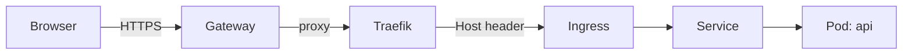
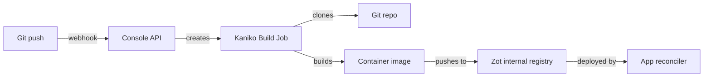

# Deploying Apps

Kipper deploys applications as Kubernetes Deployments with a Service and Ingress, all created automatically from a single command.

## Three ways to deploy

Deploy from an image or a Git repository. Add a webhook to automate updates from your existing CI workflow.

| Mechanism | When to use | Command |
|---|---|---|
| **Container image** | You build images in your own CI and just want Kipper to roll them out. | `kip app deploy --name api --image ghcr.io/acme/api:1.2.3 --port 3000` |
| **Git source** | You want Kipper to build the image in-cluster from a git repo every time you push. | `kip app deploy --name api --git https://github.com/acme/api --port 3000` |
| **CI webhook** | You want your existing CI to push deploys to Kipper without anyone running `kip` by hand. Works on top of either of the above. | See [Webhooks](./webhooks.md) |

The web console's Deploys tab shows all three as side-by-side cards, so you can see what's currently active and what's still available to wire up.

## From a container image

```bash
kip app deploy --name api --image ghcr.io/acme/api:latest --port 3000
```

```
  Deploying api...
  ✔  Deployment created
  ✔  Service created
  ✔  Ingress created
  ✔  Live at https://api--203-0-113-10.kipper.run
```

### What this creates


```mermaid
flowchart LR
    Browser -->|HTTPS| Gateway
    Gateway -->|proxy| Traefik
    Traefik -->|Host header| Ingress
    Ingress --> Service
    Service --> Pod[Pod: api]
```

Behind the scenes, Kipper creates an `App` Custom Resource (`kipper.run/v1alpha1`). A reconciler then ensures the underlying Kubernetes resources exist:

1. **Deployment:** runs your container with the specified number of replicas
2. **Service:** internal load balancer that routes traffic to your pods
3. **Ingress:** external hostname with automatic TLS via cert-manager

All three are owned by the App CR. Deleting the app cascades to all related resources automatically.

### All flags

```bash
kip app deploy \
  --name api \
  --image ghcr.io/acme/api:latest \
  --port 3000 \
  --replicas 2 \
  --project staging \
  --env LOG_LEVEL=info \
  --env API_URL=https://api.example.com \
  --secret API_KEY
```

| Flag | Required | Default | Description |
|---|---|---|---|
| `--name` | Yes | — | Application name |
| `--image` | Yes | — | Container image to deploy |
| `--port` | Yes | — | Port the application listens on |
| `--replicas` | No | 1 | Number of pod replicas |
| `--project` | No | `default` | Project namespace to deploy into |
| `--env` | No | — | Environment variable (repeatable). For non-sensitive config only; credentials go in `--secret` |
| `--secret` | No | — | Secret (repeatable). `KEY=VALUE` inline, or a bare `KEY` for a hidden prompt that stays out of shell history. See [secrets](/en/secrets) |
| `--route` | No | — | Path route group (e.g. `blog/api/users`) |
| `--profile` | No | `standard` | Resource profile: `lightweight`, `standard`, `compute-heavy`, `memory-heavy`, `jvm` |
| `--cpu` / `--memory` | No | — | Fixed CPU/memory size: sets request and limit to the same value and selects the `custom` profile |
| `--health` and `--health-*` | No | automatic | How Kipper checks whether a pod is ready for traffic. See [Health checks and rollouts](#health-checks-and-rollouts) |

Secrets passed at deploy time are written before the app starts, so the first pod boot already sees them. A key set via `--secret` behaves exactly like one set with `kip app secret set` afterwards: masked in the console and CLI listings, kept out of `kip export`, with the previous value retained for `kip app secret rollback`. Passing the same key through both `--env` and `--secret` fails the deploy.

Use `--profile jvm` for Java, Spring and other runtimes with high startup CPU demand. It allows bursts of CPU during startup without reserving a full core permanently. At deploy time, choose either `--profile` or explicit `--cpu`/`--memory` values, which select the `custom` profile.

Explicit values set a fixed size. Switching to a named profile later preserves those values, which take precedence over the profile defaults. Use `kip app update <app> --tuning auto` to return CPU and memory to automatic sizing. See [Resource Management](/en/resource-management#your-own-values) for fixed sizes, ranges and profiles.

## From a Git repository

Deploy directly from source code. Kipper clones your repo, builds a container image using your Dockerfile, pushes it to the internal registry, and deploys.

```bash
kip app deploy --name api --git https://github.com/acme/api.git --port 3000
```

```
  Deploying api...
  ✔  Deployment created
  ✔  Service created
  ✔  Git source configured: https://github.com/acme/api.git (main)
     Configure a webhook or run 'kip app rebuild api' to trigger the first build
```

### Triggering builds

**Manual rebuild:**

```bash
kip app rebuild api --project blog --environment test
```

**Automatic builds via webhook:**

Configure your Git provider to send push events to the webhook URL. Kipper validates the token and triggers a build automatically.

**Streaming build logs:**

```bash
kip app build-logs api --project blog --environment test
```

### How it works


```mermaid
flowchart LR
    Push[Git push] -->|webhook| API[Console API]
    API -->|creates| Job[Kaniko Build Job]
    Job -->|clones| Repo[Git repo]
    Job -->|builds| Image[Container image]
    Image -->|pushes to| Registry[Zot internal registry]
    Registry -->|deployed by| App[App reconciler]
```

1. A webhook or manual `kip app rebuild` triggers a build
2. Kipper creates a Kubernetes Job with two containers:
   - **clone**: fetches your repo (single branch, depth 1)
   - **build**: Kaniko builds the Dockerfile and pushes the image
3. On success, the App CR's image is updated to the new Zot registry tag
4. The App reconciler rolls out the new Deployment

### Git deploy flags

| Flag | Required | Default | Description |
|---|---|---|---|
| `--git` | Yes | — | Git repository URL |
| `--branch` | No | `main` | Branch to build from |
| `--port` | Yes | — | Port the application listens on |
| `--project` | No | `default` | Project namespace |
| `--environment` | No | — | Target environment |
| `--build-memory` | No | `2Gi` | Memory limit for the in-cluster build |
| `--build-cpu` | No | `2` | CPU limit for the in-cluster build |

### Builds that need more memory

Kipper builds your image in-cluster and gives each build 2Gi of memory by default. That covers most apps. Some builds need more: a server-rendered frontend build (Nuxt, Next, a large webpack or Vite bundle) runs the whole thing in one Node process and can use 4Gi or more. When a build runs out of memory it fails and Kipper says so plainly, with the OOM in the build message.

Give that app's build more room when you deploy it:

```bash
kip app deploy --name website \
  --git https://github.com/acme/website.git \
  --build-memory 6Gi \
  --port 3000 \
  --project acme --environment prod
```

The setting sticks to the app, so redeploys and rebuilds keep it. In a `kipper.yaml` it lives under the git source:

```yaml
git:
  url: https://github.com/acme/website.git
  branch: main
  buildResources:
    memory: 6Gi
    cpu: "2"
```

To raise the default for every build on a cluster instead of per app, set `BUILD_MEMORY_LIMIT` (and optionally `BUILD_CPU_LIMIT`) on the console-api. A per-app setting always wins over the cluster default.

### Private repositories

For private repos, pass your Git access token when deploying:

```bash
kip app deploy --name api \
  --git https://github.com/acme/private-api.git \
  --git-token ghp_xxxxxxxxxxxx \
  --port 3000 \
  --project blog \
  --environment test
```

```
  Deploying api...
  ✔  Git credentials stored
  ✔  Deployment created
  ✔  Service created
  ✔  Git source configured: https://github.com/acme/private-api.git (main)
```

The token is stored as a Kubernetes Secret named after the token and the repository host it is for, so rotating it writes a new one and the app moves onto it in a single step. Kipper removes the one it moved off. At build time git receives the token through a credential helper bound to the repository's host, so it never appears in the App CR, the clone URL, or the built image.

| Flag | Description |
|---|---|
| `--git-token` | Personal access token for HTTPS clone (GitHub PAT, GitLab PAT, etc.) |

::: tip
For GitLab, create a token with `read_repository` scope. For GitHub, a fine-grained PAT with `Contents: Read` is sufficient.
:::

### Registry credentials

Registry credentials let apps and functions run images from a private registry, for example `ghcr.io` or a company-internal one. In the web console open **Settings → Container Registries** and add the login:

| Field | Value |
|---|---|
| Server | `ghcr.io` |
| Username | your registry username |
| Password / Token | an access token for that registry |

The credential is stored once in `kipper-system`. Each credential carries an allow-list of projects, and a fresh credential starts with an empty list, so grant the projects that may use it:

```bash
kip registry add --server ghcr.io --allow-project acme
```

When a workload in an allowed project uses an image from that registry, Kipper stages a pull secret in the workload's namespace, scoped to that single registry, and removes it again when the image stops needing it. Workloads in other projects pull anonymously.

Builds are separate. The build container runs your Dockerfile's `RUN` steps, so registry credentials stay out of it, and base images in a `FROM` line are pulled anonymously. Docker Hub rate-limits anonymous pulls per IP, and every build on the cluster shares one egress IP, so a busy cluster can see builds fail with `toomanyrequests` until the window resets. Private base images are unsupported at build time. Publish shared base images to a registry the build can reach anonymously.

### Build status

The **Source** tab in the web console shows the current build status, commit SHA, timestamps, and error messages. You can also trigger rebuilds and cancel active builds from there.

Build states are `Pending`, `Building`, `Succeeded`, `Failed`, and `Discarded`. A **Discarded** build used source settings that no longer match the app. This can happen when you edit the repository, branch, Dockerfile, build context, or build arguments during a build. Source edits alone do not trigger a build; start a new build to deploy the current source.

### Moving an app off git

Detach the Git source when you want an external pipeline to manage the app's image. Otherwise, a later Kipper build can replace that image:

```bash
kip app git remove checkout --project shop --environment production
```

```
  ✔  checkout no longer builds from git
     It keeps running the image it has. Deploy a new one with
     'kip app update checkout --image <image>' or from your pipeline.
```

The app keeps running the image it has. The stored access token and the last build's status go with the source. The Git source card in the console has a Remove button that does the same thing.

See the [Source tab](/en/deploying-apps#from-a-git-repository) in the web console for a visual overview.

## Routing

<span id="path-based-routing-microservices"></span>

See [Route groups](/en/routing#route-groups-path-based-routing) to serve several apps under one hostname.

## Scaling

```bash
# Scale up
kip app scale api --replicas 3

# Scale down
kip app scale api --replicas 1

# Stop without deleting (zero replicas)
kip app scale api --replicas 0
```

The `READY` column in `kip app list` shows progress during scaling (e.g. `2/3` means 2 of 3 replicas are healthy). Kubernetes distributes traffic across all healthy replicas automatically.

Scaling is also available in the web console via the Scale tab in the app detail panel.

## Autoscaling

Kipper supports automatic horizontal scaling based on CPU and memory usage.

```bash
# Scale between 1 and 5 replicas, targeting 70% CPU
kip app autoscale api --min 1 --max 5 --cpu 70

# Scale based on both CPU and memory
kip app autoscale api --min 2 --max 10 --cpu 80 --memory 80

# Check current autoscaling status
kip app autoscale api --status

# Disable autoscaling (return to fixed replicas)
kip app autoscale api --off
```

When autoscaling is enabled, Kubernetes automatically adds replicas when CPU or memory exceeds the target and removes them when usage drops. The `--min` and `--max` flags set the boundaries.

Autoscaling is also configurable from the web console via the Scale tab. Toggle the autoscaling switch and set your thresholds.

::: tip Resource requests required
For CPU-based autoscaling to work, your deployment must have CPU resource requests set. Kipper sets sensible defaults, but if you override them, ensure requests are defined.
:::

## App connections and internal paths

<span id="linking-apps"></span>
<span id="internal-linking-backend-to-backend"></span>
<span id="linking-across-projects"></span>
<span id="public-linking-frontend-to-backend"></span>
<span id="env-var-naming"></span>
<span id="managing-links"></span>
<span id="route-groups-path-based-routing"></span>
<span id="creating-a-route-group"></span>
<span id="what-a-path-prefix-publishes"></span>
<span id="what-the-refusal-reaches-and-what-it-does-not"></span>
<span id="paths-your-own-app-keeps-to-itself"></span>
<span id="letting-one-path-back-through"></span>
<span id="looking-at-a-refused-path-yourself"></span>
<span id="moving-the-endpoints-instead"></span>
<span id="cli-equivalent"></span>
<span id="editing-and-deleting"></span>
<span id="environment-aware-domains"></span>

See [Routing & App Links](/en/routing) for app connections, route groups, and internal path protection.

## Managing apps

### List all apps

```bash
kip app list --project staging
```

```
  NAME                 STATUS     IMAGE                             READY
  api                  running    ghcr.io/acme/api:latest           2/2
  frontend             running    ghcr.io/acme/frontend:latest      1/1
```

In the web console, every app row on the **Projects** screen shows the app's public URL with an open-in-new-tab link, so you can reach a running app without opening its detail panel.

### Stream logs

```bash
kip app logs api
```

Streams logs from the first running pod with 100 lines of history. Press Ctrl+C to stop.

### Update an app image

```bash
kip app update api --image ghcr.io/acme/api:v2.1.0
```

Changes the container image and triggers a rolling update. Use this when you have a new version of your application to deploy.

For apps within a project environment:

```bash
kip app update api --image ghcr.io/acme/api:v2.1.0 --project blog --environment test
```

::: tip Rollback history
Kipper keeps the 3 most recent versions of each deployment. Kubernetes can roll back to any of these if a new version fails to start. The previous 2 versions are retained automatically, and older ones are cleaned up to save resources.
:::

### Restart an app

```bash
kip app restart api
```

Triggers a rolling restart, which replaces the pods as described in [How pods are replaced](#how-pods-are-replaced). With a [health check](#health-checks-and-rollouts) in place, a new pod counts as ready once your app passes the check. Without one, Kubernetes counts a pod as ready as soon as its container starts. Useful when you need to pick up new environment variables or pull a fresh `:latest` image.

### Delete an app

```bash
kip app delete api
```

Removes the Deployment, Service, Ingress, and all associated Secrets.

## Health checks and rollouts

Kipper uses rollouts to deploy apps and apply image, resource, or readiness changes. A health check determines when a pod is ready to receive traffic. How many old pods remain available during the rollout depends on the replica count; see [How pods are replaced](#how-pods-are-replaced).

A failed readiness check keeps traffic away from the pod and can delay the rollout. It does not restart the container.

### What Kipper checks on its own

If you omit the check, Kipper infers one during a rollout, such as an image update, restart, or resource change. It tries a TCP connection to the app port on up to three running pods, prioritizing ready pods and older app containers.

- **A ready pod accepts a connection:** new pods get a TCP check on the app port. Kipper keeps this choice for later rollouts.
- **No ready pod accepts, and an app container running for at least 10 minutes refuses a connection:** Kipper adds no app check and tries again on the next rollout.
- **Results are inconclusive**, such as timeouts or refusals only from younger containers: the rollout proceeds without an app check, and Kipper tries again next time.

A background worker that never listens on a port can therefore deploy without a check. A new app has no running pods to inspect, so its first deploy has no automatic app check. A later rollout gets one if a ready pod accepts connections on the app port.

Checks connect to the pod's IP address. An app listening only on `127.0.0.1` can receive traffic through the [instance proxy](#instance-id-header), but neither an automatic nor a declared check can reach that listener. To use a check, make the checked endpoint listen on `0.0.0.0`. A separate health endpoint can use `--health-port`.

### Declaring a check

Declare an HTTP check when an open port does not mean the app is ready, for example when it still needs to warm caches or connect to a database. A declared check also lets you allow more startup time.

```bash
kip app update api --health-path /actuator/health/readiness --health-startup-timeout 600
kip app update queue-worker --health none
kip app update api --health auto      # remove the declared check and let Kipper decide
```

| Type | What a pod must do |
|---|---|
| `http` | Respond to a `GET` on the configured path with HTTP 200-399 |
| `tcp` | Accept a TCP connection on the configured port |
| `none` | No app readiness check; intended for apps that serve no traffic |

| Flag | `kipper.yaml` field | Default | What it sets |
|---|---|---|---|
| `--health` | `type` | automatic | `http`, `tcp` or `none`. `auto` removes a declared check |
| `--health-path` | `path` | — | HTTP check path: starts with `/`, contains no whitespace, and is at most 1024 characters. Implies `http` when `--health` is omitted |
| `--health-port` | `port` | the app port | Port to check, such as a separate management port. Cannot be the instance proxy's port (app port + 10000) |
| `--health-startup-timeout` | `startupTimeoutSeconds` | 300 | Time from pod creation to readiness before the pod is reported as stuck, including image pulls: 10-3600 seconds |
| `--health-timeout` | `timeoutSeconds` | 2 | Timeout for each check: 1-60 seconds |

The startup timeout includes scheduling and image pulls. Kipper can report specific scheduling, image, configuration, or repeated-crash errors before it expires.

These flags work with both `kip app deploy` and `kip app update`. Updates merge into the existing check, so `--health-timeout 5` preserves its path. Switching types clears unsupported settings: `none` accepts a startup timeout but no path, port, or check timeout. Changes to the readiness probe trigger a rollout. Changing only the startup timeout does not restart pods.

Older clusters may silently discard health settings. The CLI and console verify that the cluster stored a declared check and ask you to run `kip upgrade` if it was dropped. In a manifest, put the settings under `health:`; see [The health block](/en/gitops#the-health-block).

Kipper configures checks every 5 seconds. Three consecutive failures mark a pod unready and remove it from traffic; one successful check makes it ready again. Detection time depends on the check timeout.

Git apps run a placeholder page until their first build is deployed. While it runs, any declared HTTP or TCP check uses a TCP check on the app port.

In the console, open the app's **Settings** tab and use **Health check**. Choose Automatic, Port check (TCP), HTTP path, or None, then click **Save health check**. The status line shows the current check or whether a saved change is still being applied.

### How pods are replaced

New apps use Kubernetes' default rolling-update strategy. With one to three replicas, Kubernetes adds one extra pod at a time and waits for a replacement to become ready before stopping an old pod. With four or more replicas, it may also stop up to a quarter of the pods before replacements are ready. This can free capacity for the rollout. Existing Deployments retain their configured strategy.

With a health check, a pod becomes ready after passing it. Without an app check, the app container counts as ready once it starts; the instance proxy has its own check.

A single-replica app temporarily needs capacity for a second pod. If no node has room, the rollout waits while the existing pod continues serving, provided it remains healthy.

On supported clusters running Kubernetes 1.30 or newer, each container waits 10 seconds before receiving the termination signal. This gives routing changes time to propagate. The pod has a total shutdown grace period of 40 seconds, including that delay. The instance proxy waits for active HTTP requests to finish within the remaining time.

### When a rollout waits

The App's `RolloutComplete` condition reports rollout progress separately from pod health. A rollout is complete when all replicas have been updated and are available, or Kubernetes has recorded the current revision as available with the expected replica counts. A pod that crashes afterwards affects app health but does not reopen the rollout. A scale-up or replacement pod can still show a waiting rollout if it cannot be scheduled or created, or encounters a startup error before any of its containers have run.

| Reason | What it means | What to do |
|---|---|---|
| `InProgress` | Pods are being replaced or scaled | Wait for the rollout to finish |
| `Unschedulable` | A new pod cannot be scheduled; the message includes the scheduler's reason | Follow the message. For insufficient CPU or memory, lower the request or add capacity |
| `QuotaExceeded` | The project quota blocks new pods | Lower the request or raise the project quota |
| `PodsRefused` | The cluster rejected a new pod, for example because of an admission policy | Resolve the error in the message |
| `PodsNotStarting` | A pod has an image, configuration, or crash-loop error, or has not started running within the startup timeout. The message includes container details when available, otherwise the pod phase | Inspect the pod status, events, and logs. Fix the reported error; for an out-of-memory failure, review the memory limit |
| `NotBecomingReady` | A pod is running but remains unready after the startup timeout, measured from pod creation | Inspect its logs and check settings. For a slow starter, increase `--health-startup-timeout`; for an inferred check, use `--health tcp --health-startup-timeout 600` |
| `DeadlineExceeded` | Kubernetes reported no progress within the deadline: at least 10 minutes, or the startup timeout plus 5 minutes | Inspect the message and pod logs |
| `NotApplied` | Kipper could not apply the latest change | Resolve the reported error; the App's other conditions may provide more detail |

`kip app list` prints a note for each app still rolling out:

```
  !   api is still rolling out: A new pod cannot be placed: 0/1 nodes are available: 1 Insufficient memory. Any healthy current pods continue serving. Lower the CPU or memory request, or add capacity.
```

In the console, the Apps list shows **Rolling out** or **Rollout waiting**, with details on hover. The app panel shows an amber banner when a pod cannot be scheduled. Kipper records a `RolloutWaitingForCapacity` warning event when this state begins. A rollout that exceeds its progress deadline also raises an [alert](/en/alerts#stalled-rollouts) with the available diagnostic details.

Automatic resource sizing normally waits during a rollout. See [Resource Management](/en/resource-management#rollouts) for the exceptions.

### Existing apps after an upgrade

These platform changes do not restart existing apps during an upgrade. Apps adopt the new readiness and shutdown settings on their next image change, restart, or other pod-template change. Run `kip app restart <app>` to apply them immediately.

If Kipper selects a check, the first rollout uses it for the new pods. Pods created before the upgrade lack the shutdown delay; their replacements use it on supported clusters. See [Upgrade scope](/en/maintenance#what-an-upgrade-moves-and-what-it-does-not) for downgrade behavior.

These app rollout settings do not apply to functions, jobs, or services.

## Browsing files

See [Browsing Files](/en/files) for uploading, downloading, and editing files inside running containers.

## AI diagnostics

See [Observability](/en/observability#ai-log-analysis) for AI-powered log analysis and diagnostics.

## Instance ID header

When you're running multiple replicas of an app, it's useful to know which pod handled a particular request. Kipper can add an `X-Instance-ID` response header to every HTTP response, identifying the pod that served it.

This is enabled by default for all apps with a route. You can toggle it off in the app's **Settings** tab under "Instance ID header".

### How it works

Kipper injects a lightweight reverse proxy sidecar container into each pod. The sidecar sits in front of your app and adds the header transparently. Your app doesn't need any code changes.

The request flow looks like this:

```
Client → Traefik → Service:8080 → Sidecar(:18080) → Your app(:8080)
```

The sidecar listens on an offset port (your app's port + 10000). The Kubernetes Service routes traffic to the sidecar via `targetPort`, and the sidecar forwards it to your app on localhost. Your app keeps listening on its original port and never knows the sidecar is there.

The sidecar has its own TCP readiness check. A pod receives traffic when both containers are ready; without an app check, the app container counts as ready once it starts. On shutdown, the sidecar waits for active HTTP requests to finish within the pod's [shutdown grace period](#how-pods-are-replaced).

The header value is a short hash of the pod name (8 hex characters). It doesn't reveal the full pod name or any infrastructure details. For example:

```
X-Instance-ID: f1582f7c
```

You can match this ID to a specific pod in the live logs viewer. The live logs tab lets you pick individual pods, so once you see which instance handled a failing request, you can jump straight to that pod's logs.

### When to disable it

Most apps should leave this on. You might turn it off if:

- Your app already adds its own instance tracking header
- You want to avoid the ~5MB memory overhead of the sidecar container per pod
- Your security policy doesn't allow extra response headers

