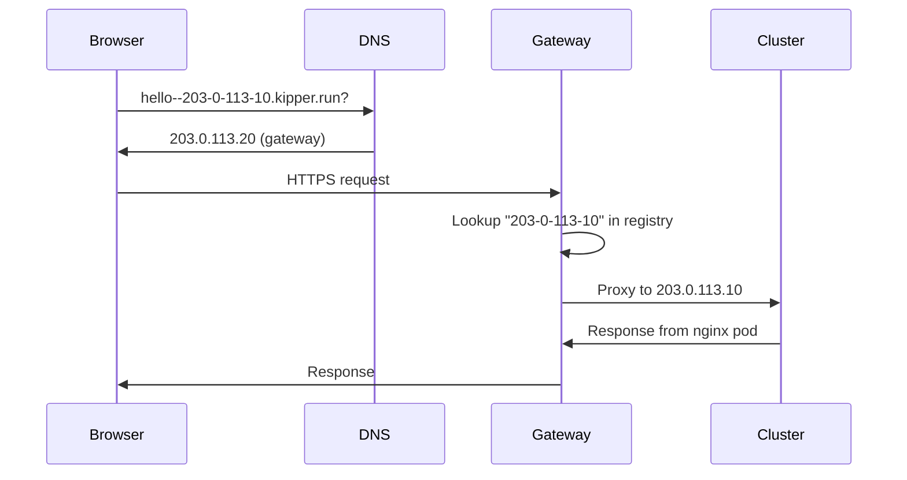

# Domains & SSL

Every Kipper cluster gets automatic HTTPS, both on free kipper.run subdomains and custom domains.

## Free kipper.run subdomains

When you run `kip install`, Kipper registers a free subdomain based on your server's IP address:

```
203-0-113-10.kipper.run
```

Apps deployed to the cluster get subdomains automatically:

```
hello--203-0-113-10.kipper.run
api--203-0-113-10.kipper.run
console--203-0-113-10.kipper.run
```

All subdomains are single-level to work with the wildcard TLS certificate. App and service names are joined to the cluster name with a double dash, and cluster names themselves can never contain a double dash, so every URL maps to exactly one cluster.

### Choosing your own name

The address-derived name puts your server's IP in every URL the cluster serves, so anyone you send a link to can read it. Pick your own name instead by passing it to `--domain` at install time:

```bash
kip install --host 203.0.113.10 --domain lab.kipper.run
```

```
  Registering subdomain...
  ✔  Subdomain assigned: lab.kipper.run
```

`--domain` takes either kind of name. Anything ending in `.kipper.run` is a name Kipper registers for you on the shared gateway; anything else is a domain whose DNS you run yourself, and you point it at your server (see [custom domains](#custom-console-domain) below).

The name has to be one DNS label, 1 to 63 characters, lowercase letters, digits and hyphens. Names that read as Kipper's own (`console`, `login`, `status`, `docs` and similar) are reserved, and a name spelling an IP address can only be registered by that address. Anything already taken is refused before the install touches your server, so you can try another name straight away.

Your apps still hang off the cluster name with a double dash:

```
todo-app--lab.kipper.run
console--lab.kipper.run
```

So `lab` is the cluster's name, not each app's. That is what keeps every hostname a single label under the wildcard certificate, and what guarantees two clusters can never claim the same URL. If you want `todo-app.example.com` instead, use a custom domain.

### Changing the name later

`kip cluster domain` moves an existing cluster to a different name, kipper.run or custom:

```bash
kip cluster domain lab.kipper.run
```

The old hosts keep serving until the cutover, and everyone signs in again once it completes, because the move takes the login issuer with it.

### How it works



A wildcard DNS record (`*.kipper.run`) points all subdomains to the Kipper Gateway. The gateway looks up the cluster IP from its registry and reverse-proxies the request. TLS is terminated at the gateway using a Let's Encrypt wildcard certificate.

### Subdomain expiry

Free subdomains stop serving after 30 days of inactivity. A live cluster renews itself: its console API heartbeats to the gateway once a day, which is what keeps the name and the proof of control current.

The name is not handed to anyone else at that point. It stays reserved for you for a further 90 days, and only your cluster's own gateway credential can bring it back, so a cluster that was off for a season finds its name waiting. Re-registering means re-running `kip install`, which is heavier than it sounds: see [re-running install](/en/installation#re-running-install) for what it costs on a cluster with console-created users.

After those 90 days the name is free for anyone to register. This matters most if you chose your own name and published it, because links, bookmarks and sign-in URLs pointing at `lab.kipper.run` will reach whoever registers it next, over a valid certificate, with nothing for a visitor to notice. Keeping the cluster in normal use is what avoids all of this. If you are retiring a cluster whose name you published, move the links before the reservation runs out.

`kip cluster uninstall` is different: it frees the name straight away. The hold exists for the cluster that went quiet without anyone deciding to stop, where a name disappearing would be an accident. An uninstall is a decision, and the command deletes the credential that would reclaim the name anyway, so holding it would lock the name away from you as well as from everyone else. It also means you can rebuild a server under the same name whenever you like. If you published links under a name you are giving up, move them before you uninstall rather than after.

## Custom console domain

Replace the auto-generated console URL with your own domain:

```bash
kip cluster domain kipper.example.com --yes
```

```
  Domain change to kipper.example.com

    From:  console--203-0-113-10.kipper.run
           console-api--203-0-113-10.kipper.run
           dex--203-0-113-10.kipper.run
    To:    console.kipper.example.com
           console-api.kipper.example.com
           dex.kipper.example.com

  The old hosts keep serving until the cutover. The cutover moves the OIDC
  issuer, so every open session has to sign in again once it completes.
  Point DNS for the new hosts at this server before continuing.

  ...  Requested kipper.example.com; bringing up the new hosts alongside the old ones
  ...  Serving old and new hosts
  ...  New hosts up; ready to cut over
  ...  Verifying the new hosts answer with a valid certificate
  ✔  New hosts reachable
  ...  Approved; cutting over
  ...  Moving the login issuer to the new hosts
  ...  Verifying the new issuer in-cluster
  ...  Removing the old hosts

  ✔  Cutover complete. Serving kipper.example.com
      Anyone with an open session signs in again on the new hosts.

  Repaired local config for production:
    Domain           = kipper.example.com
    ConsoleDomain    = console.kipper.example.com (default)
    ConsoleAPIDomain = console-api.kipper.example.com (default)
    DexDomain        = dex.kipper.example.com (default)
```

Without `--yes`, the command shows the same plan and asks `Proceed? [y/N]:` before changing anything. The final block is kip refreshing `~/.kip/config.yaml` to match the cluster's new identity.

The change runs as a no-lockout transition driven by the cluster. The new hosts come up alongside the old ones, kip verifies from outside that they answer with a valid certificate, and only then does it approve the single cutover that moves the login issuer. If anything fails to verify, the cluster reverts to the previous identity on its own and the old hosts keep serving.

Point DNS for the new hosts (`console.`, `console-api.`, `dex.` under your domain) at the server before running the command. Any per-service host overrides from an earlier change are cleared by a new move; the hosts kip prints in the plan are exactly what the cluster will serve.

### If your cluster uses SSO

The cutover moves the Dex issuer, so each SSO provider's allowed callback URL must be updated first. kip stops, prints the new callback URL, and waits. Update every provider, then re-run with `--ack-sso-callbacks`. The acknowledgement is recorded for that specific move: a later domain change asks again.

### Recovering and rolling back

```bash
kip cluster domain --sync       # finish an interrupted change
kip cluster domain --rollback   # return to the previous domain
kip cluster domain --repair     # rewrite ~/.kip/config.yaml from the cluster
```

- `--sync` resumes whatever change is in flight, or, on a cluster that already converged, finishes anything an interrupted run left behind: releasing the old kipper.run subdomain and refreshing your local config.
- `--rollback` returns to the previous serving identity recorded at the last change. It runs as a normal cutover in the opposite direction, with the same checks, so sessions sign in again on the old hosts once it completes.
- `--repair` only touches your local `~/.kip/config.yaml`. It rewrites the entry from the cluster's identity record, which is useful after switching machines or when local state drifted.

See [Configuration: Custom console domain](/en/configuration#custom-console-domain) for more details.

## Custom app domains

Apps can use custom domains instead of kipper.run subdomains. Set a route with a custom host in the web console's **Route** panel, or via the API.

With a custom domain, traffic goes directly to your server (bypassing the gateway) and cert-manager issues a Let's Encrypt certificate automatically.

::: tip
Point your domain's A record to the server's IP before configuring it. cert-manager needs DNS to resolve to issue the TLS certificate. If the hostname was covered by another record before, for example a wildcard pointing at an old server, expect issuance to start only after the old record's TTL has expired from resolver caches.
:::

### Redirect domains

A route can carry extra hostnames that answer with a permanent redirect (301) to its main hostname, preserving the path and query string. This covers `www.example.com` redirecting to `example.com`, the other direction if you prefer the `www` form as your main hostname, and old domains after a rename.

Add them in the web console's **Route** panel under **Redirect domains**, or in `kipper.yaml`:

```yaml
apiVersion: kipper.run/v1alpha1
kind: App
metadata:
  name: shop
spec:
  image: registry.example.com/shop:1.4.0
  port: 3000
  route:
    host: example.com
    redirectFrom:
      - www.example.com
```

Or from the CLI. On an app that already exists this is a configuration change, not a deployment, and
nothing restarts. The route's Ingress and middlewares are rebuilt in place:

```bash
kip app update shop --redirect-from www.example.com
```

The flag replaces the list rather than adding to it, so a second redirect domain means passing both
hostnames. Pass the flag with no value to remove them all.

::: warning If you apply this project from a manifest, add the redirects to it
`kip apply` replaces an app's whole spec, so the next apply of a `kipper.yaml` that does not mention
`redirectFrom` removes the redirect domains, the same as for any other field you leave out. Either
add them to the manifest, or run `kip export --project <project> --environment <env> -o <file>`
afterwards, which captures the live state including the redirects.
::: The same list can be set when the app is first
created, alongside the other route flags:

```bash
kip app deploy --name shop --image registry.git.example.com/shop:latest --port 3000 \
  --redirect-from www.example.com
```

A request to `https://www.example.com/checkout?step=2` then answers `301 Moved Permanently` with `Location: https://example.com/checkout?step=2`.

Each redirect domain needs its own DNS record: create an A record for it at your DNS provider, pointing at the same server IP as the main hostname. cert-manager then issues a separate certificate for it, so a redirect domain whose DNS is still missing delays only its own certificate and never the main hostname's.

Redirect domains follow the same ownership rules as route hostnames: the first project to use a hostname owns it, and a hostname another project already uses is skipped and reported in the app's status. The same applies within a project, because a hostname one of your other apps serves would have its traffic captured by the redirect. kipper.run subdomains cannot be used as redirect domains, and a route supports up to 10 redirect domains.

### DNS verification

After saving a route, the console reports one of these states next to the URL:

- **Green tick, "resolves to this cluster".** The hostname's A record points at one of the cluster's node IPs. Nothing more to do, the certificate will follow.
- **Amber warning, "does not resolve".** There's no DNS record for the hostname yet. The panel shows the IP your A record needs to point at, with a copy button.
- **Red warning, "resolves to X".** There is a DNS record but it points elsewhere. The panel shows the current IP and the IP it should point to.
- **Green tick, "Free kipper.run subdomain".** The route is on `*.kipper.run`, served by the shared kipper.run gateway. No DNS to set up.
- **Green tick, "Covered by your wildcard A record".** The route is a subdomain of your cluster's domain (the value you passed to `kip install --domain`). The wildcard A record you set at install time covers every new app subdomain automatically. A "Verify wildcard anyway" link runs the lookup if you want to sanity-check.

After you change your DNS at the registrar, click the refresh icon to re-check. There's no background polling, so the indicator only updates when you ask it to.

## SSL certificates

All SSL certificates are managed automatically:

- **kipper.run subdomains:** wildcard certificate on the gateway, renewed by Caddy
- **Custom domains:** per-domain certificate on the cluster, issued and renewed by cert-manager
- **No manual certificate management required**

## Troubleshooting certificates

### Browser shows "insecure" or "TRAEFIK DEFAULT CERT"

If you see a certificate warning with `TRAEFIK DEFAULT CERT` as the common name, it means cert-manager hasn't issued a proper Let's Encrypt certificate yet. The most common cause is an invalid ACME registration email.

**Check if this is the problem:**

```bash
kip cert email
```

If the email shows something like `admin@kipper.local`, that's the issue. Let's Encrypt rejects emails on non-public domains.

**Fix it:**

```bash
kip cert email you@yourdomain.com
```

This updates the email, re-registers with Let's Encrypt, and triggers renewal for any stuck certificates. Give it a minute or two, then reload the page.

::: tip
When you install with `kip install --domain yourdomain.com`, the email defaults to `admin@yourdomain.com`. If you install without `--domain`, it falls back to `admin@kipper.local` which Let's Encrypt will reject. Always set a real email.
:::

### Certificates stuck in "Issuing" state

If the email is valid but certificates are still not ready, check the certificate status:

```bash
KUBECONFIG=~/.kip/clusters/your-cluster.yaml kubectl get certificates -A
```

Common causes:

- **DNS not pointing to the server yet.** cert-manager uses HTTP-01 challenges, so the domain must resolve to your server's IP. Check with `dig yourdomain.com`.
- **Stale DNS caches after a recent record change.** If you created or changed the A record within the last hour, public resolvers can keep serving the previous answer until the record's TTL expires. This bites hardest when a wildcard record (`*.example.com`) already points at another server: resolvers keep synthesising the wildcard's IP for your new hostname until their cache expires. cert-manager's pre-flight self-check then reaches the wrong server, and the challenge status shows a misleading `wrong status code '404', expected '200'` or a connection error against an IP that is not your cluster. Your own machine may already see the new record while the resolvers cert-manager uses do not. Compare `dig yourdomain.com @1.1.1.1` and `dig yourdomain.com @8.8.8.8` with what you expect. Nothing is broken. Issuance retries automatically and completes once the caches expire.
- **Ports 80/443 blocked.** Let's Encrypt needs to reach your server on port 80 to verify ownership.
- **Rate limiting.** Let's Encrypt has rate limits. If you've issued too many certificates for the same domain recently, you'll need to wait. Check the cert-manager logs: `kubectl logs -n cert-manager -l app=cert-manager`.

A plain-HTTP request to any app on the cluster always answers `301 Moved Permanently`, including requests for `/.well-known/acme-challenge/` paths. That redirect comes from Traefik's HTTP entrypoint, which sends everything to HTTPS before any route is matched. It does not interfere with issuance: Let's Encrypt and cert-manager's self-check both follow the redirect, and the challenge is served on the HTTPS side. A `301` on a challenge URL is normal, so treat it as a sign the request reached the cluster rather than evidence the challenge route is broken.
