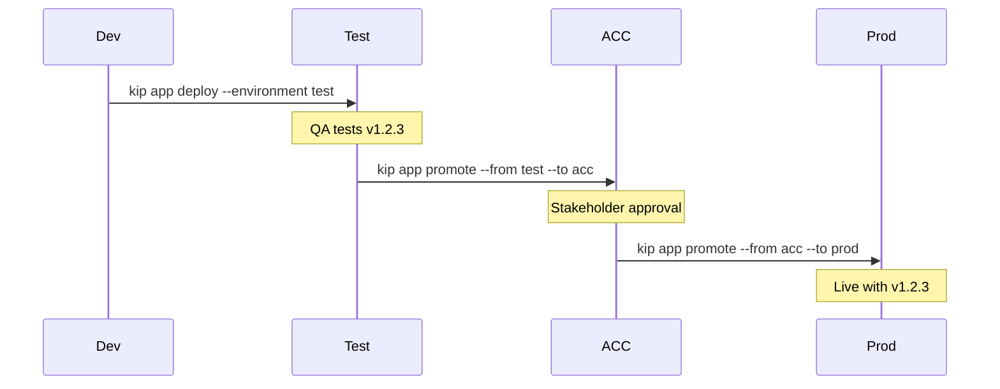

# Projects & Environments

Projects group related apps and services together. Each project can have multiple environments that form a promotion pipeline. Deploy to test, verify, then promote to production.

## Creating a project

From the CLI:

```bash
# Simple project (single default environment)
kip project create myapp

# Project with promotion pipeline
kip project create blog --environments test,acc,prod

# With a display name for the console UI
kip project create blog --display-name "example.com Domain Platform" --environments test,acc,prod
```

The display name shows up in the web console headings so non-technical team members can read it. The short code (`blog`) is used for Kubernetes namespaces and CLI commands.

From the web console, go to the **Projects** screen and click **New project**. Enter the project name, display name, and environments.

### What this creates

`kip project create` creates a Project Custom Resource (`kipper.run/v1alpha1`). The ProjectReconciler then creates:

1. **Kubernetes namespaces** for each environment, with labels linking them to the project
2. **A CPU/memory quota** per namespace, sized by the project's tier (see [Project quotas](/en/resource-management#project-quotas))
3. **Role bindings** granting the project's members access to each namespace

The Project CR is the source of truth. Deleting it cascades to all namespaces and resources inside the project.

### The environment you get without asking for one

`kip project create myapp` without `--environments` creates one called `default`, and a `default`
environment is the one case where the namespace is not suffixed: apps land in `myapp`, not
`myapp-default`. The same is true of the console's New project screen. That is why the simple case
reads as "just a project" with no environment in sight — there is one, it is called `default`, and
it shares the project's name.

Adding a second environment starts suffixing: `kip project add-env myapp prod` gives you
`myapp-prod` beside the original `myapp`.

A Project whose environment list is genuinely empty is a different thing, and neither the CLI nor
the console makes one. It can arrive by applying a CR directly or restoring from a backup, and the
reconciler gives it an environment called `test` in namespace `myapp-test`. If you are looking at a
project whose namespace ends in `-test` but whose environment list reads empty, that is what
happened.

### Organisation prefix

If an org was set during `kip install --org acme`, namespaces are prefixed automatically:

```
acme-blog-test
acme-blog-acc
acme-blog-prod
```

This prevents naming conflicts when multiple teams share a cluster. The org is set once during install and applied to all projects.

```
  Creating project "blog"...
  ✔  blog-test
  ✔  blog-acc
  ✔  blog-prod

  Promotion pipeline: test → acc → prod
```

Each environment becomes a separate Kubernetes namespace. Apps deployed to different environments are fully isolated.

## Adding and removing environments

You can change the environment list on a project after it has been created. Common cases:

- A project that started with just `test` needs a `prod` environment for the first real release.
- A short-lived `staging` slot is no longer used and should be cleaned up.

Every project caps how many environments it can have: 6 without a tier, or the tier's own cap once one is assigned (4 on `small`, 6 on `medium`, 10 on `large`). Project owners add environments up to that limit; beyond it a cluster admin raises `maxEnvironments`, making sure the cluster has the capacity to back the extra environments. Removing an environment frees a slot immediately. See [The environment limit](/en/resource-management#the-environment-limit).

### From the CLI

```bash
# Add a blank environment
kip project add-env blog prod

# Remove one. You'll be asked to type the environment name to confirm
kip project remove-env blog staging
```

If you've set an active project with `kip project use`, you can drop the project name:

```bash
kip project use blog
kip project add-env prod
kip project remove-env staging
```

### From the console

Open a project on the **Projects** screen. Next to the environment tabs you'll see an **Add environment** button. Enter a name, optionally pick **Copy from \<env\>** (see next section), and click Add.

To remove an environment, hover over its tab and click the small × icon. A dialog lists every app that lives in the environment and asks you to type the environment name before the delete goes through.

### What removal does

Removing an environment deletes the matching namespace and **everything inside it**: apps, services, secrets, volumes, certificates, function deployments. The action cannot be undone, which is why both the CLI and the console require you to type the environment name.

A project must keep at least one environment. If you want to remove the last one, delete the project itself instead.

## Copying an environment

When you create a new environment from the console, the **Copy from** dropdown lets you seed it with everything from an existing environment in one step. This is the fast path for "I have a working test env, give me a prod env that looks the same."

What gets copied:

- **Apps.** Full spec including env vars, secret references, service bindings, resource limits, autoscaling.
- **Services** (databases). Type, version, storage size. The new env gets fresh credentials. The data starts empty.
- **Volumes.** The Volume CRs are copied so each app can mount what it expects. The PVCs themselves start empty. Data migration is a separate flow.
- **Functions and Jobs.** Full specs.
- **User-managed Secrets.** Anything you stored via the secrets handler is duplicated. System-generated secrets (service credentials, registry pull secrets, per-binding secrets) regenerate automatically.

What changes between source and target:

- **Routes.** Apps that had a public route in the source env get a fresh per-env hostname under your cluster's wildcard (e.g. `myapp-prod.example.com`). The URL works immediately because of the wildcard A record you set up at install time. Open the new env in a browser and you should see your app running. Switch to a custom domain via the route panel when you're ready.
- **Database credentials.** Every service in the new env gets a fresh password. Bindings rewire automatically because they reference the local service by short name.
- **Database contents.** The new env's databases are empty. If you need to copy data over, that's a separate operation.

This is intentionally a faithful one-shot copy. For more control, use the wizard described next.

### Copy with the wizard

When you click **Add environment**, the dropdown gives you three kinds of choice:

- **Blank.** Start empty. No copy.
- **Copy as-is from \<env\>.** Verbatim copy: every app, service, secret, volume gets recreated in the new env with auto-assigned hostnames. One click after typing the env name.
- **Copy and customize from \<env\>.** Opens the wizard pre-filled with the env name and source you picked. Useful when test and prod genuinely differ in things like Stripe keys, hostnames, or replica counts.

The wizard is a five-step modal that lets you set per-app overrides before anything is created.

The five steps:

1. **Source & target.** Pick the source environment and name the new one. The wizard then loads the source and shows you exactly what's about to be created in the new environment, broken down by apps, services (with type and storage), and volumes. Services especially are worth scanning here. Each gets its own pod, PVC and credentials in the new environment, completely isolated from the source.
2. **Routes.** For every app that has a public route in the source, set the hostname for the new environment. Defaults are pre-filled with the cluster wildcard so they work immediately. Edit if you want a custom domain like `app.example.com`.
3. **Env vars.** Flat table of every env var on every app. Edit the values you want to change for the new environment. A "Suspect only" filter narrows the list to keys matching common per-env patterns (`STRIPE_`, `SENTRY_`, `_URL`, `KEY`, `SECRET`, etc.) so you can focus on the ones that usually need tweaking. Values that contain the source environment's namespace string get auto-rewritten to the new namespace and tagged **auto-updated**. That catches the common `SPRING_DATASOURCE_URL=jdbc:postgresql://db.hrportal-test.svc...` shape so prod doesn't accidentally point at test's database. Each auto-update is reversible with a one-click revert.
4. **Resources.** Per-app replicas, memory limit, CPU limit. Pre-filled from source. The "Apply prod defaults" button bumps replicas to at least 2 and memory limit by 1.5x as a starting point.
5. **Review.** Summary of what's about to be copied and how many apps have overrides. Click Create.

Secret rotation isn't in the wizard. Use the existing per-app secrets handler after the copy if a secret needs different values in the new environment.

Database content migration isn't in the wizard either. The new environment's databases start empty.

## Deploying to an environment

```bash
kip app deploy --name api --image registry.git.example.com/api:v1.2.3 --port 3000 \
  --project blog --environment test
```

Without `--environment`, apps deploy to the default namespace.

## Listing projects

```bash
kip project list
```

```
  PROJECT              ENVIRONMENTS
  blog           test, acc, prod
  other-project        default
```

## Setting an active project

Most kip commands take `--project` and `--environment` flags. Typing both on every command gets old fast, especially when you're working in one project for an afternoon. Set the active project once and the rest of the commands pick it up automatically.

```bash
kip project use blog/test
```

```
  ✔  Active project: blog/test on cluster "example.com"
```

After that:

```bash
kip service list                    # lists services in blog-test
kip app list                        # lists apps in blog-test
kip service info db                 # shows db connection details
```

The active project is per cluster. Switching with `kip cluster use` also switches whatever project was active there last. `kip cluster list` shows the active project on each cluster line.

If you need to run a one-off command in a different project, the explicit flag still wins:

```bash
kip service list --project other-project
```

To forget the active project on the current cluster:

```bash
kip project use --clear
```

The web console has the same idea built in. The project switcher in the top-left corner is what `kip project use` mirrors on the CLI side.

## Promotion

Promotion copies an app's container image tag from one environment to the next, nothing else. Resource requests, resource limits, replica counts, volumes, environment variables, and secrets are **not** copied. Each environment keeps its own configuration, so test can run one replica with 256 MB while production runs three replicas with 1 GB. This is intentional: test uses the test database, production uses the production database, and each environment is right-sized independently.

### Promote a single app

```bash
kip app promote api --from test --to acc --project blog
```

```
  Promote test → acc (blog)
  Apps: api

  Promote to acc? [y/N] y

  ✔  api → acc (registry.git.example.com/api:v1.2.3)
```

### Promote all apps

```bash
kip app promote --all --from acc --to prod --project blog
```

This promotes every app in the source environment to the target at once. Apps that
cannot be promoted are reported and the rest still go; the command exits non-zero
if any were left behind.

### What promotion needs

The app has to exist in the target environment already. Promotion sets an image
on it and copies nothing else, so creating it here would give you an app with no
route, no resources and no bindings. Create it with `kip app deploy` in that
environment first.

An app that builds from git in the target cannot be promoted onto, because its
image is build output the build controller owns and writing one would be undone
by the next build. Promote into an image-based app, or deploy the branch you want
in that environment.

The tick follows the cluster: `kip` writes the image to the app's desired state
and reads back what was stored before reporting success. A promotion that did not
land is reported as a failure rather than as a tick.

### How it works



Promotion records are stored as annotations on the app in the target environment:
- `kipper.run/promoted-from`: source environment
- `kipper.run/promoted-at`: timestamp

The image itself is not recorded separately, because it is the app's own
`spec.image` — `kip app list` shows it in the IMAGE column, and `kip export`
writes it into the manifest.

## Database strategy

Each environment gets its own database instance. One PostgreSQL instance per environment, with separate databases for each microservice inside it:

```bash
kip service add postgres --name blog-db --project blog-test
kip service add postgres --name blog-db --project blog-acc
kip service add postgres --name blog-db --project blog-prod
```

Then inject the correct connection URL per environment:

```bash
kip app secret set api DATABASE_URL --project blog-test
kip app secret set api DATABASE_URL --project blog-prod
```

Test and acc environments can use smaller storage allocations:

```bash
kip service add postgres --name db --project blog-test --storage 1Gi
kip service add postgres --name db --project blog-prod --storage 10Gi
```

## Deleting a project

```bash
kip project delete blog
```

This prompts for confirmation and deletes all environments, apps, services, and data. It cannot be undone.

From the web console, click the delete button on a project card in the **Projects** screen. You'll need to type the project name to confirm.
