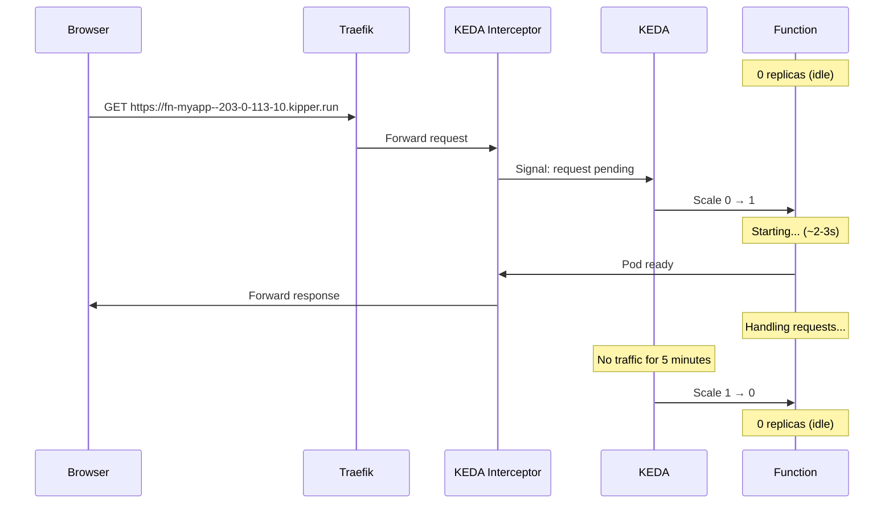
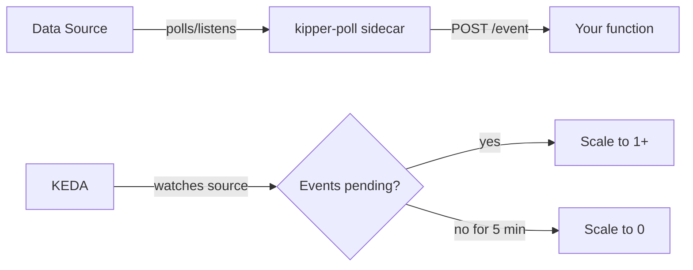

# Functions

Kipper functions are serverless workloads that scale to zero when idle and wake up automatically on demand. No traffic means no pods running and no resources consumed. When a request arrives, the function starts in seconds, handles the request, and scales back down after an idle period.

Under the hood, functions use the [KEDA HTTP Add-on](https://github.com/kedacore/http-add-on), an interceptor proxy that queues incoming requests while the function pod starts. No requests are lost, even during cold starts.

## Building a function in the browser

The web console has a single-page form for both creating and editing functions. Go to **Functions** in the sidebar and click **New function** (or click any existing function row to edit it). The form is a one-page accordion. Every aspect of the function lives in a collapsible section on the same page so you can see the whole shape at a glance.

```
┌─────────────────────────────────────────────────────────┐
│  ◀  domain-sync             [Save & deploy] ▾   │
│     cron · bound to eventdb · last run 12m ago          │
├─────────────────────────────────────────────────────────┤
│  ▼  Code                                  Node 22 ⌄     │
│     [editor]                  AI Assistant              │
│  ▼  Trigger                                             │
│     ◯ HTTP   ●  Cron   ◯ Postgres   ◯ Redis   ◯ MinIO   │
│     0 2 * * *      Every day at 02:00 UTC               │
│  ▼  Service bindings                          + Bind    │
│     eventdb (postgres)  →  DB_HOST DB_PORT DB_USERNAME ...  │
│  ▼  Environment variables                     + Add     │
│  ▼  Secrets                                   + Add     │
│  ▼  Dependencies                              + Add     │
│  ▶  Resources                                           │
│  ▶  Logs                                                │
└─────────────────────────────────────────────────────────┘
```

A single **Save & deploy** button at the top commits everything. On create, the function CR plus its env / secrets / bindings / dependencies are written in one round trip and the page navigates to the edit URL so you keep working with server-side state.

## Code

Inline code is the fastest way to get something running. Pick a runtime (Node 22 or Python 3.12), write a handler, hit Save & deploy. Kipper builds a runtime container around your code, mounts the source as a ConfigMap, and installs any dependencies you've declared.

### Node.js handler

```javascript
module.exports = async (event, context) => {
  // HTTP trigger: event is the request body, context has method/headers/path.
  // Event trigger: event is the row/item from the data source.
  // Cron trigger: event is empty, just runs on schedule.
  console.log('Processing:', event)

  return {
    statusCode: 200,
    headers: { 'Content-Type': 'application/json' },
    body: { processed: true, timestamp: new Date().toISOString() }
  }
}
```

### Python handler

```python
def handler(event, context=None):
    print('Processing:', event)
    return {'processed': True}
```

### AI assistant in the editor

Click **AI Assistant** in the Code section header to open a side panel beside the editor. The chat is context-aware. It sees:

- The runtime (Node 22 or Python 3.12)
- Service bindings with their injected env var names (e.g. `eventdb (postgres) → DB_HOST DB_PORT DB_USERNAME DB_PASSWORD DB_NAME`)
- Environment variable keys (names only)
- Secret keys (names only, values never leave the cluster)
- Installed dependencies and their versions

The "Kipper knows" block at the top of the panel shows exactly what the AI can see. So when you ask "write me a domain sync that pulls domains from a registrar API and writes them to the database", the model uses your real env var names (`process.env.REGISTRAR_API_KEY`, `process.env.DB_HOST`) and the packages you've actually installed instead of guessing.

When the AI suggests code that imports a package not in your dependencies, a small `+ pkg` button appears next to the **Apply to editor** button. Click it to add the package and the Dependencies section opens for you to set a version.

The AI assistant requires an AI provider configured under Settings. See the [Configuration](/en/configuration) page.

#### Attaching files

Click the paperclip in the chat input or drag files onto the input area. Useful when porting code from another stack: drop in your Java service classes and `pom.xml` and ask "convert this to a Python serverless function". The files become part of the prompt so the model can reference them directly.

Limits: 256 KB per file, 1 MB total per message. Text source files only: Java, Kotlin, Go, Python, JS/TS, YAML, XML, JSON, SQL, shell scripts, Dockerfiles, Markdown, plain text. Binaries, images, and PDFs aren't supported. A token estimate appears under the input once you're past 1k tokens. If it climbs into six figures, trim attachments to keep the model focused on what matters.

Attached file names appear as chips on your message bubble in the chat history. The full file content is sent to the model but the bubble stays compact.

## Trigger

Pick how the function gets invoked.

### HTTP

Default. The function gets a public URL and scales based on request rate via the KEDA HTTP Add-on.

```
https://fn-<name>--<cluster>.kipper.run
```

For example: `https://fn-webhook-handler--203-0-113-12.kipper.run`. Cold start is typically 2-3 seconds.

### Cron

Pick **Cron**, type the schedule, or pick a preset from the dropdown. The form shows a human-readable description (`Every day at 02:00 UTC`) and the next 5 firing times so you can confirm before saving.

| Preset | Cron |
|---|---|
| Every minute (testing) | `* * * * *` |
| Every 5 minutes | `*/5 * * * *` |
| Every hour, on the hour | `0 * * * *` |
| Every day at midnight UTC | `0 0 * * *` |
| Every day at 02:00 UTC | `0 2 * * *` |
| Every Monday at 09:00 UTC | `0 9 * * 1` |

The function controller renders cron triggers as a Kubernetes `CronJob`. No HTTP entry point, just a periodic invocation of your handler. Bound services and env / secrets flow through unchanged.

#### Test run

Cron schedules that fire infrequently are awkward to verify. Waiting for 02:00 UTC to find out you got the timezone wrong is a long feedback loop. The cron section has a **Test run** button that runs the function once, right now, with the same image, env, bindings, and volumes the scheduled run would use. The CronJob and its schedule stay untouched.

The test run sets `KIPPER_TRIGGER=test` instead of `cron`, so your handler can branch on it:

```python
import os

def main():
    is_test = os.environ.get("KIPPER_TRIGGER") == "test"
    if is_test:
        print("test run, skipping outbound notifications")
    # ... rest of the logic
```

A few caveats:

- Tests run the **deployed** image, not unsaved local edits. Save first.
- The test pod's logs land in the same Loki stream as scheduled runs, filtered by the `app=<function>` label. The Logs section pops open and refreshes automatically when you click Test run.
- Each test creates a separate `batch/v1.Job` named `<function>-test-<hex>` that self-cleans 10 minutes after completion. Failures show as a failed Job (no retry).
- A test launched within a couple of minutes of the scheduled run can race with the cron pod. Both will run; if the function isn't safe to run twice, hold off near the schedule.

### Postgres / MySQL / Redis / MinIO

Event triggers. KEDA watches the source (a SQL query result, a Redis list, an S3 bucket) and scales the function up when there's work to do. The `kipper-poll` sidecar polls the source and forwards each event to your handler as `POST /event`. See [How event triggers work](#how-event-triggers-work) below.

## Service bindings

Bind a Kipper service to inject its connection details as prefixed env vars. The form shows a picker of services in the project; selecting one previews the env var names that will be injected.

```
eventdb (postgres)                        [unbind]
Database: domain_sync_dev    Prefix: DB_
Injects:  DB_HOST  DB_PORT  DB_USERNAME  DB_PASSWORD  DB_NAME
```

The injected names depend on the service type. Database services (Postgres, MySQL, MongoDB) use `DB_` by default; Redis uses `REDIS_`; MinIO uses `S3_`. Override the prefix when binding if you need to.

For database services, Kipper auto-creates a per-function database (`<service>_<function>_<env>`) on bind so functions don't have to share the default `app` database with the rest of the project.

CLI:

```bash
kip function bind domain-sync eventdb --project domains --environment prod
kip function unbind domain-sync eventdb --project domains --environment prod
```

The binding also accepts `--prefix` and `--database` overrides. The same `target=function` flag flows through the API for the console UI.

## Environment variables and secrets

Two key/value tables on the function form.

**Environment variables** are non-sensitive configuration. Edit inline; persisted as a `Spec.Env` map on the Function CR. The reconciler resolves the whole environment and publishes it as one immutable Secret named for a digest of its contents, `function-<name>-env-<digest>`, which the Deployment, the cron CronJob and test runs all name in `EnvFrom`. The name carries the kind, so a function and an app of one name keep separate configuration on a cluster old enough to hold both. New ones cannot be created, since [a name belongs to one workload kind](#names-are-shared-across-workload-kinds).

A value may reference another by name, the same [`${NAME}` syntax apps use](/en/secrets#referencing-another-variable), so a function composes a connection string from a binding's credentials instead of carrying the password. One Secret serves the HTTP pod and every batch run, so `KIPPER_MODE` and `KIPPER_TRIGGER` are the two names a reference cannot resolve: they mean different things in each.

**Secrets** are sensitive values (API keys, tokens, encrypted things). Values are write-only. Once stored they never round-trip back through the API. The list endpoint returns key names plus a `has_previous` flag so you can tell when a secret has been rotated. Stored in `function-<function>-secrets`, which the controller publishes into the function's environment. An app of the same name, on a cluster old enough to have both, keeps its own `app-<app>-secrets`, so the two never cross.

CLI parity:

```bash
kip function env set domain-sync REGISTRAR_HOST=api.registrar.example.com
kip function env list domain-sync
kip function env delete domain-sync REGISTRAR_HOST

kip function secret set domain-sync REGISTRAR_API_KEY
# ... prompts for the value
kip function secret list domain-sync
kip function secret delete domain-sync REGISTRAR_API_KEY
```

A pod reads its environment once, at startup, so a running function keeps the values it started with until it restarts. These commands save the change and say so; add `--restart` to apply it in the same step. A function that has scaled to zero picks the new values up on its next cold start either way.

## Dependencies

Inline functions can declare third-party packages. The runtime container installs them at startup from a `package.json` (Node) or `requirements.txt` (Python) generated from your declarations.

In the form, add packages one row at a time as `name@version`. The **Scan code** button parses your editor for `require(...)` / `import` statements and pre-fills missing rows so you don't have to type them by hand.

CLI:

```bash
kip function create domain-sync \
  --code-file ./domain-sync.js \
  --runtime node \
  --trigger cron --schedule "0 2 * * *" \
  --dependency pg@8.11.5 \
  --dependency axios@1.6.7
```

Pin exact versions to avoid lockfile drift across pod restarts.

## Volume mounts

Mount a Kipper volume (`kip volume create cache`) into a function's pod. Useful for shared caches, scratch space, or anything you want to persist across function invocations. Pass `--volume name:/container/path` (e.g. `--volume cache:/data`), repeated for more than one.

```bash
kip function create cache-warmer \
  --code-file ./warmer.py \
  --runtime python \
  --volume cache:/data
```

The volume is also mounted into the cron CronJob's pod for cron-triggered functions, so the cache survives across runs.

## Resources

CPU and memory limits per function pod, edited from the Resources section in the form. The defaults work for most lightweight handlers; bump them for CPU- or memory-heavy work. Changes take effect on the next scale-up.

## Logs

Logs from past invocations are queried from Loki. The Logs section in the form shows the last hour by default with a search box and a time-range select (5m / 15m / 1h / 6h / 24h / 7d). Cron functions only emit logs while a run is in flight, so a quiet log section is normal between runs.

## URL format

Every HTTP function gets a public URL automatically:

```
https://fn-<name>--<cluster>.kipper.run
```

URLs are unique within a cluster. Kipper rejects duplicate hostnames across all apps and functions.

## Names are shared across workload kinds

Within one environment, an app, a function and a job cannot share a name. All three run a workload named after themselves, and one workload can only belong to one owner, so the second one would never start.

Kipper reserves the name when a workload is created. The reservation is a `WorkloadName` object in the environment's namespace, named after the workload, so exactly one of two workloads racing for a name gets it and the other is told who holds it. It is owned by the workload, so deleting the workload frees the name.

Creating a function over a name an app or a job already holds is refused, from the CLI and the console alike, and the error says which kind is holding it:

```
the name "checkout" is already used by an app in this environment; an app, a function and a job cannot share a name
```

If a collision does reach the cluster anyway, the function that lost reports it instead of looking idle with a URL that 404s. `kip function list` and the console both show it as `failed`. The function's `ChildrenAdopted` condition carries the detail, naming the object and the kind that owns it.

A cluster upgrading from a version before reservations can already contain a collision, with both workloads running. Kipper gives the name to the older one and stops the other, and it does not delete what that one already built: an upgrade that tore down a running workload would be worse than the collision it fixes. The stopped workload keeps serving until you delete or rename that workload, which its status says, so check for `failed` workloads after an upgrade.

Each environment has its own namespace and its own names, so `checkout` in `shop-staging` and `checkout` in `shop-prod` are fine whether they are two environments of one project or two separate projects.

## Building from a Docker image

For functions that need a custom base image or a runtime Kipper doesn't provide, use `--image` instead of `--code-file`:

```bash
kip function create webhook-handler \
  --image registry.git.example.com/webhook-handler:latest \
  --trigger http \
  --port 8080 \
  --project blog --environment prod
```

The same form fields apply (bindings, env, secrets, volumes, cron). You bring your own runtime.

## CLI reference

```bash
# Create
kip function create <name> --image <image> [flags]
kip function create <name> --code-file <path> --runtime node|python [flags]

# Manage
kip function list                          # every project, plus functions with none
kip function list --project blog           # one project
kip function logs <name>
kip function delete <name1> <name2> ...   # accepts multiple args

# Bindings
kip function bind <name> <service> [--prefix <prefix>] [--database <name>]
kip function unbind <name> <service>

# Env + secrets
kip function env set <name> KEY=value
kip function env list <name>
kip function env delete <name> KEY
kip function secret set <name> KEY    # prompts for value
kip function secret list <name>
kip function secret delete <name> KEY
```

Flags on `kip function create`:

| Flag | Description |
|---|---|
| `--image` | Container image (or use `--code-file` for inline) |
| `--code-file` | Path to a local source file with the handler code |
| `--runtime` | `node` or `python` (required with `--code-file`) |
| `--trigger` | `http` (default), `cron`, `postgres`, `mysql`, `redis`, `minio` |
| `--schedule` | Cron expression for `--trigger cron` |
| `--source` | Service name for event triggers |
| `--query` | SQL query for postgres / mysql triggers |
| `--mark-done` | SQL run after each row is processed |
| `--list` | Redis list name for redis triggers |
| `--bucket` | MinIO bucket for minio triggers |
| `--port` | Port the function listens on (default 8080) |
| `--dependency` | Inline dep `name@version` (repeatable) |
| `--volume` | Mount a Kipper volume `name:/path` (repeatable) |

## How scale-to-zero works



The KEDA HTTP interceptor proxy sits between Traefik and your function. When the function is at zero replicas:

1. The request arrives at the interceptor.
2. The interceptor holds the connection (the browser waits).
3. KEDA scales the function from 0 to 1.
4. Once the pod is ready, the interceptor forwards the request.
5. The response is returned. No errors, no lost requests.

Cold start time is typically 2-3 seconds depending on the image size. Subsequent requests while the function is warm are instant. After the idle timeout (default 5 minutes), KEDA scales the function back to zero.

## Auto-scaling under load

Functions don't just scale between 0 and 1. They scale up to 10 replicas based on request rate.

| Request rate | Replicas |
|---|---|
| No traffic (5 min) | 0 |
| Low traffic | 1 |
| Moderate traffic | 2-5 |
| High traffic | Up to 10 |

## How event triggers work

For non-HTTP triggers, Kipper injects a lightweight sidecar called **kipper-poll** into the function pod:



1. **KEDA** watches the data source (query result count, list length, bucket events).
2. When events appear, KEDA scales the function from 0 to 1.
3. **kipper-poll** connects to the data source and polls for work.
4. Each event is forwarded as `POST /event` to your function on `localhost`.
5. Your function processes the event and returns 200.
6. When no events remain, KEDA scales back to 0.

An event-triggered function has no public URL. The sidecar reaches your handler
over `localhost` inside the pod, so nothing needs to be exposed. Give the
function an `http` trigger as well if you want to call it from outside too.

Your handler doesn't need to know about the data source, connection strings, or polling logic. It just receives events as HTTP requests:

```javascript
// Node.js
app.post('/event', (req, res) => {
  console.log('Processing:', req.body)
  res.json({ ok: true })
})
```

```python
# Python / Flask
@app.post('/event')
def handle_event():
    process(request.json)
    return {'ok': True}
```

## All trigger types

| Trigger | Source | Scale signal | Use case |
|---|---|---|---|
| `http` | HTTP requests | Request rate | Webhooks, APIs, lightweight endpoints |
| `cron` | Schedule | Time | Periodic sync, daily reports, cleanup |
| `postgres` | PostgreSQL query | Row count > 0 | Process new orders, sync data |
| `mysql` | MySQL query | Row count > 0 | Same as PostgreSQL |
| `redis` | Redis list | List length > 0 | Job queues, message processing |
| `minio` | S3 bucket events | File uploaded/deleted | Image processing, file conversion |

## Functions vs apps vs jobs

| | Apps | Functions | Jobs |
|---|---|---|---|
| Always running | Yes | No (scale-to-zero) | No (run once or scheduled) |
| Triggered by | HTTP traffic | HTTP, cron, events | Schedule or manual |
| Scaling | Manual or HPA | Automatic (KEDA) | N/A |
| Cold start | None | 2-3 seconds | N/A |
| Cost when idle | Full pod cost | Zero | Zero |
| Source | Container image | Inline code or container image | Container image |
| Use case | Web servers, APIs, frontends | Webhooks, event handlers, scheduled scripts | Batch tasks, migrations, ETL |

The decision rule:

- **Function** when you want to write code (Node or Python) and have Kipper handle the runtime, deps, bindings.
- **App** when you have constant traffic, low-latency requirements, or WebSocket connections.
- **Job** when you have a pre-built container and just want it to run once or on a schedule.

## Postgres trigger example

```bash
kip function create process-orders \
  --image registry.git.example.com/order-processor:latest \
  --trigger postgres \
  --source mydb \
  --query "SELECT * FROM orders WHERE status = 'pending'" \
  --mark-done "UPDATE orders SET status = 'done' WHERE id = {{id}}" \
  --port 8080
```

Your function receives each row as a JSON `POST /event`:

```json
POST /event
{
  "id": 42,
  "customer": "acme",
  "amount": 99.99,
  "status": "pending"
}
```

The `--mark-done` flag is optional. When set, Kipper runs the query after your function returns 200 so the same row isn't processed twice. The `{{id}}` placeholder is substituted with the row's id.

## Security settings

Functions have the same security settings as apps. Open the function form → Resources / Settings sections to toggle security headers and configure the CSP allowlist for external domains. See [Security: CSP allowlist](/en/security#csp-allowlist).
