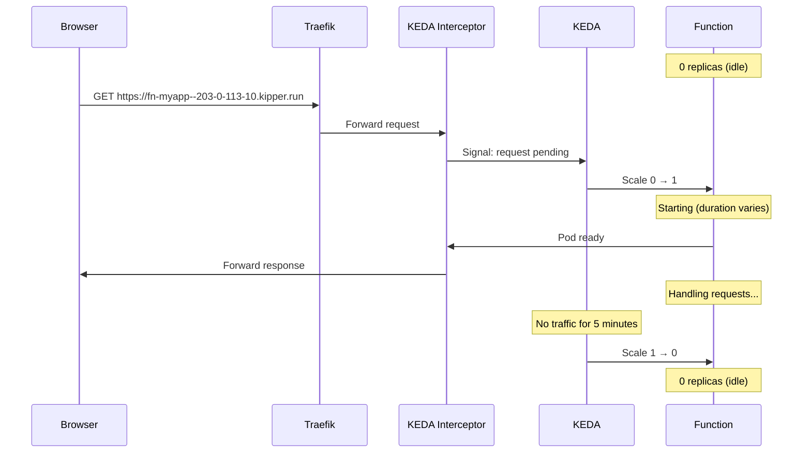
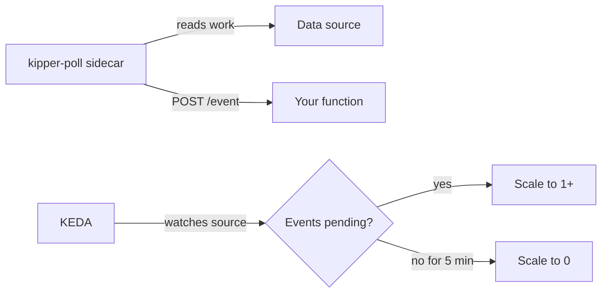

# Functions

Kipper functions run code on HTTP requests, schedules, or service events. HTTP and event-driven functions can scale to zero between invocations; scheduled functions run as CronJobs.

HTTP functions use the KEDA HTTP Add-on to queue requests while a pod starts. Cold-start time depends on image downloads, dependencies, and application startup. Callers should allow for that delay and handle timeouts.

## Building a function in the browser

Open **Functions** in the console sidebar, then choose **New function** or an existing function to edit. The form groups code, triggers, bindings, environment variables, secrets, dependencies, resources, and logs into collapsible sections.

Use **Save & deploy** to save your code and configuration. When creating a function, bindings and secrets are saved with it. When editing, binding changes take effect as you add or remove them.

## Code

Inline code is the fastest way to get something running. Pick a runtime (Node 22 or Python 3.12), write a handler, hit Save & deploy. Kipper uses a prebuilt runtime image, mounts your source as a ConfigMap, and installs the dependencies you declare.

### Node.js handler

```javascript
module.exports = async (event, context) => {
  console.log('Processing:', event)

  return {
    statusCode: 200,
    headers: { 'Content-Type': 'application/json' },
    body: { processed: true, timestamp: new Date().toISOString() }
  }
}
```

For HTTP routes other than the reserved `/health` and `POST /event`, `event` contains `method`, `path`, `headers`, `query`, and `body`. The runtime uses the returned `statusCode`, `headers`, and `body` to build the response.

For `POST /event`, `event` is the JSON request body and `context` contains `method`, `headers`, and `path`. The return value becomes a JSON response with status 200; throw an error to return 500.

For cron and test runs, `event` contains `type` (`cron` or `test`) and `timestamp`, and `context.mode` is `batch`.

### Python handler

```python
def handler(event, context=None):
    print('Processing:', event)
    return {'processed': True}
```

For POST requests, `event` is the parsed JSON body and `context` contains the request method, path, and headers. GET requests other than `/health` pass those fields in `event`. Cron and test runs receive the same batch event shape as Node.js.

### AI assistant in the editor

Click **AI Assistant** in the Code section header to open a side panel beside the editor. The chat is context-aware. It sees:

- The runtime (Node 22 or Python 3.12)
- Service bindings with their injected env var names (e.g. `eventdb (postgres) → DB_HOST DB_PORT DB_USERNAME DB_PASSWORD DB_NAME`)
- Environment variable keys (names only)
- Secret keys (names only; the context excludes stored secret values)
- Installed dependencies and their versions

The **Kipper knows** block lists this configuration context. The assistant also receives your code, conversation, and any attachments, so avoid including secret values in them.

When the AI suggests code that imports a package not in your dependencies, a small `+ pkg` button appears next to the **Apply to editor** button. Click it to add the package and the Dependencies section opens for you to set a version.

The AI assistant requires an AI provider configured under Settings. See the [Configuration](/en/configuration) page.

#### Attaching files

Click the paperclip in the chat input or drag files onto the input area. Useful when porting code from another stack: drop in your Java service classes and `pom.xml` and ask "convert this to a Python serverless function". The files become part of the prompt so the model can reference them directly.

Limits: 256 KB per file, 1 MB total per message. Text source files only: Java, Kotlin, Go, Python, JS/TS, YAML, XML, JSON, SQL, shell scripts, Dockerfiles, Markdown, plain text. Binaries, images, and PDFs aren't supported. A token estimate appears under the input once you're past 1k tokens. If it climbs into six figures, trim attachments to keep the model focused on what matters.

Attached file names appear as chips on your message bubble in the chat history. The full file content is sent to the model but the bubble stays compact.

## Trigger

Pick how the function gets invoked.

### HTTP

Default. The function gets a public URL and scales based on request rate via the KEDA HTTP Add-on.

```
https://fn-<name>--<cluster>.kipper.run
```

For example: `https://fn-webhook-handler--203-0-113-12.kipper.run`. Allow for a cold-start delay on the first request.

### Cron

Pick **Cron**, type the schedule, or pick a preset from the dropdown. The form shows a human-readable description (`Every day at 02:00 UTC`) and the next 5 firing times so you can confirm before saving.

| Preset | Cron |
|---|---|
| Every minute (testing) | `* * * * *` |
| Every 5 minutes | `*/5 * * * *` |
| Every hour, on the hour | `0 * * * *` |
| Every day at midnight UTC | `0 0 * * *` |
| Every day at 02:00 UTC | `0 2 * * *` |
| Every Monday at 09:00 UTC | `0 9 * * 1` |

The function controller renders cron triggers as a Kubernetes `CronJob`. No HTTP entry point, just a periodic invocation of your handler. Bound services and env / secrets flow through unchanged.

#### Test run

Use **Test run** in the Cron section to run the saved function immediately with its image, environment, bindings, and volumes. This creates an independent run and leaves the schedule unchanged.

The test run sets `KIPPER_TRIGGER=test` instead of `cron`, so your handler can branch on it:

```python
import os

def handler(event, context=None):
    is_test = os.environ.get("KIPPER_TRIGGER") == "test"
    if is_test:
        print("test run, skipping outbound notifications")
    # ... rest of the logic
```

Before starting a test run:

- Save your changes first; test runs use the saved function configuration.
- The test pod's logs land in the same Loki stream as scheduled runs, filtered by the `app=<function>` label. The Logs section pops open and refreshes automatically when you click Test run.
- Each test creates a separate `batch/v1.Job` named `<function>-test-<hex>` that self-cleans 10 minutes after completion. Failures show as a failed Job (no retry).
- A test launched within a couple of minutes of the scheduled run can race with the cron pod. Both will run; if the function isn't safe to run twice, hold off near the schedule.

### Postgres / MySQL / Redis / MinIO

For Postgres, MySQL, and Redis, KEDA watches query results or list length and scales the function when work is pending. The `kipper-poll` sidecar reads that work and sends it to your handler as `POST /event`. MinIO uses a webhook receiver and scheduled scaling. See [How event triggers work](#how-event-triggers-work) for delivery behavior and MinIO setup limits.

## Service bindings

Bind a Kipper service to inject its connection details as prefixed env vars. The form shows a picker of services in the project; selecting one previews the env var names that will be injected.

```
eventdb (postgres)                        [unbind]
Database: domain_sync_dev    Prefix: DB_
Injects:  DB_HOST  DB_PORT  DB_USERNAME  DB_PASSWORD  DB_NAME
```

The injected names depend on the service type. Database services (Postgres, MySQL, MongoDB) use `DB_` by default; Redis uses `REDIS_`; MinIO uses `S3_`. Override the prefix when binding if you need to.

For Postgres and MySQL, the console lets you select an existing database or name a new one when binding. Choose a separate database when the function should own its data.

CLI:

```bash
kip function bind domain-sync eventdb --project domains --environment prod
kip function unbind domain-sync eventdb --project domains --environment prod
```

Use `--prefix` to change the injected variable prefix and `--database` to choose the database.

## Environment variables and secrets

Two key/value tables on the function form.

**Environment variables** are non-sensitive configuration. Edit inline; persisted as a `Spec.Env` map on the Function CR. The reconciler resolves the whole environment and publishes it as one immutable Secret named for a digest of its contents, `function-<name>-env-<digest>`, which the Deployment, the cron CronJob and test runs all name in `EnvFrom`. The name carries the kind, so a function and an app of one name keep separate configuration on a cluster old enough to hold both. New ones cannot be created, since [a name belongs to one workload kind](#names-are-shared-across-workload-kinds).

A value may reference another by name, the same [`${NAME}` syntax apps use](/en/secrets#referencing-another-variable), so a function composes a connection string from a binding's credentials instead of carrying the password. One Secret serves the HTTP pod and every batch run, so `KIPPER_MODE` and `KIPPER_TRIGGER` are the two names a reference cannot resolve: they mean different things in each.

**Secrets** store sensitive values separately from ordinary environment variables. Lists show key names and whether a previous value is available; revealing a value requires explicit permission. Kipper publishes them into the function’s environment. See [Secrets & Environment](/en/secrets).


```bash
kip function env set domain-sync REGISTRAR_HOST=api.registrar.example.com
kip function env list domain-sync
kip function env delete domain-sync REGISTRAR_HOST

kip function secret set domain-sync REGISTRAR_API_KEY
# ... prompts for the value
kip function secret list domain-sync
kip function secret delete domain-sync REGISTRAR_API_KEY
```

A pod reads its environment once, at startup, so a running function keeps the values it started with until it restarts. These commands save the change and say so; add `--restart` to apply it in the same step. A function that has scaled to zero picks the new values up on its next cold start either way.

## Dependencies

Inline functions can declare third-party packages. The runtime container installs them at startup from a `package.json` (Node) or `requirements.txt` (Python) generated from your declarations.

In the form, add packages one row at a time as `name@version`. The **Scan code** button parses your editor for `require(...)` / `import` statements and pre-fills missing rows so you don't have to type them by hand.

CLI:

```bash
kip function create domain-sync \
  --code-file ./domain-sync.js \
  --runtime node \
  --trigger cron --schedule "0 2 * * *" \
  --dependency pg@8.11.5 \
  --dependency axios@1.6.7
```

Pin exact versions to keep direct dependencies consistent across pod restarts. Transitive dependencies can still change.

## Volume mounts

Mount a Kipper volume (`kip volume create cache`) into a function's pod. Useful for shared caches, scratch space, or anything you want to persist across function invocations. Pass `--volume name:/container/path` (e.g. `--volume cache:/data`), repeated for more than one.

```bash
kip function create cache-warmer \
  --code-file ./warmer.py \
  --runtime python \
  --volume cache:/data
```

The volume is also mounted into the cron CronJob's pod for cron-triggered functions, so the cache survives across runs.

## Resources

Set CPU and memory per function pod in the Resources section of the form. Equal request and limit values set a fixed size. A request below its limit defines a range for tuning the function Deployment. Saved changes update its pod template; cron and one-off runs use the configured values when new pods start. See [Your own CPU and memory values](/en/resource-management#your-own-values).

## Logs

Logs from past invocations are queried from Loki. The Logs section in the form shows the last hour by default with a search box and a time-range select (5m / 15m / 1h / 6h / 24h / 7d). Cron functions only emit logs while a run is in flight, so a quiet log section is normal between runs.

## URL format

Every HTTP function gets a public URL automatically:

```
https://fn-<name>--<cluster>.kipper.run
```

URLs are unique within a cluster. Kipper rejects duplicate hostnames across all apps and functions.

## Names are shared across workload kinds

Within one environment, an app, a function and a job cannot share a name. All three run a workload named after themselves, and one workload can only belong to one owner, so the second one would never start.

Kipper reserves the name when a workload is created. The reservation is a `WorkloadName` object in the environment's namespace, named after the workload, so exactly one of two workloads racing for a name gets it and the other is told who holds it. It is owned by the workload, so deleting the workload frees the name.

Creating a function over a name an app or a job already holds is refused, from the CLI and the console alike, and the error says which kind is holding it:

```
the name "checkout" is already used by an app in this environment; an app, a function and a job cannot share a name
```

If a collision does reach the cluster anyway, the function that lost reports it instead of looking idle with a URL that 404s. `kip function list` and the console both show it as `failed`. The function's `ChildrenAdopted` condition carries the detail, naming the object and the kind that owns it.

On older clusters, existing workloads may already share a name. The older workload keeps the reservation; the other reports `failed` and stops reconciling. Existing resources remain, so it may still serve traffic. Resolve the collision by renaming or deleting the affected workload.

Each environment has its own namespace and its own names, so `checkout` in `shop-staging` and `checkout` in `shop-prod` are fine whether they are two environments of one project or two separate projects.

## Building from a Docker image

For functions that need a custom base image or a runtime Kipper doesn't provide, use `--image` instead of `--code-file`:

```bash
kip function create webhook-handler \
  --image registry.git.example.com/webhook-handler:latest \
  --trigger http \
  --port 8080 \
  --project blog --environment prod
```

The same form fields apply (bindings, env, secrets, volumes, cron). You bring your own runtime.

## CLI reference

```bash
# Create
kip function create <name> --image <image> [flags]
kip function create <name> --code-file <path> --runtime node|python [flags]

# Manage
kip function list                          # every project, plus functions with none
kip function list --project blog           # one project
kip function logs <name>
kip function delete <name1> <name2> ...   # accepts multiple args

# Bindings
kip function bind <name> <service> [--prefix <prefix>] [--database <name>]
kip function unbind <name> <service>

# Env + secrets
kip function env set <name> KEY=value
kip function env list <name>
kip function env delete <name> KEY
kip function secret set <name> KEY    # prompts for value
kip function secret list <name>
kip function secret delete <name> KEY
```

Flags on `kip function create`:

| Flag | Description |
|---|---|
| `--image` | Container image (or use `--code-file` for inline) |
| `--code-file` | Path to a local source file with the handler code |
| `--runtime` | `node` or `python` (required with `--code-file`) |
| `--trigger` | `http` (default), `cron`, `postgres`, `mysql`, `redis`, `minio` |
| `--schedule` | Cron expression for `--trigger cron` |
| `--source` | Service name for event triggers |
| `--query` | SQL query for postgres / mysql triggers |
| `--mark-done` | SQL run after each row is processed |
| `--list` | Redis list name for redis triggers |
| `--bucket` | MinIO bucket for minio triggers |
| `--port` | Port the function listens on (default 8080) |
| `--dependency` | Inline dep `name@version` (repeatable) |
| `--volume` | Mount a Kipper volume `name:/path` (repeatable) |

## How scale-to-zero works


```mermaid
sequenceDiagram
    participant Browser
    participant Traefik
    participant Interceptor as KEDA Interceptor
    participant KEDA
    participant Function

    Note over Function: 0 replicas (idle)
    Browser->>Traefik: GET https://fn-myapp--203-0-113-10.kipper.run
    Traefik->>Interceptor: Forward request
    Interceptor->>KEDA: Signal: request pending
    KEDA->>Function: Scale 0 → 1
    Note over Function: Starting (duration varies)
    Function->>Interceptor: Pod ready
    Interceptor->>Browser: Forward response
    Note over Function: Handling requests...
    Note over KEDA: No traffic for 5 minutes
    KEDA->>Function: Scale 1 → 0
    Note over Function: 0 replicas (idle)
```

The KEDA HTTP interceptor proxy sits between Traefik and your function. When the function is at zero replicas:

1. The request arrives at the interceptor.
2. The interceptor holds the connection (the browser waits).
3. KEDA scales the function from 0 to 1.
4. Once the pod is ready, the interceptor forwards the request.
5. The interceptor returns the function’s response to the caller.

The interceptor also forwards requests to warm function pods. After the idle timeout (default five minutes), KEDA scales it back to zero.

## Auto-scaling under load

HTTP functions scale from 0 to 10 replicas. Kipper configures a request-rate target of 5 over a one-minute window and a five-minute scale-down period. Replica counts depend on observed traffic and KEDA's scaling decisions.

Postgres, MySQL, and Redis functions also allow up to 10 replicas, using pending rows or list length as the scaling signal.

## How event triggers work

For Postgres, MySQL, and Redis triggers, Kipper runs a **kipper-poll** sidecar alongside the function:


```mermaid
flowchart LR
    B[kipper-poll sidecar] -->|reads work| A[Data source]
    B -->|POST /event| C[Your function]
    D[KEDA] -->|watches source| E{Events pending?}
    E -->|yes| F[Scale to 1+]
    E -->|no for 5 min| G[Scale to 0]
```

1. **KEDA** checks the query result count or Redis list length every 10 seconds.
2. When events appear, KEDA scales the function from 0 to 1.
3. **kipper-poll** connects to the data source and polls for work.
4. Each event is forwarded as `POST /event` to your function on `localhost`.
5. Your function processes the event and returns a successful HTTP response.
6. When the source stays idle for the five-minute cooldown, KEDA can scale back to 0.

An event-triggered function has no public URL. The sidecar reaches your handler
over `localhost` inside the pod, so nothing needs to be exposed. Give the
function an `http` trigger as well if you want to call it from outside too.

Inline handlers receive the event as described in [Code](#code). A custom image must serve `POST /event` on its configured port.

Delivery behavior depends on the source:

- **Postgres / MySQL:** each selected row becomes a JSON object. The poller attempts `--mark-done` only after successful delivery. Make handlers safe to run more than once: multiple replicas can select the same row, and a failed update can leave a delivered row pending.
- **Redis:** the poller removes each item with `LPOP` before delivery. JSON items are passed as parsed values; other items are wrapped as `{"data": "..."}`. Failed deliveries are logged, and the item is not requeued.
- **MinIO:** the sidecar listens for webhook POSTs on port 9090 and forwards their JSON body. Kipper currently configures a KEDA cron scaler requesting one replica from minute 0 to minute 59 of every hour, rather than watching bucket activity. The function controller does not configure bucket notifications or expose the webhook port; those require separate setup. Setting `--bucket` alone does not establish event delivery.

## All trigger types

| Trigger | Source | Scale signal | Use case |
|---|---|---|---|
| `http` | HTTP requests | Request rate | Webhooks, APIs, lightweight endpoints |
| `cron` | Schedule | Time | Periodic sync, daily reports, cleanup |
| `postgres` | PostgreSQL query | Row count > 0 | Process new orders, sync data |
| `mysql` | MySQL query | Row count > 0 | Same as PostgreSQL |
| `redis` | Redis list | List length > 0 | Job queues, message processing |
| `minio` | Bucket notification webhooks | Scheduled replica window | Image processing, file conversion; requires webhook setup |

## Functions vs apps vs jobs

| | Apps | Functions | Jobs |
|---|---|---|---|
| Always running | Yes | No (scale-to-zero) | No (run once or scheduled) |
| Triggered by | HTTP traffic | HTTP, cron, events | Schedule or manual |
| Scaling | Manual or HPA | Automatic (KEDA) | N/A |
| Cold start | Already running | Depends on image and startup | N/A |
| Workload compute when idle | Running pods | Zero when scaled to zero | Zero between runs |
| Source | Container image | Inline code or container image | Container image |
| Use case | Web servers, APIs, frontends | Webhooks, event handlers, scheduled scripts | Batch tasks, migrations, ETL |

The decision rule:

- **Function** when you want to write code (Node or Python) and have Kipper handle the runtime, deps, bindings.
- **App** when you have constant traffic, low-latency requirements, or WebSocket connections.
- **Job** when you have a pre-built container and just want it to run once or on a schedule.

## Postgres trigger example

```bash
kip function create process-orders \
  --image registry.git.example.com/order-processor:latest \
  --trigger postgres \
  --source mydb \
  --query "SELECT * FROM orders WHERE status = 'pending'" \
  --mark-done "UPDATE orders SET status = 'done' WHERE id = {{id}}" \
  --port 8080
```

Your function receives each row in the JSON body of `POST /event`:

```json
{
  "id": 42,
  "customer": "acme",
  "amount": 99.99,
  "status": "pending"
}
```

### Mark rows as processed

Use `--mark-done` to update a row after the function accepts it. Each `{{column}}` placeholder binds the matching row value as a database parameter, keeping row data separate from SQL. Include every referenced column in your `--query` result; a placeholder for a missing column stays unchanged.

Placeholders work in value positions and ordinary single-quoted strings:

| Template fragment | Meaning |
|---|---|
| `WHERE id = {{id}}` | Bind the row's `id` as a value |
| `WHERE id = '{{id}}'` | Bind one value; the surrounding quotes are removed |
| `SET reference = 'order-{{id}}'` | Concatenate fixed text with the bound value |
| `WHERE name LIKE '%{{name}}%'` | Concatenate wildcard text with the bound value |

Use literal table and column names in the SQL. Parameters represent values, so a placeholder in an identifier position cannot select a table or column.

The poller validates the template at startup. Use one statement and write parameters as `{{column}}`, rather than native PostgreSQL `$1` or MySQL `?` markers. Placeholders are rejected inside comments, double quotes, backticks, dollar-quoted strings, and prefixed strings such as PostgreSQL `E'...'` or MySQL `_utf8mb4'...'`. If adjacent string literals contain a placeholder, combine them into one literal.

For PostgreSQL, add an explicit cast when the surrounding SQL cannot determine a parameter's type, for example `{{created}}::timestamptz` or `jsonb_build_object('id', {{id}}::int)`. A placeholder mixed with fixed text produces a text concatenation. Ordinary PostgreSQL strings are parsed assuming `standard_conforming_strings=on`.

Delivery and the update are separate operations. A delivery error skips the update; an update error is logged and can leave the row eligible for delivery again. During shutdown, a row already delivered gets an update attempt with a ten-second timeout. Design the handler to tolerate repeated delivery.

## Security settings

Functions have the same security settings as apps. Open the function form → Resources / Settings sections to toggle security headers and configure the CSP allowlist for external domains. See [Security: CSP allowlist](/en/security#csp-allowlist).
