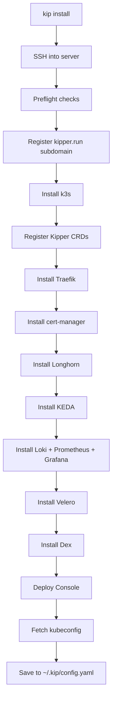

# Installation Reference

For your first cluster, follow [Getting Started](/en/getting-started). This page covers installation flags, server requirements, and setup details.

## kip install

Installs a production-ready Kubernetes cluster on a remote Linux server.

```bash
kip install --host <ip> [flags]
```

### Flags

| Flag | Required | Default | Description |
|---|---|---|---|
| `--host` | Yes | — | IP address or hostname of the target server |
| `--ssh-key` | No | see below | Path to SSH private key. Saved to `~/.kip/config.yaml` so subsequent `kip` commands inherit it. If unset, `kip` reads `KIP_SSH_KEY`, then `cluster.ssh_key` from config; if still unset, ssh consults your ssh-agent and `~/.ssh/config` as normal |
| `--domain` | No | `<ip>.kipper.run` | The name the cluster serves on. A `*.kipper.run` name (`lab.kipper.run`) is registered for you on the shared gateway; anything else is a domain whose DNS you run yourself, and whose hostnames have to resolve to the server before you install (see [DNS for a domain you run](#dns-for-a-domain-you-run)). Omit it and the free name is derived from the server's address. See [choosing your own name](/en/domains#choosing-your-own-name) |
| `--admin-email` | No | `admin@<domain>` | Email for Let's Encrypt certificates and the admin account. Defaults to `admin@<domain>` when `--domain` is a domain you run, otherwise `admin@kipper.local` |
| `--org` | No | — | Organisation short code (e.g. `acme`), used as namespace prefix |
| `--org-display-name` | No | — | Human-readable organisation name (e.g. `Acme Inc`) |
| `--harden` | No | `true` | Disable surplus host services exposed on public interfaces (e.g. `rpcbind`). Pass `--harden=false` only when you manage host security yourself |
| `--admin-kubeconfig` | No | `false` | Write the shared k3s admin certificate to this machine instead of a per-operator OIDC kubeconfig. The certificate is unattributed and revocable only by rotating the cluster CA. A CI escape hatch, not the everyday path |
| `--no-login` | No | `false` | Skip the inline browser sign-in during install. The machine ends up with a credential-free kubeconfig; the first operator runs `kip auth login && kip auth verify` afterwards |
| `--firewall` | No | `true` | Install and configure UFW with k3s-correct rules. Skipped automatically if another firewall is already active. Pass `--firewall=false` only when you manage host security yourself |
| `--no-ssh-rate-limit` | No | `false` | Open the SSH port outright instead of rate-limiting it. See below |
| `--dns-resolver` | No | `1.1.1.1`, `8.8.8.8`, `9.9.9.9` | Upstream DNS resolver CoreDNS forwards external queries to. Repeatable, up to three IPv4 addresses (the resolv.conf nameserver limit; the cluster pod network is IPv4-only). Kipper forwards to reliable public resolvers instead of the host's `/etc/resolv.conf`, which varies by provider and can carry unreachable or rate-limited entries that break cluster DNS. The default sends your workloads' external DNS lookups to Cloudflare, Google, and Quad9. On private, split-horizon, or data-residency-sensitive networks, set your own resolvers (e.g. `--dns-resolver 10.0.0.53`), which is also how clusters resolve internal or corporate names. During install, Kipper checks each resolver is reachable from the server on port 53 and warns about any that are not |
| `--trusted-proxy` | No | — | IP or CIDR whose `X-Forwarded-*` headers Traefik honours. Repeatable. Set it when an external load balancer or proxy sits in front of the cluster, so apps and logs see real client addresses instead of the balancer's. The kipper.run gateway is trusted automatically; with no proxy in front, leave it unset and forwarded headers are ignored |
| `--backup-storage-bucket` | No | — | S3-compatible bucket name for Velero backups. When set, backups live off-cluster and survive a wipe. See [External backup storage](#external-backup-storage) below |
| `--backup-storage-region` | If bucket set | — | AWS region or provider equivalent. Use the actual region for AWS S3, `auto` for Cloudflare R2, whatever your provider expects elsewhere |
| `--backup-storage-endpoint` | No | — | S3 endpoint URL. Omit for native AWS S3 (Velero derives it from the region). Required for R2, self-hosted MinIO, B2, Wasabi, DigitalOcean Spaces |
| `--backup-storage-credentials` | No | `~/.aws/credentials` | Path to an AWS-style INI credentials file. Read only at install time and never stored back on disk |
| `--backup-storage-profile` | No | `default` | Profile name inside the credentials file. Lets you reuse an existing AWS CLI profile like `acme` without copying it to a separate file |

#### DNS for a domain you run

`--domain example.com` puts the console on `console.example.com`, the API on `console-api.example.com` and the login on `dex.example.com`, and every app you deploy afterwards gets its own host under the same domain. cert-manager issues a Let's Encrypt certificate for each of those hosts and solves the HTTP-01 challenge against it, so each one has to resolve to the server.

One wildcard A record covers all of them, including the apps you have not deployed yet:

```
*.example.com.   A   203.0.113.10
```

Individual records work too, so long as `console`, `console-api` and `dex` exist before you install and you add another for every app you deploy afterwards.

The install looks up `console`, `console-api` and `dex`, including any per-host overrides, and warns when any of them do not resolve yet; it still continues, because DNS may only be minutes from propagating. The check asks only whether each name resolves somewhere, so a record pointing at the wrong address still passes. Separately, an install that ends in a browser sign-in waits up to five minutes for `dex.example.com` to answer its discovery URL over verified TLS, and tells you whether DNS or the certificate is what it is waiting for; if that never comes good it finishes anyway, with sign-in deferred. Four routes skip the wait: `--admin-kubeconfig`, `--no-login`, a run with no terminal, and a re-install by an operator whose session is still valid. Missing records still show up later as their own service failing: `console.` as a page that will not load, `dex.` as a sign-in that never completes, and `console-api.` as the `kip` commands that call the console API refusing to connect. The browser console is unaffected by that last one, because it reaches the API through `/api` on its own host.

Adding the record afterwards is enough on its own. cert-manager keeps retrying and issues once the hostnames resolve, and `kip auth login` finishes the sign-in that was deferred. See [troubleshooting certificates](/en/domains#troubleshooting-certificates).

#### SSH rate limiting

The default UFW rule rate-limits new SSH connections to six in thirty seconds from one source address. Kipper normally shares one SSH connection during installation.

Turn it off with `--no-ssh-rate-limit` if your legitimate traffic can look like a burst:

- CI that runs several `kip` commands in a row
- Two or more people administering the server from the same office or VPN address
- Any automation that opens SSH connections in quick succession

```bash
kip install --host 203.0.113.10 --domain example.com --no-ssh-rate-limit
```

You can change your mind later:

```bash
kip cluster harden --no-ssh-rate-limit
```

Kipper also skips the rate limit on its own when it cannot share one connection for the whole install, on a machine where it cannot write to your home directory for instance. Rate-limiting a port it then needs hundreds of connections through would lock it out of your half-built server.

## What it installs



### Preflight checks

Before installing, Kipper verifies:

- **OS:** Ubuntu 20.04, 22.04, 24.04, 26.04, or Debian 11, 12
- **RAM:** 2 GB minimum. The `nano` sizing profile disables monitoring. The installer recommends at least 8 GB for production workloads.
- **Disk:** 30 GB free space minimum; allow additional space for images, data, and backups.
- **Ports:** 80 (HTTP), 443 (HTTPS), and 6443 (Kubernetes API) must not be in use by another service. The installer stops if something other than k3s, such as nginx or a Docker container, already listens on one of them

Kipper selects a system sizing profile from detected RAM. The cutoffs are 3500, 7500, 15000, and 30000 MB as reported by the installer, allowing a margin below advertised server sizes. See [Sizing profiles](/en/platform-resources#sizing-profiles) for the ranges and component allocations.

::: tip Plan for your workload
The preflight minimums let you install Kipper. Choose additional CPU, memory, and disk capacity for your apps, persistent data, monitoring, and backups. Leave room for image downloads, startup peaks, and overlapping pods during updates.

The AI bundle has its own [memory and backup-storage checks](/en/ai#what-hardware-do-you-need). Measure performance with representative workloads before relying on a server size for production.
:::


If you're on the `small` profile and need more room for apps, disabling the monitoring stack frees ~1-2 GB:

```bash
kip platform disable prometheus
kip platform disable loki
```

The `nano` profile already disables monitoring. See [Platform Resources](/en/platform-resources) for the full picture.

### Components installed

| Component | Purpose |
|---|---|
| [k3s](https://k3s.io) | Lightweight Kubernetes distribution |
| [Traefik](https://traefik.io) | Ingress controller and reverse proxy |
| [cert-manager](https://cert-manager.io) | Automatic TLS certificates via Let's Encrypt |
| [Longhorn](https://longhorn.io) | Distributed persistent storage |
| [Dex](https://dexidp.io) | Identity provider (OAuth2/OIDC) |
| [Prometheus](https://prometheus.io) + [Grafana](https://grafana.com) | Metrics and dashboards (can be [disabled](/en/observability#disabling-monitoring)) |
| [Loki](https://grafana.com/oss/loki/) | Log aggregation (can be [disabled](/en/observability#disabling-monitoring)) |
| [Velero](https://velero.io) | Backup and restore |
| [KEDA](https://keda.sh) | Event-driven autoscaling |
| Kipper Console | Web dashboard for cluster management |

### Re-running install

Re-running `kip install` updates a component that is already there rather than duplicating it, and it keeps the serving identity recorded in the cluster (the domain and hosts for the console, API, and login) even when the cluster has moved to a different domain since the original install. Passing a conflicting `--domain` is an error: domain changes go through `kip cluster domain`, which keeps login available throughout the change.

`kip upgrade` is the routine way to catch a cluster up. Re-running the install is destructive in one specific way: it re-renders the Dex ConfigMap, which deletes every user account created through the console. Read [what an upgrade moves](/en/maintenance#what-an-upgrade-moves-and-what-it-does-not) before re-running it on a cluster that has any.

### External backup storage

By default Kipper installs an in-cluster MinIO and points Velero at it. That gives every new cluster automatic backups with zero configuration, but those backups live on the cluster's own storage. A `kip cluster uninstall`, a hardware failure, or anything that wipes Longhorn data also wipes the backup bucket.

For a cluster you care about, point Velero at off-cluster object storage instead. The bucket must already exist, kip does not create it.

#### Native AWS S3

```bash
kip install \
  --host 203.0.113.10 \
  --domain example.com \
  --backup-storage-bucket example-kipper-backups \
  --backup-storage-region eu-west-1 \
  --backup-storage-profile acme
```

`--backup-storage-credentials` defaults to `~/.aws/credentials`. `--backup-storage-profile` defaults to `default`. Both `[NAME]` (the credentials file convention) and `[profile NAME]` (the config file convention) section headers are accepted.

#### Cloudflare R2 or other S3-compatible providers

```bash
kip install \
  --host 203.0.113.10 \
  --domain example.com \
  --backup-storage-bucket example-kipper-backups \
  --backup-storage-region auto \
  --backup-storage-endpoint https://<accountid>.r2.cloudflarestorage.com \
  --backup-storage-credentials ~/r2-credentials
```

Same shape works for self-hosted MinIO, Backblaze B2, Wasabi, and DigitalOcean Spaces. Set `--backup-storage-endpoint` to your provider's S3 URL.

#### Credentials handling

The credentials file is read once at install time and never written to disk again. Kipper creates a Kubernetes Secret (`cloud-credentials` in the `velero` namespace) on the cluster, and the Velero HelmChart references that Secret by name. Your local kip config records the bucket, region, and endpoint but never the keys.

`kip upgrade` re-applies the Velero chart without rotating the secret, so you do not need to keep the credentials file around after install. To rotate keys, run `kip install` again with the updated credentials file pointing at the same host, which replaces the Secret in place. It re-runs the rest of the install as well, so read [what an upgrade moves](/en/maintenance#what-an-upgrade-moves-and-what-it-does-not) before doing it on a cluster with console-created users.

#### One-shot decision

Backup storage is chosen at install time. No command migrates a running cluster from one mode to another, and **uninstalling to switch destroys your backups**: in in-cluster mode they live on the cluster, so `kip cluster uninstall` removes them along with everything else and there is nothing left to restore from.

Re-running `kip install` with `--backup-storage-bucket` against the same host does repoint Velero at external storage, but it does not move the backups you already have, and it re-runs the rest of the install. Treat it as a change to make deliberately rather than a migration.

The route that keeps your data is to install a second cluster with external storage from the start and move workloads onto it, taking anything you need off the first by a route that does not depend on its in-cluster backups. Both clusters can live in your config at once; switch between them with `kip cluster use`.

## Sharing access with your team

After installing, you can give other developers access to the cluster without sharing SSH keys or server passwords. Invite each person, assign project membership, then export the cluster connection details:

```bash
kip cluster export > my-cluster.kip
```

Team members import the file, sign in as themselves, and start working:

```bash
kip cluster add my-cluster.kip --set-current
kip auth login
kip status
```

The export contains connection details and the public CA certificate. Each recipient signs in with their own account; permissions come from their role bindings and project membership.

Import creates a kubeconfig using Kipper’s credential plugin. It takes connection settings from the bundle and excludes executable plugins supplied by the sender. Existing kubeconfigs with credentials are preserved: move one aside deliberately if you intend to replace it.

The imported cluster name must be a valid plain name and must not conflict with another local kubeconfig.

See [Team Access](/en/team-access) for the full workflow, including managing multiple clusters, database tunnels, and shell access.

## What install writes to your machine

By default a fresh install writes a **credential-free** kubeconfig: it carries the cluster address and CA, and a `kip auth kubectl-token` exec plugin that serves your own short-lived OIDC token. The shared k3s admin certificate never leaves the server. At a terminal the installer signs you in inline and proves your identity works against the API server before finishing.

The admin account is printed first, because the sign-in asks for it.

```
  Admin sign-in
  Email:      admin@shop.kipper.run
  Password:   02026a371f24a488a86e654cada6e1c6

  Save these credentials now. They will not be shown again.
  If lost, run: kip auth reset-password

  Sign in to finish setup (a browser will open; Ctrl+C to skip and finish later with: kip auth login)
  kubectl authenticates as admin@shop.kipper.run: the admin certificate never left the server (break-glass: ssh, then sudo k3s kubectl)
```

Headless installs (CI, no terminal, or `--no-login`) finish credential-free without the sign-in; the first operator runs `kip auth login && kip auth verify`. The admin certificate reaches your machine only when you ask for it with `--admin-kubeconfig`, when an interactive install fails partway (so you can inspect the half-built cluster), or when sign-in genuinely fails to authorize against the cluster. Each case says so loudly.

### Kubernetes and console API authentication {#a-kubeconfig-is-not-a-login}

Most of `kip` talks to the Kubernetes API, so the certificate `--admin-kubeconfig` writes covers it: creating projects, adding services, deploying apps, reading logs, scaling, and everything `kubectl` does. A few commands go through the console API instead, which authenticates the operator rather than the kubeconfig, and they stop with `not authenticated. Run: kip auth login`:

- `kip service bind` and `kip service unbind`
- `kip function bind` and `kip function unbind`
- `kip app rebuild`
- `kip service share`
- `kip project allow-links` and `kip project links`
- `kip auth sessions revoke-all`

A pipeline holding only the certificate can therefore install a cluster, create a database and deploy an app, and connecting the two needs an operator to sign in once with `kip auth login`. The token that sign-in writes is what those commands read afterwards.

## Next steps

<span id="kip-cluster"></span>
<span id="kip-cluster-uninstall"></span>
<span id="kip-platform-restart"></span>
<span id="kip-cluster-env"></span>
<span id="kip-tunnel"></span>
<span id="kip-exec"></span>
<span id="naming-one-workload"></span>
<span id="kip-status"></span>
<span id="kip-cluster-dns-repair"></span>
<span id="kip-node-add"></span>
<span id="kip-node-list"></span>
<span id="kip-auth-verify"></span>
<span id="kip-auth-kubeconfig"></span>
<span id="kip-auth-kubectl-token"></span>
<span id="kip-auth-reset-password"></span>
<span id="kip-discover"></span>
<span id="kip-cert-list"></span>
<span id="kip-cert-email"></span>
<span id="kip-ai"></span>
<span id="kip-ai-configure-kip-ai-status"></span>
<span id="kip-ai-admin-create"></span>
<span id="kip-ai-install-kip-ai-uninstall"></span>
<span id="ai-bundle-health-on-the-platform-page"></span>
<span id="kip-ai-backup-kip-ai-restore"></span>
<span id="kip-app-update"></span>
<span id="kip-app-scale"></span>
<span id="kip-app-env-kip-app-secret"></span>
<span id="kip-app-link-kip-app-unlink"></span>
<span id="kip-service"></span>
<span id="kip-project"></span>
<span id="kip-project-members"></span>
<span id="kip-project-use"></span>
<span id="kip-app-promote"></span>
<span id="kip-function"></span>
<span id="kip-function-create-flags"></span>
<span id="kip-job"></span>
<span id="kip-volume"></span>
<span id="kip-volume-create-flags"></span>
<span id="kip-volume-mount-flags"></span>
<span id="kip-user"></span>
<span id="kip-user-import"></span>
<span id="kip-user-add-flags"></span>
<span id="kip-user-invite-flags"></span>
<span id="kip-2fa"></span>
<span id="kip-2fa-bootstrap"></span>
<span id="kip-2fa-remove"></span>
<span id="kip-registry"></span>
<span id="kip-credentials"></span>
<span id="granting-a-project"></span>
<span id="kip-backup"></span>
<span id="kip-backup-create-flags"></span>
<span id="kip-backup-restore-flags"></span>
<span id="kip-platform"></span>
<span id="kip-blueprint"></span>
<span id="kip-blueprint-install-flags"></span>
<span id="kip-apply"></span>
<span id="kip-diff"></span>
<span id="kip-export"></span>
<span id="kip-init"></span>

See the [CLI Reference](/en/cli-reference) for workload, cluster, and authentication commands.

<span id="kip-upgrade"></span>
<span id="clusters-installed-before-operator-login-existed"></span>
<span id="flags-1"></span>
<span id="what-an-upgrade-moves-and-what-it-does-not"></span>
<span id="recovering-from-a-failed-chart-upgrade"></span>

See [Upgrades & Maintenance](/en/maintenance) for upgrade scope, options, and recovery.
