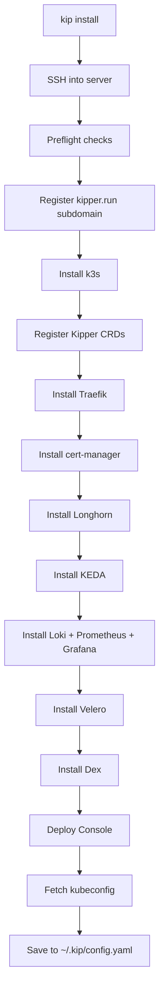

# Installation Reference

## kip install

Installs a production-ready Kubernetes cluster on a remote Linux server.

```bash
kip install --host <ip> [flags]
```

### Flags

| Flag | Required | Default | Description |
|---|---|---|---|
| `--host` | Yes | — | IP address or hostname of the target server |
| `--ssh-key` | No | see below | Path to SSH private key. Saved to `~/.kip/config.yaml` so subsequent `kip` commands inherit it. If unset, `kip` reads `KIP_SSH_KEY`, then `cluster.ssh_key` from config; if still unset, ssh consults your ssh-agent and `~/.ssh/config` as normal |
| `--domain` | No | `<ip>.kipper.run` | The name the cluster serves on. A `*.kipper.run` name (`lab.kipper.run`) is registered for you on the shared gateway; anything else is a domain whose DNS you run yourself. Omit it and the free name is derived from the server's address. See [choosing your own name](/en/domains#choosing-your-own-name) |
| `--admin-email` | No | `admin@<domain>` | Email for Let's Encrypt certificates and the admin account. Defaults to `admin@<domain>` when `--domain` is a domain you run, otherwise `admin@kipper.local` |
| `--org` | No | — | Organisation short code (e.g. `acme`), used as namespace prefix |
| `--org-display-name` | No | — | Human-readable organisation name (e.g. `Acme Inc`) |
| `--harden` | No | `true` | Disable surplus host services exposed on public interfaces (e.g. `rpcbind`). Pass `--harden=false` only when you manage host security yourself |
| `--admin-kubeconfig` | No | `false` | Write the shared k3s admin certificate to this machine instead of a per-operator OIDC kubeconfig. The certificate is unattributed and revocable only by rotating the cluster CA. A CI escape hatch, not the everyday path |
| `--no-login` | No | `false` | Skip the inline browser sign-in during install. The machine ends up with a credential-free kubeconfig; the first operator runs `kip auth login && kip auth verify` afterwards |
| `--firewall` | No | `true` | Install and configure UFW with k3s-correct rules. Skipped automatically if another firewall is already active. Pass `--firewall=false` only when you manage host security yourself |
| `--no-ssh-rate-limit` | No | `false` | Open the SSH port outright instead of rate-limiting it. See below |
| `--dns-resolver` | No | `1.1.1.1`, `8.8.8.8`, `9.9.9.9` | Upstream DNS resolver CoreDNS forwards external queries to. Repeatable, up to three IPv4 addresses (the resolv.conf nameserver limit; the cluster pod network is IPv4-only). Kipper forwards to reliable public resolvers instead of the host's `/etc/resolv.conf`, which varies by provider and can carry unreachable or rate-limited entries that break cluster DNS. The default sends your workloads' external DNS lookups to Cloudflare, Google, and Quad9. On private, split-horizon, or data-residency-sensitive networks, set your own resolvers (e.g. `--dns-resolver 10.0.0.53`), which is also how clusters resolve internal or corporate names. During install, Kipper checks each resolver is reachable from the server on port 53 and warns about any that are not |
| `--trusted-proxy` | No | — | IP or CIDR whose `X-Forwarded-*` headers Traefik honours. Repeatable. Set it when an external load balancer or proxy sits in front of the cluster, so apps and logs see real client addresses instead of the balancer's. The kipper.run gateway is trusted automatically; with no proxy in front, leave it unset and forwarded headers are ignored |
| `--backup-storage-bucket` | No | — | S3-compatible bucket name for Velero backups. When set, backups live off-cluster and survive a wipe. See [External backup storage](#external-backup-storage) below |
| `--backup-storage-region` | If bucket set | — | AWS region or provider equivalent. Use the actual region for AWS S3, `auto` for Cloudflare R2, whatever your provider expects elsewhere |
| `--backup-storage-endpoint` | No | — | S3 endpoint URL. Omit for native AWS S3 (Velero derives it from the region). Required for R2, self-hosted MinIO, B2, Wasabi, DigitalOcean Spaces |
| `--backup-storage-credentials` | No | `~/.aws/credentials` | Path to an AWS-style INI credentials file. Read only at install time and never stored back on disk |
| `--backup-storage-profile` | No | `default` | Profile name inside the credentials file. Lets you reuse an existing AWS CLI profile like `acme` without copying it to a separate file |

#### SSH rate limiting

The firewall Kipper installs rate-limits SSH: six connections in thirty seconds from one address, then that address is dropped for a while. A brute-force sweep looks exactly like that and a person never does, so this costs you nothing and keeps the noise off your server.

It matters more than it sounds. A server on a public IP gets scanned constantly, and OpenSSH starts refusing *new* connections once ten unauthenticated ones are in flight, including yours. One of our own installs failed halfway through for exactly that reason, while six bots were working through passwords on port 22.

Turn it off with `--no-ssh-rate-limit` if your legitimate traffic can look like a burst:

- CI that runs several `kip` commands in a row
- Two or more people administering the server from the same office or VPN address
- Any automation that opens SSH connections in quick succession

```bash
kip install --host 203.0.113.10 --domain example.com --no-ssh-rate-limit
```

You can change your mind later:

```bash
kip cluster harden --no-ssh-rate-limit
```

Kipper also skips the rate limit on its own when it cannot share one connection for the whole install, on a machine where it cannot write to your home directory for instance. Rate-limiting a port it then needs hundreds of connections through would lock it out of your half-built server.

## What it installs



### Preflight checks

Before installing, Kipper verifies:

- **OS:** Ubuntu 20.04, 22.04, 24.04, 26.04, or Debian 11, 12
- **CPU:** 2 vCPU minimum (4 vCPU is the realistic floor for anything beyond a hello-world app)
- **RAM:** 2 GB minimum (sub-4 GB installs run the `nano` profile with monitoring disabled). 8 GB is the realistic floor for a real workload. 16 GB+ for production.
- **Disk:** 30 GB minimum (80 GB realistic floor, 200 GB+ if you turn on backups or the AI bundle)
- **Ports:** 80 (HTTP), 443 (HTTPS), and 6443 (Kubernetes API) must be available

Kipper picks a system sizing profile at install time based on detected RAM: `nano` below 4 GB, `small` for 4-8 GB, `medium` for 8-16 GB, `large` for 16-32 GB, `xlarge` above 32 GB. The profile controls how much memory Prometheus, Loki, and other system components get. The `nano` profile turns metrics off entirely so a small VPS has room for apps.

::: warning Be generous on every dimension
"Minimum" here means "Kipper installs and runs". It does not mean "Kipper is pleasant to use". On a 4 GB / 2 vCPU box, the install works, but a single backup, a routine OS update, or a busy app can push the node into memory pressure and start evicting workloads.

Be generous on every axis at once. Memory matters because Kubernetes evicts pods on pressure. CPU matters because Velero's Kopia backup is essentially single-threaded per volume, so a 5 GB PVC backup on a 2 vCPU box takes 10-15 minutes and a restore can take longer. Disk matters because Longhorn, MinIO (Velero's object store), monitoring metrics, and log retention all share it; the AI bundle's model cache alone is 2-10 GB depending on the model.

If you skimp on one axis and not the others, you'll hit a cascade. Disk fills, MinIO refuses writes, backups fail, cleanup needs more disk to make space. Pick a server with headroom on every dimension from the start; resizing later is more work than just paying for a bigger box up front.
:::

::: tip Recommended sizing in practice

| Use case | Spec | What you get |
|---|---|---|
| Demo or dev | 2-3 GB RAM, 2 vCPU, 40 GB SSD | The `nano` profile. Kipper runs without Prometheus, Loki, or Grafana. Enough for a hello-world app or two; no monitoring, no breathing room. |
| Evaluation | 4 GB RAM, 2 vCPU, 40 GB SSD | The `small` profile. Kipper installs and runs with monitoring enabled but tight. Velero's scheduled backups will fight with your apps for disk; the AI bundle won't fit. |
| Small team / production starter | 8 GB RAM, 4 vCPU, 80 GB SSD | Kipper plus a handful of apps. Backups work but are slow. Not enough free RAM for the [AI bundle](/en/ai). `kip ai install` needs 8 GiB free on a single node, which an 8 GB box cannot provide after k3s and system pods. |
| Production | 16 GB RAM, 8 vCPU, 200 GB NVMe | Several production apps with monitoring on. Backups complete in minutes. Comfortable headroom. |
| Production + AI | 32 GB RAM, 8+ vCPU (or NVIDIA GPU), 500 GB NVMe | The above plus the AI bundle running a 7B+ model with response times users won't complain about. |

For comparison, enterprise Kubernetes distributions typically require 3+ nodes with 16 GB each (48 GB+ total) just for the control plane.
:::

If you're on the `small` profile (4-8 GB) and need more room for apps, disabling the monitoring stack frees ~1-2 GB:

```bash
kip platform disable prometheus
kip platform disable loki
```

The `nano` profile (sub-4 GB) already does this for you. See [Platform Resources](/en/platform-resources) for the full picture.

### Components installed

| Component | Purpose |
|---|---|
| [k3s](https://k3s.io) | Lightweight Kubernetes distribution |
| [Traefik](https://traefik.io) | Ingress controller and reverse proxy |
| [cert-manager](https://cert-manager.io) | Automatic TLS certificates via Let's Encrypt |
| [Longhorn](https://longhorn.io) | Distributed persistent storage |
| [Dex](https://dexidp.io) | Identity provider (OAuth2/OIDC) |
| [Prometheus](https://prometheus.io) + [Grafana](https://grafana.com) | Metrics and dashboards (can be [disabled](/en/observability#disabling-monitoring)) |
| [Loki](https://grafana.com/oss/loki/) | Log aggregation (can be [disabled](/en/observability#disabling-monitoring)) |
| [Velero](https://velero.io) | Backup and restore |
| [KEDA](https://keda.sh) | Event-driven autoscaling |
| Kipper Console | Web dashboard for cluster management |

### Re-running install

Re-running `kip install` updates a component that is already there rather than duplicating it, and it keeps the serving identity recorded in the cluster (the domain and hosts for the console, API, and login) even when the cluster has moved to a different domain since the original install. Passing a conflicting `--domain` is an error: domain changes go through `kip cluster domain`, which keeps login available throughout the change.

It is not a general way to catch a cluster up, and it is destructive in one specific way: it re-renders the Dex ConfigMap, which deletes every user account created through the console. Read [what an upgrade moves](#what-an-upgrade-moves-and-what-it-does-not) before re-running it on a cluster with console-created users. `kip upgrade` is the routine path.

### External backup storage

By default Kipper installs an in-cluster MinIO and points Velero at it. That gives every new cluster automatic backups with zero configuration, but those backups live on the cluster's own storage. A `kip cluster uninstall`, a hardware failure, or anything that wipes Longhorn data also wipes the backup bucket.

For a cluster you care about, point Velero at off-cluster object storage instead. The bucket must already exist, kip does not create it.

#### Native AWS S3

```bash
kip install \
  --host 203.0.113.10 \
  --domain example.com \
  --backup-storage-bucket example-kipper-backups \
  --backup-storage-region eu-west-1 \
  --backup-storage-profile acme
```

`--backup-storage-credentials` defaults to `~/.aws/credentials`. `--backup-storage-profile` defaults to `default`. Both `[NAME]` (the credentials file convention) and `[profile NAME]` (the config file convention) section headers are accepted.

#### Cloudflare R2 or other S3-compatible providers

```bash
kip install \
  --host 203.0.113.10 \
  --domain example.com \
  --backup-storage-bucket example-kipper-backups \
  --backup-storage-region auto \
  --backup-storage-endpoint https://<accountid>.r2.cloudflarestorage.com \
  --backup-storage-credentials ~/r2-credentials
```

Same shape works for self-hosted MinIO, Backblaze B2, Wasabi, and DigitalOcean Spaces. Set `--backup-storage-endpoint` to your provider's S3 URL.

#### Credentials handling

The credentials file is read once at install time and never written to disk again. Kipper creates a Kubernetes Secret (`cloud-credentials` in the `velero` namespace) on the cluster, and the Velero HelmChart references that Secret by name. Your local kip config records the bucket, region, and endpoint but never the keys.

`kip upgrade` re-applies the Velero chart without rotating the secret, so you do not need to keep the credentials file around after install. To rotate keys, run `kip install` again with the updated credentials file pointing at the same host, which replaces the Secret in place. It re-runs the rest of the install as well, so read [what an upgrade moves](#what-an-upgrade-moves-and-what-it-does-not) before doing it on a cluster with console-created users.

#### One-shot decision

Backup storage is chosen at install time. No command migrates a running cluster from one mode to another, and **uninstalling to switch destroys your backups**: in in-cluster mode they live on the cluster, so `kip cluster uninstall` removes them along with everything else and there is nothing left to restore from.

Re-running `kip install` with `--backup-storage-bucket` against the same host does repoint Velero at external storage, but it does not move the backups you already have, and it re-runs the rest of the install. Treat it as a change to make deliberately rather than a migration.

The route that keeps your data is to install a second cluster with external storage from the start and move workloads onto it, taking anything you need off the first by a route that does not depend on its in-cluster backups. Both clusters can live in your config at once; switch between them with `kip cluster use`.

## Sharing access with your team

After installing, you can give other developers access to the cluster without sharing SSH keys or server passwords. Export the cluster credentials and send the file to your team:

```bash
kip cluster export > my-cluster.kip
```

Team members import the file, sign in as themselves, and start working:

```bash
kip cluster add my-cluster.kip --set-current
kip auth login
kip status
```

The export carries how to reach the cluster and the hosts it serves on, and no credential at all: `kip cluster export` renders the kubeconfig through the same path the import uses, so a machine still holding the shared admin certificate does not put it in the file. Kipper is per-operator: the kubeconfig it writes fetches short-lived tokens from your own login, so `kip auth login` is what turns an imported cluster into one you can use, and every action in the audit log names you rather than a shared certificate.

An import writes the cluster's kubeconfig to `~/.kip/clusters/<name>.yaml`, and it will not overwrite a credential it cannot put back. If that file holds the cluster's admin certificate, another tool's credential plugin, or any credential at all in any of its contexts, the import stops and names the entry, because on some machines that file is the only way in. Move it aside and run the import again to replace it. A kubeconfig Kipper wrote itself carries no credential, so re-importing an updated export over one of those is the ordinary way to pick up a changed domain.

What lands is a kubeconfig Kipper renders, not the one in the file you were sent. The server address, the cluster's certificate authority and the settings needed to reach that address (a proxy, a TLS server name) are taken from it and wrapped around Kipper's own credential plugin. Nothing else crosses. A kubeconfig is not only data, and an `exec` entry in one names a command your machine runs the next time anything asks for credentials, so nothing executable crosses over from a file someone sent you.

An export cannot choose where the import writes either. The name inside it has to be a plain cluster name: one carrying a path is refused, as is one that another cluster's kubeconfig already occupies, or a name Windows reserves for a device.

See [Team Access](/en/team-access) for the full workflow, including managing multiple clusters, database tunnels, and shell access.

## kip cluster

Manage cluster configurations on your local machine.

```bash
kip cluster export > file.kip        # export credentials for sharing
kip cluster add file.kip              # import a cluster
kip cluster add file.kip --set-current # import and switch to it
kip cluster list                      # list all clusters
kip cluster use <name>                # switch active cluster
kip cluster remove <name>             # remove local config
kip cluster uninstall <name>          # wipe the cluster off the remote host
kip cluster domain <domain>           # move to a custom domain (no-lockout cutover)
kip cluster domain <domain> --ack-sso-callbacks # confirm SSO callback URLs are updated
kip cluster domain --sync             # finish an interrupted domain change
kip cluster domain --rollback         # return to the previous domain
kip cluster domain --repair           # rewrite local config from the cluster
kip cluster hosts                     # show the hostnames kip uses for a cluster
kip cluster hosts --dex dex.example.com # correct one without contacting the cluster
kip cluster dns repair                # restore the curated DNS resolvers and restart CoreDNS
kip platform restart <component>      # restart a platform or cluster component
```

### kip cluster uninstall

Wipes Kipper from a remote Linux server. Runs k3s's own uninstall script over SSH, sweeps the data directories Kipper writes outside k3s (Longhorn volumes, Zot blobs, AI bundle data), and removes the cluster from your local kip config.

```bash
kip cluster uninstall storefront                  # interactive (prompts for cluster name)
kip cluster uninstall storefront --yes            # skip the confirmation prompt
kip cluster uninstall storefront --keep-local-config  # wipe host, keep local entry
kip cluster uninstall storefront --ssh-key ~/.ssh/kipper_ed25519
```

The command prompts you to type the cluster name to confirm, so you cannot tear down a cluster by reflex. Pass `--yes` only for automation.

A cluster on a free `*.kipper.run` subdomain also hands that name back to the gateway. The name is released after the host is wiped, using a credential read from the cluster beforehand: the gateway will only release a name to whoever holds its token, and that token lives on the cluster the wipe destroys. The name is free again straight away, so a rebuild of the same server can claim it back immediately. That also means links you published under it can be claimed by someone else, so move them before you uninstall if they still matter.

If the cluster cannot be reached, kip falls back to a copy of that credential it keeps in `~/.kip/config.yaml`, recorded on an earlier command. When neither is available the command says so and asks whether to wipe anyway. Answering no is the safe choice: wiping leaves the name registered with nothing able to release it, and installing on that host again cannot serve on it. Such a name stops serving after 30 days without contact and comes free 90 days after that, so waiting it out means waiting four months. `--yes` skips this question as well as the typed-name one, so scripted teardown consents to stranding a name it could not release.

If the server itself cannot be reached, kip offers to hand the name back without it, provided a credential for that name is recorded locally. Say yes only when the server is really gone: a cluster that is merely unreachable is still serving, and releasing its name takes it off the air. `--yes` never takes this offer, because a script cannot tell those two apart.

When the host is wiped but the gateway will not take the name back, the cluster stays in `~/.kip/config.yaml` and the command tells you to run it again. That entry is deliberate, because it holds the only credential that can still release the name, and it is why `kip cluster list` can show a server you have already wiped. The re-run goes straight to the gateway: it does not touch the host, so it works just as well on a server you have since destroyed.

```bash
kip cluster uninstall storefront
#   storefront was already wiped. Releasing its gateway name.
#
#   ✔  Gateway name released
#   ✔  Local config entry for storefront removed
```

This is destructive. All cluster state and persistent volume data on the host is removed. The command does **not** revert host firewall rules or OS hardening (rpcbind disabled, etc.), because those are general OS security improvements unrelated to k3s.

Use `--keep-local-config` when you plan to reinstall immediately, so the existing cluster name and kubeconfig path stay in `~/.kip/config.yaml` for the new install to refresh.

### kip platform restart

Triggers a rolling restart of a platform or cluster component, for when it has stale configuration or needs to pick up changes.

```bash
kip platform restart dex           # restart identity provider
kip platform restart console       # restart web console
kip platform restart console-api   # restart console API
kip platform restart traefik       # restart ingress controller
```

### kip cluster env

Sets environment variables on a cluster component and restarts it to pick up the changes.

```bash
kip cluster env console-api LOG_LEVEL=debug
kip cluster env console-api LOG_LEVEL=debug FEATURE_X=enabled
```

See [Team Access](/en/team-access) for full documentation.

## kip tunnel

Opens a secure tunnel from your machine to a service running in the cluster. Use this to connect desktop database clients (DBeaver, TablePlus, pgAdmin) to databases that are not exposed to the internet.

```bash
kip tunnel mydb                        # PostgreSQL on localhost:5432
kip tunnel cache                       # Redis on localhost:6379
kip tunnel mydb --local-port 15432     # custom local port
```

| Flag | Required | Default | Description |
|---|---|---|---|
| `--local-port` | No | Same as service port | Local port to listen on |
| `--port` | No | Auto-detected from the pod | Remote container port |
| `--project` | No | Saved project, else every project | Project name |
| `--environment` | No | Saved environment, but only when using the saved project | Target environment |
| `--kind` | No | Any kind | Restrict to `app`, `function`, or `service` |

The tunnel forwards to a pod that is Ready. When a workload is running but no
replica is ready, `kip tunnel` says so instead of forwarding, because a tunnel
to a pod that cannot serve produces connection errors that look like a broken
application.

See [Naming one workload](#naming-one-workload) below, and
[Team Access](/en/team-access) for full documentation.

## kip exec

Opens an interactive shell or runs a command inside a running container.

```bash
kip exec myapp                         # interactive shell
kip exec myapp -- cat /app/config.yaml # run a single command
kip exec mydb -- psql -U kipper app   # SQL session in a database pod
```

| Flag | Required | Default | Description |
|---|---|---|---|
| `--project` | No | Saved project, else every project | Project name |
| `--environment` | No | Saved environment, but only when using the saved project | Target environment |
| `--kind` | No | Any kind | Restrict to `app`, `function`, or `service` |

Unlike `kip tunnel`, `kip exec` will enter a pod that is running but not ready,
since a container failing its readiness probe is usually the one you want a
shell in.

See [Naming one workload](#naming-one-workload) below, and
[Team Access](/en/team-access) for full documentation.

## Naming one workload

`kip exec` and `kip tunnel` both take a workload name, and that name has to
identify exactly one workload. Where it matches more than one, they list the
matches and stop rather than pick one for you.

A project is authoritative when you give one, either with `--project` and
`--environment` or through `kip project use`. The search is confined to it, and
a project that holds no workload of that name is an error rather than a reason
to look in someone else's project. Without a project, the search covers the
whole cluster.

Two things commonly match more than once. The same app name in several
environments is the ordinary case, since each environment is its own namespace:

```bash
$ kip exec api
Error: "api" matches more than one workload:
  app/blog-prod
  app/blog-test
Name the one you mean with --project, plus --environment if the project has environments.
```

An app and a service can also share a name inside one namespace, which naming
the project does not resolve. Use `--kind` for that:

```bash
$ kip exec api --project blog --environment prod
Error: "api" matches more than one workload in blog-prod:
  app/blog-prod
  service/blog-prod
Name the one you mean with --kind app or --kind service.

$ kip exec api --project blog --environment prod --kind service
  Connecting to blog-prod/api-0...
```

## kip status

Shows cluster health, node status, and component availability.

```bash
kip status
```

It also audits the DNS resolvers your cluster forwards external queries to. Those live in a file on the server, so `kip status` makes a best-effort root SSH connection (reusing the key from install, then your SSH agent or `~/.ssh/id_ed25519`) to read it. Three things are checked: the file is still a safe set (IPv4 entries only, at most three), the entries still match the resolvers the cluster was configured with (`dns_resolvers` in `~/.kip/config.yaml`, or the default public set), and each resolver actually accepts connections from the server. Each problem gets its own warning, and drift or an unsafe hand-edit is fixed with `kip cluster dns repair`. If the server can't be reached over SSH, the section says so explicitly rather than pretending the check passed, and the rest of the status still prints.

## kip cluster dns repair

Restores the curated DNS resolver file on the server and restarts CoreDNS to pick it up. This is the scoped fix for the resolver drift `kip status` warns about; nothing else about the installation is touched.

```bash
kip cluster dns repair
```

```
  ✔  Restored resolvers on 203.0.113.10: 1.1.1.1, 8.8.8.8, 9.9.9.9
  ✔  CoreDNS restarted to pick them up
```

The resolvers come from `dns_resolvers` in `~/.kip/config.yaml` (set via `--dns-resolver` at install time), or the default public set when none are configured.

## kip node add

Joins a worker node to an existing cluster.

```bash
kip node add --host <ip> [--ssh-key <path>]
```

## kip node list

Lists all nodes in the cluster with role, status, version, and IP.

```bash
kip node list
```

## What install writes to your machine

By default a fresh install writes a **credential-free** kubeconfig: it carries the cluster address and CA, and a `kip auth kubectl-token` exec plugin that serves your own short-lived OIDC token. The shared k3s admin certificate never leaves the server. At a terminal the installer signs you in inline and proves your identity works against the API server before finishing.

The admin account is printed first, because the sign-in asks for it.

```
  Admin sign-in
  Email:      admin@shop.kipper.run
  Password:   02026a371f24a488a86e654cada6e1c6

  Save these credentials now. They will not be shown again.
  If lost, run: kip auth reset-password

  Sign in to finish setup (a browser will open; Ctrl+C to skip and finish later with: kip auth login)
  kubectl authenticates as admin@shop.kipper.run: the admin certificate never left the server (break-glass: ssh, then sudo k3s kubectl)
```

Headless installs (CI, no terminal, or `--no-login`) finish credential-free without the sign-in; the first operator runs `kip auth login && kip auth verify`. The admin certificate reaches your machine only when you ask for it with `--admin-kubeconfig`, when an interactive install fails partway (so you can inspect the half-built cluster), or when sign-in genuinely fails to authorize against the cluster. Each case says so loudly.

## kip auth verify

Proves your OIDC identity authenticates and authorizes against the cluster, the same check the installer runs inline. Run it after a headless install, or any time you want to confirm the login path works end to end.

```bash
kip auth verify
```

```
  ✔  Authenticated and authorized as oidc:admin@shop.kipper.run
```

It exits non-zero when the API server rejects your token or an admin identity is denied access, so it doubles as the CI signal that the authenticator is live. It never changes your kubeconfig.

## kip auth kubeconfig

Rewrites the cluster's stored kubeconfig so kubectl authenticates as you personally, through your `kip auth login` session, instead of the shared admin certificate the installer fetched.

```bash
kip auth kubeconfig
```

```
  ...  Checking that your login reaches this cluster (up to a minute)

  ✔  /Users/anna/.kip/clusters/shop.kipper.run.yaml now authenticates as your OIDC identity
     kubectl runs `kip auth kubectl-token` for short-lived tokens.
```

The check comes first because the file being replaced is often the only credential that reaches the cluster from this machine. It is the same proof [`kip auth verify`](#kip-auth-verify) makes: your session token is sent to the API server, which has to accept it as you and grant you access. A cluster that answers anything else keeps the credential it has.

```
  ✗  This cluster did not accept your login: the API server rejected the token
     /Users/anna/.kip/clusters/shop.kipper.run.yaml is unchanged, so it still reaches the cluster.
     Run 'kip cluster ca status' to see what the API server has loaded,
     and 'kip auth verify' to re-check the login once it is fixed.

this cluster does not accept your login, kubeconfig unchanged
```

A rejected token usually means the API server has no authenticator for your issuer. `kip cluster ca status` says so directly, reporting that the authentication config names no issuer.

An API server that cannot be reached is refused too, with its own message, because an answer nobody got is not a yes:

```
  ⚠  Could not reach the API server to check your login: Get "https://203.0.113.10:6443/apis/authentication.k8s.io/v1/selfsubjectreviews": dial tcp 203.0.113.10:6443: i/o timeout
     /Users/anna/.kip/clusters/shop.kipper.run.yaml is unchanged and still works.

login could not be checked, kubeconfig unchanged
```

Running it before `kip auth login` refuses in the same spirit, naming the login as the fix:

```
  ✗  Your login could not be checked, so /Users/anna/.kip/clusters/shop.kipper.run.yaml is unchanged.

not authenticated. Run: kip auth login
```

After this, the kubeconfig carries no credential at all: kubectl obtains a token valid for a few minutes each time it needs one, every action in the Kubernetes audit log names your email, and removing a person's access means removing their account rather than rotating certificates. The admin certificate stays on the server as the break-glass credential (see [Architecture](/en/architecture)).

The file also names the cluster it signs in against, so run this once per cluster on each machine that holds one. `kip cluster domain` keeps that name current when a cluster's domain changes.

## kip auth kubectl-token

The credential plugin the rewritten kubeconfig calls. kubectl runs it automatically whenever it needs a token; there is normally no reason to run it by hand.

```bash
kip auth kubectl-token --cluster-domain shop.kipper.run
```

```json
{"apiVersion":"client.authentication.k8s.io/v1","kind":"ExecCredential","status":{"token":"eyJhbGciOi…","expirationTimestamp":"2026-07-21T09:15:00Z"}}
```

`--cluster-domain` names the cluster whose session to serve, and kip writes it into every kubeconfig it renders, so kubectl passes it for you. It has to come from the file because kubectl tells a credential plugin nothing about which kubeconfig invoked it: each kubeconfig therefore signs in against its own cluster whatever `kip cluster use` is set to, which is what lets you work across two clusters in two terminals.

`kip cluster use` still decides which cluster the rest of kip talks to. It has no say over kubectl.

When the session has expired entirely it prints `session expired. Run: kip auth login` on stderr, which kubectl surfaces verbatim. A kubeconfig written before this flag existed prints `this kubeconfig does not say which cluster it authenticates to. Regenerate it with: kip auth kubeconfig`, and no token is issued until you do.

## kip auth reset-password

Generates a new admin password, writes it to Dex, displays the new credentials, and restarts Dex.

```bash
kip auth reset-password
```

This command requires the kubeconfig stored in `~/.kip/clusters/`. Only someone with cluster admin access can run it.

## kip discover

Find Kipper-labelled workloads on the cluster that have no owning Kipper CR. Read-only.

```bash
kip discover
```

Kipper considers a Service or App or Volume or Function to "exist" when its CR exists. A Deployment, StatefulSet, or PVC carrying `app.kubernetes.io/managed-by=kipper` without a matching CR is drift. It will not show up in `kip service list` or in the console, even though it occupies cluster resources.

`kip discover` lists each orphan and prints a suggested kip command that recreates it as a proper CR with the workload's current settings. Run the suggested command to bring the orphan under management. The controller adopts the existing workload to match the new CR, no deletion needed. Edit the suggested command first if you want to change anything.

For Deployments, the suggestion uses `kip app deploy` with `--image`, `--port`, `--memory`, `--cpu`, `--env`, `--secret`, `--replicas`. For StatefulSets, `kip service add` plus the service type (postgres, redis, and so on), with `--storage`, `--memory`, `--cpu`. For PVCs, `kip volume create` with `--size`. Functions print a comment instead, because the source code is not on the workload and has to come from `kip function create`.

Workloads in the `kipper-system` namespace are skipped. The console, console-api, and zot legitimately have no owning CR.

## kip cert email

Shows or updates the Let's Encrypt email used for TLS certificates. This is the email cert-manager uses when registering with Let's Encrypt for automatic certificate issuance.

```bash
kip cert email                    # show current email
kip cert email admin@example.com  # update email and renew stuck certs
```

When updating, the command re-registers with Let's Encrypt using the new email and triggers renewal for any certificates that are stuck or failed. Certificates usually come through within 1-2 minutes.

See [Domains & SSL: Troubleshooting certificates](/en/domains#troubleshooting-certificates) for common certificate issues.

## kip ai

`kip ai` covers two related things: choosing which AI provider Kipper itself uses (for log analysis, Dockerfile generation, diagnostics), and installing a private LLM stack inside the cluster that your apps can call.

### kip ai configure / kip ai status

Configure which AI provider Kipper uses. Supports Claude (Anthropic), OpenAI, and Ollama (self-hosted).

```bash
kip ai configure                                     # interactive setup
kip ai configure --provider claude --key sk-ant-...  # non-interactive
kip ai configure --provider ollama                   # self-hosted (no key needed)
kip ai status                                        # show current config and bundle health
```

| Flag | Required | Default | Description |
|---|---|---|---|
| `--provider` | No | — | AI provider: `claude`, `openai`, `ollama` |
| `--key` | No | — | API key (not needed for Ollama) |
| `--model` | No | — | Model override |
| `--ollama-url` | No | `http://localhost:11434` | Ollama server URL |

### kip ai admin create

Seed the first LibreChat admin account after `kip ai install`. The bundle ships with open registration off, so an admin must be created once before anyone can log in. Runs `npm run create-user` inside the running librechat pod via the Kubernetes API. No kubectl required.

```bash
kip ai admin create --email you@example.com --name 'Your Name' --password 'a-strong-password'
kip ai admin create --email you@example.com --name 'Your Name' --username alice --password '...'
```

| Flag | Required | Default | Description |
|---|---|---|---|
| `--email` | Yes | — | Admin email address |
| `--password` | Yes | — | At least 8 characters |
| `--name` | Yes | — | Display name shown in the chat UI |
| `--username` | No | local part of `--email` | LibreChat username |

### kip ai install / kip ai uninstall

Install or remove the in-cluster AI bundle (Ollama and LibreChat). The full walkthrough is on the [AI Bundle](./ai) page.

```bash
kip ai install                            # detect tier, pick a model, install
kip ai install --host chat.example.com    # override the chat hostname
kip ai install --model qwen2.5:7b-instruct-q4_K_M
kip ai uninstall                          # remove the bundle and wipe its data
```

`kip ai uninstall` is destructive: it deletes the workload, the PVCs (model cache, chat history, MongoDB), credentials, and the `kipper-ai` namespace. Take a blocking snapshot first with `kip ai backup --name pre-uninstall --wait` if you want to preserve any of it. Uninstall refuses by default while a Kipper AI backup is still in flight; pass `--force` to override (you'll get an unrestorable snapshot if you do).

| Flag | Command | Default | Description |
|---|---|---|---|
| `--host` | install | `chat.<cluster-domain>` | External chat UI hostname |
| `--model` | install | tier-appropriate Qwen 2.5 | Ollama model tag to preload |
| `--pvc-size` | install | 10/30/60 GiB by tier | Model cache PVC size |
| `-y, --yes` | install | `false` | Skip the auto-configure prompt |

### AI bundle health on the Platform page

The Platform page surfaces a drift check for each installed AI bundle. The check reads the `kipper-ai-bundle-state` and `kipper-rag-bundle-state` ConfigMaps in `kipper-ai` and confirms every expected workload (Ollama, LibreChat, AnythingLLM, Qdrant, plus their Ingresses) still exists.

If a bundle was installed but a workload has disappeared, the panel renders the missing resources and points at the `kip ai install` command that reconciles. This is the same diagnosis path that used to require `ssh + kubectl get`.

### kip ai backup / kip ai restore

Velero-backed snapshot of the AI bundle. Velero is a Kipper system component, so no extra setup is needed.

```bash
kip ai backup                            # auto-name, exits after 60s warmup
kip ai backup --name pre-upgrade         # named, exits after 60s warmup
kip ai backup --name pre-upgrade --wait  # block until completion (CI scripts)
kip ai backup show --name pre-upgrade    # detailed status (phase, items, errors)
kip ai backup list
kip ai backup delete --name pre-upgrade           # exits after 60s warmup
kip ai backup delete --name pre-upgrade --wait    # block until Backup CRs are gone
kip ai restore --name pre-upgrade        # requires kipper-ai uninstalled first
```

| Flag | Command | Default | Description |
|---|---|---|---|
| `--name` | backup | timestamped | Snapshot name |
| `--wait` | backup | `false` | Block until completion instead of exiting after the 60s warmup |
| `--wait` | backup delete | `false` | Block until both Backup CRs are gone instead of exiting after the 60s warmup |
| `--name` | backup show | — | Snapshot to inspect (required) |
| `--name` | backup delete | — | Snapshot to delete (required) |
| `--name` | restore | — | Snapshot to restore (required) |

## kip app update

Updates the container image or resource profile of a deployed application and triggers a rolling update.

```bash
kip app update api --image ghcr.io/acme/api:v2.1.0
kip app update api --profile jvm
```

| Flag | Required | Description |
|---|---|---|
| `--image` | No* | New container image |
| `--profile` | No* | Resource profile: `lightweight`, `standard`, `compute-heavy`, `memory-heavy`, or `jvm` |
| `--project` | No | Project name |
| `--environment` | No | Target environment |

*At least one of `--image` or `--profile` is required. Setting a profile replaces any custom CPU/memory values with the profile's defaults.

## kip app scale

Sets the replica count for a deployed application.

```bash
kip app scale api --replicas 3
```

| Flag | Required | Description |
|---|---|---|
| `--replicas` | Yes | Number of replicas |

Setting replicas to 0 stops the application without deleting it.

## kip app env / kip app secret

Manage environment variables and secrets for an application.

```bash
kip app env set api LOG_LEVEL=debug       # set env var
kip app env list api                      # list with values visible
kip app env delete api LOG_LEVEL          # remove

kip app secret set api DATABASE_URL       # interactive hidden prompt
kip app secret list api                   # keys only, values masked
kip app secret reveal api DATABASE_URL    # show a single value
kip app secret rollback api DATABASE_URL  # restore previous value
kip app secret delete api DATABASE_URL    # remove
```

Every command that changes configuration saves it without restarting the
workload; add `--restart` to apply it immediately. See [Secrets and
configuration](/en/secrets).

Secrets can also be set at deploy time with `--secret` on `kip app deploy` (repeatable; a bare `KEY` prompts with hidden input), so the app never starts without them.

See [Secrets & Environment](/en/secrets) for full documentation.

## kip app link / kip app unlink

Connect apps so one can reach another via a URL.

```bash
kip app link domain-service api-gateway             # internal URL (backend-to-backend)
kip app link domain-service webapp --public          # public URL (for frontend apps)
kip app unlink domain-service api-gateway            # removes DOMAIN_SERVICE_URL
```

Use `--public` when linking to a frontend app that runs in the browser. It injects the target's public HTTPS URL instead of the internal Kubernetes DNS.

See [Deploying Apps: Linking apps](/en/deploying-apps#linking-apps) for details.

## kip service

Manage stateful services (databases, caches) with persistent storage.

```bash
kip service add postgres --name mydb         # deploy PostgreSQL
kip service add redis --name cache           # deploy Redis
kip service list                             # list all services
kip service info mydb                        # show connection details
kip service share mailhog --expires 72h      # shareable link to a service web UI
kip service import mydb --file dump.sql      # load a database dump
kip service export mydb --file nightly.dump  # dump a database to a local file
kip service credentials                      # check every service owns its credentials
kip service delete mydb --delete-data        # delete (requires flag)
```

`kip service share` accepts `--project` and `--environment` to target a service outside the active project, `--expires` (up to 720h) for the link lifetime, and `--label` for a note in the listing. Use `--list` to see a service's links, `--revoke <id>` to kill one, and `--revoke-all` plus `--rotate-key` to contain a leak.

See [Stateful Services](/en/services) for full documentation.

## kip project

Manage projects and environments.

```bash
kip project create blog --environments test,acc,prod
kip project create blog --display-name "example.com Domain Platform" --environments test,acc,prod
kip project list
kip project add-env blog prod
kip project remove-env blog staging
kip project delete blog
```

`kip project remove-env` deletes the matching namespace and everything in it. You'll be asked to type the environment name to confirm. See [Projects & Environments](/en/environments#adding-and-removing-environments) for details.

### kip project members

Manage who can access a project and what they can do.

```bash
kip project members list blog
kip project members add blog jordan@acme.com deployer
kip project members remove blog jordan@acme.com
```

Roles are `owner`, `deployer`, or `viewer`. See [Project Members](/en/project-members) for what each role can do.

### kip project use

Set a persistent project context for the current cluster, so the rest of the kip commands do not need `--project` and `--environment` flags every time.

```bash
kip project use blog           # active project: blog, default environment
kip project use blog/test      # active project: blog, environment: test
kip project use blog test      # same, with a space instead of a slash
kip project use --clear              # forget the active project on this cluster
```

The active project is stored per cluster in `~/.kip/config.yaml`. After setting it, `kip service list`, `kip app list`, `kip volume list`, `kip function list`, and similar commands resolve to the active project's namespace automatically. `kip cluster list` shows the active project on each cluster line.

Explicit `--project` flags still win. Passing `--project other-name` switches that single command to the other project; the persisted environment is not carried over so a different project never inherits a stale environment.

See [Projects & Environments](/en/environments) for full documentation.

## kip app promote

Promote an app from one environment to the next (copies the image tag only).

```bash
kip app promote api --from test --to acc --project blog
kip app promote --all --from acc --to prod --project blog
```

See [Projects & Environments](/en/environments) for full documentation.

## kip function

Manage serverless functions. Functions scale to zero when idle and spin up on demand. Alias: `kip fn`.

```bash
kip function create process-image --image myregistry/processor:v1 --port 8080 --project blog
kip function create db-sync --trigger postgres --source mydb --query "SELECT * FROM events WHERE processed = false" --project blog
kip function create cache-worker --trigger redis --source cache --list jobs --project blog
kip function list --project blog
kip function logs process-image --project blog
kip function delete process-image --project blog
```

### kip function create flags

| Flag | Required | Default | Description |
|---|---|---|---|
| `--image` | Yes | — | Container image for the function |
| `--trigger` | No | `http` | Trigger type: `http`, `postgres`, `mysql`, `redis`, `minio` |
| `--port` | No | `8080` | Port the function listens on |
| `--source` | No | — | Service name for event triggers |
| `--query` | No | — | SQL query for postgres/mysql triggers |
| `--mark-done` | No | — | SQL to mark rows as processed |
| `--list` | No | — | Redis list name for redis triggers |
| `--bucket` | No | — | MinIO bucket name for minio triggers |
| `--project` | No | `default` | Project name |
| `--environment` | No | — | Target environment |

See [Serverless Functions](/en/functions) for full documentation.

## kip job

Run one-off tasks and scheduled jobs.

```bash
kip job run --name migrate --image myapp:latest --command "npm run migrate" --project blog --environment test
kip job schedule --name cleanup --image myapp:latest --command "python cleanup.py" --cron "0 3 * * *"
kip job list --project blog
kip job history cleanup
kip job delete cleanup
```

See [Jobs & Scheduled Tasks](/en/jobs) for full documentation.

## kip volume

Create shared persistent volumes that can be mounted by multiple apps. Backed by Longhorn with ReadWriteMany access.

```bash
kip volume create uploads --size 5Gi --project blog --environment test
kip volume mount uploads webapp --path /data --project blog --environment test
kip volume unmount uploads webapp --project blog --environment test
kip volume list --project blog
kip volume delete uploads --delete-data --project blog --environment test
```

### kip volume create flags

| Flag | Required | Default | Description |
|---|---|---|---|
| `--size` | No | `5Gi` | Volume size |
| `--project` | No | `default` | Project name |
| `--environment` | No | — | Target environment |

### kip volume mount flags

| Flag | Required | Default | Description |
|---|---|---|---|
| `--path` | No | `/data` | Mount path inside the container |
| `--project` | No | `default` | Project name |
| `--environment` | No | — | Target environment |

Mounts are recorded on the volume and applied to the app automatically, so they survive image updates and redeployments. `kip volume unmount` removes the mount again; the volume and its data stay available for other apps. Deleting a volume needs `--delete-data` because it permanently destroys the data.

See [Storage](/en/storage) for full documentation.

## kip user

Manage cluster users and roles. Kipper supports three roles: `admin` (full access), `deployer` (deploy, scale, manage apps and services), and `viewer` (read-only).

```bash
kip user list
kip user add dev@example.com --role deployer
kip user add pm@example.com --role viewer --password secret123
kip user invite --email dev@example.com --role deployer      # invite a developer
kip user invite --email ops@example.com --role admin --expires 24h
kip user role dev@example.com admin                # change role
kip user remove dev@example.com
kip user import dex-snapshot.yaml                  # bulk-import Dex users from a snapshot
kip user import dex-snapshot.yaml --restart-dex    # also roll Dex so the new config takes effect
```

### kip user import

Merges the `staticPasswords` and `connectors` blocks from a captured `dex-config` snapshot into the live `dex/dex-config` ConfigMap. The snapshot can be either a full ConfigMap manifest (`kubectl get cm dex-config -n dex -o yaml`) or the raw Dex config YAML directly.

Existing entries on the live side always win on conflicts, so the install admin cannot get overwritten with stale snapshot data. Use this after a Velero restore that brought a pre-rename `dex-config` across. Without it, production users live in the snapshot but the new install only knows about the bootstrap admin.

Pass `--restart-dex` to roll the Dex Deployment automatically. Without it, run `kubectl -n dex rollout restart deploy/dex` once the import finishes.

### kip user add flags

| Flag | Required | Default | Description |
|---|---|---|---|
| `--role` | No | `deployer` | Role: `admin`, `deployer`, or `viewer` |
| `--password` | No | prompted | Password (prompted interactively if not provided) |

### kip user invite flags

| Flag | Required | Default | Description |
|---|---|---|---|
| `--email` | Yes | — | Address of the person being invited. The account is created under it, and only that address can accept the invite |
| `--role` | No | `deployer` | Role: `admin`, `deployer`, or `viewer` |
| `--expires` | No | `48h` | Expiry: `24h`, `48h`, `7d` |

Every invite is for one named person. An invite without an address would be a
link granting its role to whoever opened it, under whatever identity they typed,
so the address is required. It does not need mail configured, because the command
prints the link either way, and you can send it however you like.

`--role` is the role across the whole cluster. To give someone access to one project instead, invite
them as a viewer and add the project role separately:

```bash
kip user invite --email jordan@acme.com --role viewer
# once they have accepted, which is what creates the account:
kip project members add acme-shop jordan@acme.com deployer
```

`--role deployer` on the invite would let them deploy to every project on the cluster, and adding a
project role afterwards would not take that away.

See [Team Access](/en/team-access) for full documentation.

## kip 2fa

Manage two-factor authentication for console users. Destructive operations, meaning starting a cluster migration and applying its cutover, require a TOTP code on top of the admin login, and enrolling a factor requires a one-time code that only these host-level commands can issue.

```bash
kip 2fa bootstrap admin@example.com    # issue a one-time enrollment code
kip 2fa remove admin@example.com       # remove a factor (lost phone, no recovery codes)
```

### kip 2fa bootstrap

Issues a single-use enrollment code, valid for 15 minutes:

```bash
kip 2fa bootstrap admin@example.com

  ✔  Enrollment code for admin@example.com

     K7QT-M3XP-9WLC-R2VD

  Valid for 15 minutes, single-use.
  Enter it in Console → Settings → Two-factor authentication to enroll.
```

The user enters the code in **Console → Settings → Two-factor authentication**, scans the QR code with an authenticator app, and confirms. Issuing a new code for the same email replaces any unused one. Enrollment is gated on this code because it can only be issued with kubeconfig access; a stolen console login alone can never enroll a device.

### kip 2fa remove

Deletes a user's enrolled factor, leaving the account unenrolled. This is the recovery path when the phone is gone and no recovery codes are left. Re-enrollment needs a fresh bootstrap code, and the new factor waits the full eligibility period (7 days by default) before it can authorise a migration.

See [Cluster Migration](/en/migration#two-factor-authentication) for the full 2FA and migration security model.

## kip registry

Manage container registry credentials. A credential is stored once in `kipper-system` and carries an allow-list of projects. When a workload in an allowed project runs an image from that registry, Kipper stages a pull secret in the workload's namespace, scoped to that single registry. Build containers run user code, so they carry no registry credentials and pull base images anonymously.

```bash
kip registry add --server ghcr.io --username myuser --password ghp_token123 --allow-project acme
kip registry add --server registry.git.example.com --username deploy --password secret --allow-project acme
kip registry add --server ghcr.io --allow-project acme --allow-project shop
kip registry list
kip registry remove ghcr-io
```

| Flag | Required | Default | Description |
|---|---|---|---|
| `--server` | Yes | — | Registry server (e.g. `ghcr.io`, `registry.git.example.com`) |
| `--username` | For a new registry | — | Registry username or token name |
| `--password` | For a new registry | — | Registry password or access token |
| `--name` | No | auto-generated | Credential name (derived from the server's host if omitted) |
| `--allow-project` | No | none | Project allowed to pull with this credential (repeatable; replaces the allow-list) |

A credential is used only by projects on its allow-list, so grant at least one. Re-running `kip registry add` for an existing name updates just the flags you pass, so granting a project keeps the stored password.

When a workload in a granted project runs an image from that registry, the credential is staged into the workload's namespace as a pull secret, where the project's members can read it. Grant a credential only to projects that may share that registry login. When projects must stay isolated, create a separate registry account per project and add each as its own credential; a project's workloads then use the credential granted to them.

## kip credentials

Read back the git and container-registry credentials stored in the cluster. Useful if you no longer have a copy of a token and need to reuse it somewhere else, such as another cluster or a CI pipeline.

```bash
kip credentials list                          # masked overview, both types, with allowed projects
kip credentials list --type git               # masked overview, git only
kip credentials get git-acme-tools            # plaintext token to stdout
kip credentials get ghcr-io --type registry   # disambiguate if names collide
kip credentials get --app blog --project acme --environment prod   # an app's own git token
kip credentials allow git-acme-tools --project acme    # let a project build with it
kip credentials revoke git-acme-tools --project acme   # stop it building with it
```

### Granting a project

A shared git credential is usable only by the projects on its allow-list, so a new one builds nothing until you allow a project. Granting never asks for the token: it changes who may use the credential, not what it is.

```bash
kip credentials allow git-acme-tools --project acme
kip credentials allow git-acme-tools --project acme --project blog
kip credentials revoke git-acme-tools --project blog
```

A build refused for want of a grant says so and names the command:

```
git credential "git-acme-tools" is not allowed for project "acme". Allow it with 'kip credentials allow git-acme-tools --project acme'
```

Revoking leaves running apps alone. They keep the image they have, and the next build for that project is refused.

Container registry credentials have their own allow-list, granted with `kip registry add --allow-project` as described above. That flag replaces the list rather than adding to it, so name every project that should keep access.

The console's credential settings edit the token and the server. Who may build with an existing credential is changed with the commands above; `allow` checks that the project exists, and `revoke` takes any name, since it is also how you remove one that should never have been there. The settings API accepts a credential's allow-list when creating it, and refuses a request that would change the list on one that is already there.

`kip credentials list` shows each credential's allowed projects, so you can check a grant landed where you meant it.

On a cluster installed before allow-lists existed, `kip upgrade` offers to grant each shared credential the projects whose apps reference it, so an upgrade does not stop builds that were working. Before the console-api rollout it prints the credentials and the projects referencing them, and asks. A reference is not proof of a successful build, so the wording stops at what is observed. Answering yes grants exactly the previewed pairs and closes the migration; answering no continues the upgrade, grants nothing, and prints the two ways to grant later. It reports every grant it writes. It runs once per cluster and is recorded on the `kipper-system` namespace, so a credential added later is never granted from what happens to reference it. The snapshot is frozen when the prompt is shown: an app that starts referencing a credential during the rollout window is not silently granted, because the closing pass fills only what was previewed and approved. The upgrade records the migration only once the new console-api is serving, which is what stops a half-finished upgrade closing a migration it did not finish.

A scripted upgrade with no terminal on stdin declines rather than aborting: it grants nothing, prints the same list, and points at `--seed-credential-grants` for the automated grant. Pass that flag to skip the prompt and grant every referenced project without asking, mirroring how `--yes` opts in to the system-component prompt. A cluster with no undecided credentials, or one where no app references an undecided one, closes the migration automatically without asking; the fail-closed decision needs no permission.

Going back to a Kipper older than 0.14 takes the allow-lists with it: that console-api replaced a credential's whole entry when the token was edited, so the next edit clears who may build with it. Rolling forward again does not bring the grants back. Run `kip credentials list` after a rollback and grant what is missing. Upgrade before curating a legacy cluster's allow-lists by hand: a credential you grant or revoke first counts as decided, and the upgrade will not add the other projects that were building with it.

A token configured per app (under the app's Git settings) lives in a secret in the app's namespace, separate from the named credentials above. It does not show up in `kip credentials list` or the global credentials screen. To read it back, pass `--app` with the project and environment instead of a credential name. Kipper finds the secret the app references for its git source and prints that token.

The console masks credential values by default. To reveal one in the browser, click the eye icon next to a credential in Settings and re-enter your password. On the CLI, `kip credentials get` prints plaintext to stdout without prompting, so make sure nothing is watching your terminal.

Reading credentials from the CLI requires kubeconfig access to secrets in the cluster, which in practice means this is a cluster-admin command. Named credentials live in `kipper-system`; an app's own token lives in that app's namespace.

| Flag | Required | Default | Description |
|---|---|---|---|
| `--type` | No | — | Restrict or disambiguate: `git` or `registry` |

## kip backup

Create, list, and restore cluster backups using Velero.

```bash
kip backup create                                                   # backup user namespaces (system namespaces excluded by default)
kip backup create weekly --project blog                       # backup one project
kip backup create --project blog --environment prod --ttl 720h  # 30-day retention
kip backup create everything --include-system                       # also back up system namespaces
kip backup list
kip backup restore weekly-20260413
kip backup restore weekly-20260413 --namespace blog-prod      # restore one namespace
kip backup schedules                                                # list scheduled backups
```

A default `kip backup create` excludes system namespaces (`kube-system`, `kube-public`, `kube-node-lease`, `traefik`, `longhorn-system`, `keda`, `monitoring`, `velero`). The exclusion is the same one the daily/weekly schedules use. Without it, Velero would try to back up its own MinIO PVC and the backup would hang. Pass `--include-system` if you really want a backup of those namespaces too.

Every backup also skips cert-manager's transient issuance objects (CertificateRequests, Orders, Challenges), including when `--include-system` is set. cert-manager recreates them on demand, and restoring them stops certificates renewing.

### kip backup create flags

| Flag | Required | Default | Description |
|---|---|---|---|
| `--project` | No | — | Backup a specific project only |
| `--environment` | No | — | Backup a specific environment only |
| `--ttl` | No | `168h` (7 days) | Backup retention period |
| `--include-system` | No | `false` | Include system namespaces (kube-*, traefik, longhorn-system, monitoring, keda, velero). Off by default because Velero recurses into its own MinIO PVC otherwise. |

### kip backup restore flags

| Flag | Required | Default | Description |
|---|---|---|---|
| `--namespace` | No | — | Restore only a specific namespace |
| `--namespace-mapping` | No | — | Restore to a different namespace (format: `source:target`) |
| `--resources` | No | — | Restore only specific resource types (comma-separated) |

## kip platform

Manage system component sizing, including the observability stack (Prometheus, Grafana, Loki). See [Platform Resources](/en/platform-resources) for the full reference.

```bash
kip platform status                          # active profile + per-component state
kip platform resize prometheus --memory 2Gi  # set a manual memory override
kip platform disable loki                    # turn a component off
kip platform enable loki                     # turn it back on
kip platform restart prometheus              # rolling restart
kip platform profile show                    # current profile
kip platform profile set large               # change profile
kip platform tuning show                     # active resource tuning mode
kip platform tuning expert                   # stop automatic resource changes
kip platform tuning auto                     # resume automatic tuning
```

## kip blueprint

Browse and install application blueprints. Blueprints are pre-built templates for common application stacks.

```bash
kip blueprint list
kip blueprint info wordpress
kip blueprint install wordpress --project myblog --set domain=blog.example.com
```

### kip blueprint install flags

| Flag | Required | Default | Description |
|---|---|---|---|
| `--project` | No | — | Project name (overrides template) |
| `--environment` | No | — | Target environment |
| `--set` | No | — | Parameter values (`key=value`, repeatable) |

## kip apply

Apply a `kipper.yaml` manifest to the cluster. This is the declarative way to manage Kipper resources: the manifest is the desired spec, and on update a field left out of it is cleared.

```bash
kip apply                                         # apply ./kipper.yaml
kip apply -f myapp.yaml                           # apply a specific file
kip apply -f kipper/                              # apply all manifests in a directory
kip apply --dry-run                               # preview changes without applying
kip apply --project blog --environment prod  # override project/environment
```

| Flag | Required | Default | Description |
|---|---|---|---|
| `-f`, `--file` | No | `kipper.yaml` | Path to manifest file or directory |
| `--dry-run` | No | `false` | Print what would be applied without making changes |
| `--project` | No | from manifest | Override the project name |
| `--environment` | No | from manifest | Override the environment |

## kip diff

Show differences between a `kipper.yaml` manifest and the live cluster state. Useful for reviewing changes before applying.

```bash
kip diff                               # diff ./kipper.yaml against live state
kip diff -f myapp.yaml                 # diff a specific file
kip diff --project blog          # override project
```

| Flag | Required | Default | Description |
|---|---|---|---|
| `-f`, `--file` | No | `kipper.yaml` | Path to manifest file or directory |
| `--project` | No | from manifest | Override the project name |
| `--environment` | No | from manifest | Override the environment |

## kip export

Export the current cluster state as a `kipper.yaml` manifest. Useful for backing up configuration or migrating between clusters.

```bash
kip export --project blog                                # export to stdout
kip export --project blog -o kipper.yaml                 # export to file
kip export --project blog --split -o blog-exports  # export every env, one file per env, into a directory
```

| Flag | Required | Default | Description |
|---|---|---|---|
| `--project` | Yes | — | Project name |
| `--environment` | No | — | Export a specific environment only. Mutually exclusive with `--split`. |
| `-o`, `--output` | No | stdout | Output file. With `--split`, this is the output directory. |
| `--split` | No | `false` | Read the project's `spec.environments` and write one manifest per env into `--output`. The directory is created if it does not exist. |

## kip init

Generate a `kipper.yaml` manifest from a blueprint template.

```bash
kip init --blueprint wordpress --set domain=blog.example.com
kip init --blueprint nodejs -o kipper.yaml
```

| Flag | Required | Default | Description |
|---|---|---|---|
| `--blueprint` | Yes | — | Blueprint name to use as template |
| `--set` | No | — | Parameter values (`key=value`, repeatable) |
| `-o`, `--output` | No | `kipper.yaml` | Output file |

## kip upgrade

Upgrades the cluster to the versions pinned in this kip build. Three things happen, in order:

1. **Kipper CRDs** are updated (so newer console features that need new CRD fields work).
2. **Console and console-api** are restarted to pull the latest images. console-api also gets the pod security settings this kip build ships (non-root, no privilege escalation, dropped capabilities, a read-only root filesystem), so a cluster installed a while ago ends up with the same posture as a fresh install. Anything you added to the Deployment by hand, such as an extra volume, is kept. Each component is then waited for: kip only moves on once the new pods are actually running, and stops with the reason if one of them cannot start. That matters because a rollout keeps the previous pod serving while the new one fails, so without the wait a broken upgrade looks exactly like a working one.
3. **Cluster system components** (Traefik, Longhorn, KEDA, Loki, Prometheus, Grafana, Velero, Zot, security middleware) are reconciled. Each chart is re-applied at the version pinned in kip, and helm-controller upgrades it in place.

On a cluster that uses a `*.kipper.run` name, the upgrade also records that name and the address the cluster registers with on the ClusterIdentity, which is where the console reads them from when it renews the registration. It keeps the address already recorded rather than replacing it, and tells you when the cluster answers somewhere else: a server that has genuinely moved needs a fresh registration, because the gateway ties a name to one address. A cluster that has never registered is left alone and told so, since only you know whether it should hold a kipper.run name.

Your apps and services are not directly touched, but step 3 can briefly disrupt running workloads if a chart upgrade rolls pods. For that reason kip prompts before running step 3 and refuses to proceed in non-interactive contexts without `--yes`.

### Clusters installed before operator login existed

A cluster installed before Kipper configured the API server has no authenticator, so it rejects every login token while still accepting the admin certificate. `kip cluster ca status` reports it as an authentication config that names no issuer. The arguments that fix it live on the server rather than in the cluster, so only an upgrade, which reaches the host over SSH, can add them.

Every upgrade checks, and repairs a cluster that needs it:

```
  ...  The API server is missing the arguments this kip installs. Adding them and restarting k3s once; workloads keep running through it.
  ✔  API server arguments, and k3s restarted on them
  ...  Operator login against dex.shop.kipper.run
  ✔  Operator login configured. Run 'kip auth login', then 'kip auth kubeconfig'
```

k3s restarts once, which interrupts the control plane for a few seconds. containerd and your pods run through it, so apps keep serving. kip then waits up to two minutes for the API server to answer.

One component can notice: `kube-state-metrics` rebuilds its view of every object when the API server returns, and on a cluster still carrying the old 64 Mi limit that burst can OOM-kill it for a few minutes before it settles. The current limit is applied by the system-component step of a full `kip upgrade`, which runs after this one, so a cluster being repaired for the first time may see that blip once. `--skip-system` skips the resize entirely, and the next full upgrade applies it.

If the API server does not come back from a restart that changed the configuration, kip restores the file it replaced and restarts k3s on that. A copy of the previous file stays at `/etc/rancher/k3s/config.yaml.kipper-bak` either way.

A restart that changed no configuration is different, and kip restores nothing there. Later upgrades restart k3s to load a new audit policy, and the backup on disk may be months old and predate edits you have made since, so putting it back to recover from a failed restart would undo your work rather than kip's. The error names the file and leaves the decision with you.

What it tells you afterwards depends on how far it got, and it never claims more than it verified. When the restore worked and k3s came back on it, the cluster is where it started. When k3s did not come back on the restored configuration either, it says that, and that server needs looking at directly. When the restore itself could not run, because the server became unreachable partway, it says the state of that server is unknown, names the backup, and gives you the two commands to put it back by hand.

Two things it will not do. A `kube-apiserver-arg` block kip did not write is never rewritten, and neither is one carrying only some of these arguments: kip writes the files the arguments name, prints the lines to add, and stops, because merging arguments it does not understand is how an upgrade breaks a cluster. And if Dex cannot be reached to configure the issuer, the upgrade says so and carries on rather than failing, since the cluster is then exactly where it started, with certificate authentication untouched.

Audit logging arrives with the same block, writing to `/var/lib/rancher/k3s/server/logs/audit.log` under the policy fresh installs use: metadata only, never request or response bodies, capped at 100 MB per file with 10 kept for 30 days.

A cluster already carrying these arguments keeps them, and the arguments themselves are not rewritten. It can still restart: an upgrade that changes the audit policy loads it by restarting k3s, and says so before it does.

```bash
kip upgrade                    # default, prompts before system components
kip upgrade --skip-system      # only steps 1 and 2 (Kipper console layer)
kip upgrade --yes              # all three steps, no prompt (for automation)
```

### Flags

| Flag | Default | Description |
|---|---|---|
| `--skip-system` | `false` | Skip the cluster components (Traefik, Longhorn, KEDA, Velero, Zot, monitoring). CRDs, console, and the cluster's own trust material still move. Use this in production to avoid touching component versions. |
| `--yes` | `false` | Skip the confirmation prompt before upgrading cluster components. Required in non-interactive contexts (CI, scripts) |
| `--ssh-key` | inherited from `~/.kip/config.yaml` | SSH private key for connecting to the cluster host. If unset, falls back to `KIP_SSH_KEY` env, then the saved `cluster.ssh_key`, then your ssh-agent. Needed by every upgrade, including `--skip-system`, because the cluster's trust material is reconciled over SSH |

### What an upgrade moves, and what it does not

`kip upgrade` does not move everything on the cluster. This table is the full
list, so you can tell before you run it whether the thing you need is included.

| Component | `kip upgrade` | How it moves otherwise |
|---|---|---|
| Kipper CRD schemas | Yes, or the upgrade stops | — |
| Cluster CA and API server trust anchor | Yes, over SSH, even with `--skip-system` | — |
| Recorded gateway identity (`*.kipper.run`) | Yes | — |
| console-api image and pod hardening | Yes | — |
| console image | Yes | — |
| kipper-authz image | Yes | — |
| console-api RBAC | Yes | — |
| Project operator roles (viewer, deployer, owner) | Yes | — |
| Shared git credential allow-lists, where never set | Once, on consent (prompt, or `--seed-credential-grants`), from the apps that reference them | `kip credentials allow` |
| Traefik, Longhorn, KEDA, Velero, Zot | Yes | — |
| Loki, Prometheus, Grafana | Yes, when enabled | — |
| Security-header middleware, build isolation | Yes | — |
| cert-manager DNS resolvers | Yes | — |
| **cert-manager version** | **No** | Re-run `kip install` |
| **Dex** (version and configuration) | **No** | See the warning below |
| **Console deployment manifest** | **No** | Image moves on upgrade; the manifest does not |
| **Initial admin ClusterRoleBinding** | **No, deliberately** | Managed as you add and remove admins |
| **k3s** | **No** | Re-run `kip install` |
| API server arguments and operator login | Yes, over SSH, even with `--skip-system` | — |
| **Host firewall, kernel sysctls** | **No** | Fresh install only |

Four of those need more than a row.

**The CRD schemas** move unless this kip is older than the cluster. Two things
stop that, and both refuse before anything is written, so nothing is ever
partially applied:

- The cluster has objects stored under an API version this kip does not declare.
  Applying would strand them.
- The schemas were last written by a newer kip. Every upgrade records which
  version wrote them, so an older CLI can tell it is about to replace a newer
  schema with an older one and prune whatever the newer one added. A cluster
  last upgraded before this recording existed carries no such marker, and is
  allowed through on the first check alone.

Either way the remedy is the same: upgrade kip, then run it again. A `kip` built
from source reports a version that cannot be ordered against a release, so the
second check announces that it was skipped rather than passing quietly.

**The cluster CA and the trust anchor** the API server verifies logins against are
reconciled over SSH on every upgrade, including with `--skip-system`, because they
are this cluster's own identity rather than a component version. With
`--skip-system` it is the only part that reaches the host, which is why `--ssh-key`
matters even for an upgrade you expected to be API-only. It is announced before it
runs.

**Dex.** Its configuration lives in a ConfigMap that `kip install` renders from
install-time values, and the console writes users into that same ConfigMap. So
re-running `kip install` on a cluster removes every user account created through
the console since. There is no supported way to move Dex on an existing cluster
today, and re-running the installer is not a workaround for it.

**The initial admin binding** is left alone on purpose. Its subject list changes
as admins are added and removed, so re-applying the install-time copy would
reset the cluster to a single admin and revoke everyone else.

::: warning Re-running `kip install` is not a general upgrade path
It is idempotent for some things and destructive for others. It replaces the
Velero credentials Secret in place, which is why it is the documented way to
rotate backup keys, and it moves k3s and cert-manager onto the versions this kip
pins. It also re-renders the Dex ConfigMap, losing console-created users, and
re-runs the rest of the install. Use it for the specific tasks named in these
docs, not as a way to catch up a cluster.
:::

**k3s** deserves its own note: re-running `kip install` moves the server onto the
k3s release this kip version pins, which briefly restarts the control plane. That
path refuses downgrades and upgrades at most one Kubernetes minor per run,
because the Kubernetes skew policy forbids skipping minors. A server further
behind stays untouched with a warning and needs the intermediate minor upgrades
first.

### Recovering from a failed chart upgrade

If a system component upgrade fails (helm release ends in `failed` state), subsequent `kip upgrade` runs may hang on `helm uninstall --wait` while helm-controller tries to reset the release. The fix is to drop the stale helm release secrets and let helm-controller do a fresh install:

```bash
ssh root@<cluster-host>
kubectl -n kube-system delete job helm-install-<chart>
kubectl -n kube-system delete pods -l helmcharts.helm.cattle.io/chart=<chart> --force --grace-period=0
kubectl -n <chart-target-ns> delete secret -l owner=helm,name=<chart>
kubectl -n kube-system annotate helmchart <chart> kip.kipper/reapply="$(date +%s)" --overwrite
```
