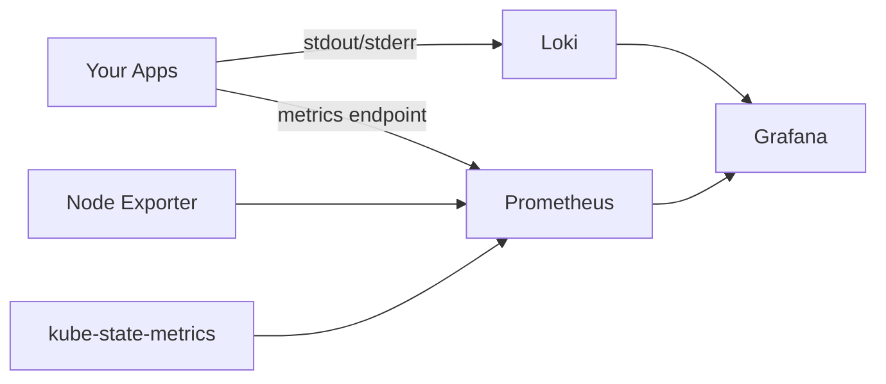

# Observability

Kipper includes a built-in observability stack for production monitoring: **Loki** for logs, **Prometheus** for metrics, and **Grafana** for dashboards.

All three are installed automatically during `kip install` on every profile except `nano`, which ships without monitoring to save memory. You can turn monitoring off (or back on) later per component, see [Disabling monitoring](#disabling-monitoring).

## Accessing Grafana

Grafana's data source spans every tenant's logs and metrics, so it is an admin-only tool with no public URL. Reach it over the Kubernetes API with a port-forward:

```
kubectl -n monitoring port-forward svc/kube-prometheus-stack-grafana 3000:80
```

Then open `http://localhost:3000`.

The admin password is generated randomly when Grafana is first installed (at `kip install`, or when you enable monitoring later) and stored in the `grafana-admin` Secret. Read it with:

```
kubectl -n monitoring get secret grafana-admin -o jsonpath='{.data.admin-password}' | base64 -d
```

Log in with username `admin` and that password.

## What's included

### Loki: Log aggregation

Loki collects logs from all pods across all namespaces. Unlike streaming logs from a single pod (`kip app logs`), Loki gives you:

- **Persistent logs:** survive pod restarts and crashes
- **Searchable:** filter by app, namespace, time range, or text content
- **Multi-pod:** see logs from all replicas of an app in one view

In Grafana, go to **Explore** → select **Loki** as the data source → query with LogQL:

```
{namespace="blog-test", app="domain-service"}
```

Filter for errors:

```
{namespace="blog-test", app="domain-service"} |= "ERROR"
```

### Prometheus: Metrics

Prometheus collects CPU, memory, network, and request metrics from all pods and nodes. Pre-configured with:

- **Node exporter:** CPU, memory, disk, network per node
- **kube-state-metrics:** pod status, deployment health, replica counts
- **Pod metrics:** CPU and memory usage per container
- **Traefik request metrics:** HTTP request counts, status codes, and latency per routed service

In Grafana, go to **Explore** → select **Prometheus** as the data source → query with PromQL:

```
container_memory_usage_bytes{namespace="blog-test"}
```

Traefik's request counters carry a `service` label that encodes the namespace and app, so per-app traffic is one query away:

```
rate(traefik_service_requests_total{service=~"blog-test-.*"}[5m])
```

### Grafana: Dashboards

Grafana comes with pre-built dashboards for cluster monitoring. Access them from the sidebar → **Dashboards**.

Useful built-in dashboards:
- **Kubernetes / Compute Resources / Namespace:** CPU and memory per namespace
- **Kubernetes / Compute Resources / Pod:** CPU and memory per pod
- **Node Exporter Full:** detailed node health

## API gateway health

If you gate apps behind [API keys](/en/api-keys), the gate (`kipper-authz`) and the console API write structured JSON logs that Loki collects like any other pod, so these queries work with no extra setup.

### Denials and the audit trail (Loki)

```
# Every denied request, with client IP, key prefix, and reason.
{namespace="kipper-system", app="kipper-authz"} | json | msg="authorize deny"
```

```
# Who created, changed, or revoked keys and plans, and when.
{namespace="kipper-system", app="console-api"} | json | msg="apikey audit"
```

Denials are always logged. Allowed requests are sampled, one in a hundred, so steady traffic leaves a heartbeat without flooding the logs. A burst of `deny_key` lines from one `client_ip` is someone spraying guessed keys. When the request carried an `X-Forwarded-For` header, the line also has `forwarded_for` with the whole chain (logged up to 256 bytes): `client_ip` is the leftmost hop for a quick read, and the chain lets you cross-check it when a load balancer you trust with `--trusted-proxy` appends to a client-supplied value.

### Metrics

The gate also exposes Prometheus metrics on its `/metrics` endpoint:

| Metric | Meaning |
|--------|---------|
| `authz_requests_total{decision}` | Decisions by outcome: `allow`, `deny_key`, `deny_rate`, `deny_quota`, `unavailable`, `preflight` |
| `authz_cache_fresh_seconds` | Seconds since the replica last proved its key and plan view is current; `-1` before the first success. This is how you tell "the gate is down" from "the gate's cache is stale" |
| `authz_rollup_flush_failures_total` | Usage-counter batches that failed to persist. A rising value means usage and quota data is being dropped |

The default install doesn't scrape these yet. Pointing Prometheus at the endpoint takes a ServiceMonitor, which lands with Kipper's general alerting story; the Loki queries above cover the same ground until then. Once scraped, two alerts are worth wiring:

```
# A replica's key view is going stale. At 90 seconds it fails closed and denies.
max(authz_cache_fresh_seconds) > 60
```

```
# Usage counters are failing to persist: quota and billing data being dropped.
increase(authz_rollup_flush_failures_total[15m]) > 0
```

### When the gate is unavailable

A gated route answers `503` with `gate_unavailable` when no replica can prove its view is fresh, and the app's Settings panel shows an amber notice while a gate is still being applied. `authz_cache_fresh_seconds`, or its absence, tells you whether the service is stale or down. Ungated apps keep serving throughout.

## Controller health

The console API runs the reconcilers that turn your Apps, Services, Functions and Jobs into running workloads. If one of them fails to start, the API itself keeps serving, so the console still loads while nothing new actually deploys. The `/health/controllers` endpoint makes that state visible instead of leaving it in the logs.

It's unauthenticated, like `/health`, and reports each controller's registration plus whether the manager is running and its caches have synced:

```bash
curl http://console-api.kipper-system:8080/health/controllers
```

```json
{
  "healthy": true,
  "managerStarted": true,
  "cacheSynced": true,
  "controllers": [
    { "name": "App", "registered": true },
    { "name": "Build", "registered": true },
    { "name": "Function", "registered": true },
    { "name": "Job", "registered": true },
    { "name": "PlatformConfig", "registered": true },
    { "name": "PodOOM", "registered": true },
    { "name": "Project", "registered": true },
    { "name": "Service", "registered": true },
    { "name": "Volume", "registered": true }
  ]
}
```

When everything is up the endpoint returns `200`. When the manager is still starting, its caches haven't synced, or any controller failed to register, it returns `503` and `healthy` is `false`. Point an uptime monitor at it and read a `503` as "controllers are degraded, deploys may be stuck", not as "the API is down". The console API answers requests either way.

This is a reporting endpoint, not the pod readiness probe. console-api usually runs a single replica, so gating readiness on a controller would pull the whole console out of rotation over one broken reconciler. Keeping it separate means a degraded controller shows up as a warning while the console stays reachable.

## AI log analysis

The log viewers in the web console (for apps, functions, and jobs) include an **Analyse** button. Click it to send the currently visible logs to the configured AI provider for analysis.

The AI scans the log output for errors, warnings, stack traces, and unusual patterns. It returns a summary of what happened, highlights the most likely root cause, and suggests next steps. This is especially useful when debugging unfamiliar stack traces or sifting through high-volume log output where the signal is buried in noise.

AI log analysis works with both live streaming logs and Loki history queries. The analysis uses whatever logs are currently displayed. Use the time range and search filters to narrow the context before clicking Analyse.

Requires an AI provider to be configured in the Settings page. See [Configuration: AI provider settings](/en/configuration.md#ai-provider-settings) for setup.

## Disabling monitoring

On smaller servers (8-12 GB RAM), the monitoring stack can be disabled to free approximately 1-2 GB of memory for your applications. Logs from the web console (live streaming via `kip app logs` and the Console log viewer) continue to work. Only persistent log storage and metrics collection are affected.

Monitoring lives in the platform layer. The same `kip platform` commands that manage Prometheus and Loki memory limits also toggle them on and off. See [Platform Resources](/en/platform-resources) for the full picture.

### Disable

```bash
kip platform disable prometheus
kip platform disable loki
```

The platform reconciler in console-api picks the change up and deletes the underlying HelmCharts; helm-controller then uninstalls the releases.

### Re-enable

```bash
kip platform enable prometheus
kip platform enable loki
```

The HelmCharts are re-created from the same templates the installer uses, with the active profile's memory values.

### Check status

```bash
kip platform status
```

```
  Platform profile: medium
  8-16 GB host. Real workloads, sensible defaults.

    prometheus   on        limit 1Gi
    loki         on        limit 512Mi
```

When a component is disabled, `kip status` shows it as "disabled" rather than unhealthy.

## Resource usage

Prometheus and Loki memory scale with the platform sizing profile that `kip install` picks based on node memory. The other observability components (Grafana, Promtail, kube-state-metrics, node-exporter) have small, near-flat footprints across all profiles.

Per-profile memory limits (request is typically half the limit):

| Profile  | Prometheus limit | Loki limit |
|----------|------------------|------------|
| `nano`   | disabled         | disabled   |
| `small`  | 512 Mi           | 384 Mi     |
| `medium` | 1 Gi             | 512 Mi     |
| `large`  | 1 Gi             | 512 Mi     |
| `xlarge` | 2 Gi             | 1 Gi       |

If Prometheus or Loki hits its limit and gets OOMKilled, the platform reconciler auto-bumps the limit (up to per-component ceilings of 4 Gi for Prometheus and 2 Gi for Loki) so a workload that outgrew the profile default doesn't fail silently. You can also override the limit manually via the console's Platform page or `kip platform resize`. See [Platform Resources](/en/platform-resources) for the full reference.

Grafana sits at 64 Mi request / 128 Mi limit across all profiles. Promtail is 32 Mi / 128 Mi. node-exporter is 32 Mi / 64 Mi.

kube-state-metrics requests 32 Mi and is allowed 192 Mi. The gap is deliberate: it keeps every object it watches in memory and re-lists all of them when the API server restarts, so it needs far more for a moment than it uses at rest. See [Platform Resources](/en/platform-resources) for what that means and how to change it.

## Data retention

- **Metrics (Prometheus):** 3 days
- **Logs (Loki):** 3 days

For longer retention, update the Helm values via the k3s HelmChart resource in `kube-system`.

## Architecture



All components run in the `monitoring` namespace and are managed by Helm charts via k3s.

### When a reconcile keeps failing

`/health/controllers` answers whether a controller started. It says nothing about whether its passes succeed, and a controller can be registered, running, and failing on the same workload every time.

Two things make that visible. The reconcilers write their errors to the same log stream as everything else, so Loki has them:

```bash
{namespace="kipper-system", app="console-api"} |= "Reconciler error"
```

And a workload whose pass stops on one of its own objects says so on the object itself:

```bash
kubectl describe app checkout-api -n shop-prod
```

```
Conditions:
  Type              Status  Reason                 Message
  ChildrenAdopted   False   ChildReconcileFailed   reconciling security middleware: Middleware "checkout-api-security" in shop-prod was not created by Kipper; rename the Middleware or remove that object
Events:
  Type     Reason           Age                  From            Message
  Warning  ReconcileFailed  2m (x18 over 41m)    app-controller  reconciling security middleware: Middleware "checkout-api-security" in shop-prod was not created by Kipper; rename the Middleware or remove that object
```

`ChildrenAdopted: False` means the pass stopped partway, so everything after the failing step was skipped. The workload keeps serving whatever it was already running, but route changes, autoscaling and status stop being applied until the named object is dealt with. Most often the object is one Kipper made and something restored without its labels, in which case putting `app.kubernetes.io/managed-by=kipper` back on it is the whole fix. If it genuinely belongs to something else, rename your app's route resources or delete the object.

Prometheus scrapes the reconcilers directly, and two alerts ship with the cluster:

- **KipperReconcileFailing** fires when a controller has recorded three or more errors within the last hour, and that has held for ten minutes. It counts errors in a rolling window rather than proving they were continuous, so a burst of three followed by quiet will still fire. The window is an hour rather than something tighter because a reconcile that keeps failing is retried on a backoff stretching to about seventeen minutes between attempts, and a five-minute view of that reads as quiet. The count covers every workload the controller manages, so three unrelated one-off errors in the same hour will fire it just as a single workload failing repeatedly will. That is a deliberate bias towards noticing: a workload stuck on every pass can sit there indefinitely, and a look at the logs costs less than missing one.
- **KipperReconcileWedged** fires when a single reconcile has been running for over five minutes. That is a different fault: a failing pass returns and retries, while a wedged one never comes back, and nothing else on that controller's queue moves behind it. Look for a call with no timeout.

Both name the controller, not the workload, because the metrics behind them are per-controller. Finding which workload is the next step rather than something the alert can tell you.

Both evaluate in Prometheus and appear in Grafana under Alerting. Note that the stack ships with Alertmanager disabled, so nothing routes them onwards: no email, no Slack, no page. Until you enable it these are alerts you find by looking, which is worth knowing before you rely on them.

To find which workloads are affected when one fires:

```bash
kubectl get apps -A -o json | jq -r '.items[] | select(.status.conditions[]? | select(.type=="ChildrenAdopted" and .status=="False")) | .metadata.namespace + "/" + .metadata.name'
```
