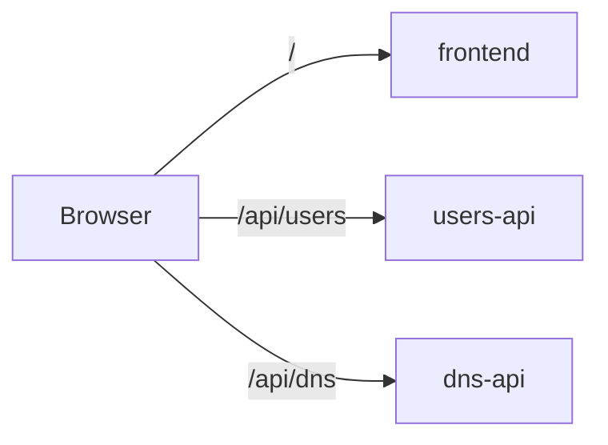

# Routing & App Links

Choose how clients reach your apps:

- **Public routes** expose an app on a hostname, optionally sharing it with other apps through path prefixes.
- **App links** supply another app’s address and configure permitted internal connections.
- **Internal path rules** limit which endpoints a public route exposes.

For DNS and certificates, see [Domains & SSL](/en/domains). For route authentication, see [API Keys](/en/api-keys) and [Basic authentication](/en/security#basic-authentication).

## Route groups {#route-groups-path-based-routing}

<span id="path-based-routing-microservices"></span>
<span id="cli-equivalent"></span>

Apps can share a hostname through a route group, with a different path prefix for each app. Traefik strips that prefix before forwarding the request. Use the `--route` flag:

```bash
kip app deploy --name frontend --image registry.git.example.com/frontend:latest --port 80 --route blog/
kip app deploy --name users-api --image registry.git.example.com/users-api:latest --port 3000 --route blog/api/users
kip app deploy --name dns-api --image registry.git.example.com/dns-api:latest --port 3001 --route blog/api/dns
```

All three share the same subdomain (`blog--<cluster>.kipper.run` on a free kipper.run cluster, `blog.<your-domain>` on a custom domain) but route by path:



Services in the same route group share a single Ingress and TLS certificate. Traefik handles the path-based routing, so no separate API gateway is needed.

Without `--route`, each app gets its own subdomain (the default behaviour).

### Creating a route group {#creating-a-route-group}

From the **Routes** page in the web console, click **+ Create route**:

1. Set the domain (or leave empty for auto-generated)
2. Add path mappings, where each path points to an app
3. Save

```
Domain: webapp-test--203-0-113-10.kipper.run

/              → webapp
/domains-api   → domain-service
/identity-api  → identity-service
/exchange-api  → exchange-service
```

All apps share one TLS certificate. Traefik routes by path prefix and strips it before forwarding, so `domain-service` receives `/api/v1/...` not `/domains-api/api/v1/...`.

### Editing and deleting {#editing-and-deleting}

Click the pencil icon on any route group to add, remove, or change path mappings. Click the trash icon to remove all routes in the group.

### Environment-aware domains {#environment-aware-domains}

Auto-generated domains include the environment name to prevent collisions:

| App | Environment | Domain |
|---|---|---|
| `webapp` | `test` | `webapp-test--203-0-113-10.kipper.run` |
| `webapp` | `acc` | `webapp-acc--203-0-113-10.kipper.run` |
| `webapp` | `prod` | `webapp-prod--203-0-113-10.kipper.run` |

## Linking apps {#linking-apps}

When one app needs to call another, link them to inject the target's URL as an environment variable.

### Internal linking (backend-to-backend) {#internal-linking-backend-to-backend}

By default, links use the Kubernetes internal DNS. Fast, secure, and no external networking required:

```bash
kip app link domain-service api-gateway
```

```
  ✔  Linked domain-service → api-gateway
     DOMAIN_SERVICE_URL=http://domain-service.blog-test.svc.cluster.local:8081
```

### Linking across projects {#linking-across-projects}

Cross-project links require consent from the target project's owner, followed by a link from the calling app. Internal links connect directly to the target, bypassing public-route authentication and rate limits. Grant consent only to projects that should have that access.

Whoever owns the target project allows the caller in:

```bash
kip project allow-links hrportal --project docuseal
```

```
  ✔  hrportal may link to docuseal
     Apps in docuseal can now be linked to, one at a time, with:
       kip app link docuseal/<app> <their-app> --project hrportal
```

Then the calling side names the app it needs:

```bash
kip app link docuseal/docuseal hrportal-backend --environment test
```

```
  ✔  Linked docuseal → hrportal-backend
     DOCUSEAL_URL=http://docuseal.docuseal-test.svc.cluster.local:3000
     Egress opened to docuseal in docuseal-test
```

`--environment` names the environment the target runs in. Without it the target resolves to the
project's default namespace, so `docuseal/docuseal` would be looked for in `docuseal` rather than
`docuseal-test`. The same flag picks the calling app's environment when `--project` is set, so a
caller and a target in differently named environments cannot both be addressed in one command yet.

Consent applies to a project pair. Each link opens access only to its named target app and follows that app's current port.

Kipper records the link and derives `DOCUSEAL_URL` during reconciliation. View the supplied address under **Linked apps**; the environment editor shows variables you set yourself. Target address changes are applied when the caller's configuration is reconciled.

You also need read access to the target's project. The CLI looks the target app up with your own
credentials, so a project you cannot see reports the app as not found even after its owner has
consented. Ask them for a role in it, or have someone who holds one create the link.

A link created before consent remains declared and is reported as blocked. Granting consent allows the controller to open it on reconciliation.

Check a link is doing what it says:

```bash
kip app links hrportal-backend --project hrportal --environment test
```

```
  Links for hrportal-backend in hrportal-test

  ✔  docuseal in docuseal-test
       DOCUSEAL_URL=http://docuseal.docuseal-test.svc.cluster.local:3000
       consent      docuseal allows hrportal
       target       serving on port 3000
       allowance    egress to docuseal on port 13000, which is where its Service sends 3000
       address      in the running pod
       connection   reachable — nc connected to docuseal.docuseal-test.svc.cluster.local:3000 from hrportal-backend-7999dfd5-29qhl
```

The report checks the link declaration, target, policy, and connectivity. The final check runs from the calling app's pod, where the link's network policy applies.

The two port numbers differing is correct. The address names the port the target's Service
publishes, which is what your app dials; the allowance names the port its pods listen on, which is
10000 higher whenever the target serves a public route and so runs the instance-id proxy.

The connectivity check requires suitable tools in the app image. If they are missing, the report marks the check as unavailable; use an application-level request to test the connection.

See who may link to a project:

```bash
kip project links --project docuseal
```

Withdraw it with `kip project allow-links hrportal --project docuseal --remove`. Each calling app is
reconciled as the consent changes and loses the egress it was granted. If one of those notifications
is dropped by a cache error at the wrong moment or a controller restart, the app is swept within thirty
minutes and loses it then, so the outside edge of a withdrawal is half an hour rather than instant.

Links between environments within the same project need no cross-project consent.

Internal links use cluster networking to reach the target service directly.

### Public linking (frontend-to-backend) {#public-linking-frontend-to-backend}

Frontend apps run in the browser and cannot reach internal cluster URLs. Use `--public` to inject the target's public HTTPS URL instead:

```bash
kip app link domain-service webapp --public
```

```
  ✔  Linked domain-service → webapp
     DOMAIN_SERVICE_URL=https://domain-service-test--203-0-113-10.kipper.run
```

The target app must have a public route configured. If it doesn't, the command will tell you to create one first.

### Env var naming {#env-var-naming}

The env var name is derived from the target app name, uppercased with hyphens converted to underscores and `_URL` appended:

| Target app | Env var |
|---|---|
| `domain-service` | `DOMAIN_SERVICE_URL` |
| `dns-service` | `DNS_SERVICE_URL` |
| `email-service` | `EMAIL_SERVICE_URL` |
| `payments` | `PAYMENTS_URL` |

### Managing links {#managing-links}

Link multiple apps:

```bash
kip app link domain-service webapp --public
kip app link identity-service webapp --public
kip app link exchange-service webapp --public
```

Remove a link:

```bash
kip app unlink domain-service webapp
```

For a cross-project link, unlinking also withdraws the egress:

```bash
kip app unlink docuseal/docuseal hrportal-backend
```

```
  ✔  Unlinked docuseal from hrportal-backend
     Removed DOCUSEAL_URL
     Egress to docuseal withdrawn
```

Deleting an app removes any egress its own links opened, and closes the paths other apps had to it: a
link whose target is gone opens nothing on the next reconcile, so its callers lose the address along
with the allowance. The link stays declared until someone runs `kip app unlink`, and the caller
reports it as a `LinksOpen` condition in the meantime, which is what tells you a dependency you still
declare is not there any more.

In the web console, links are managed from the app's Env tab. Select an app from the dropdown, check "public" if needed, and click Link. Existing links appear with an unlink button.

## Internal paths

### What a path prefix publishes {#what-a-path-prefix-publishes}

A route prefix exposes the paths your app serves beneath it. For example, `/domains-api` can expose both application endpoints and management endpoints on the same port.

Review what the application serves, including static files copied into its image and diagnostics enabled by its framework.

Kipper refuses a short list of well-known internal prefixes at the ingress:

| Prefix | Common content to keep internal |
|---|---|
| `/.git` | Repository metadata and history |
| `/.env` | Environment configuration, which may contain credentials |
| `/internal` | Application-internal endpoints |
| `/actuator` | Spring Boot management endpoints |
| `/debug/pprof` | Go profiling endpoints |

Add application-specific paths such as `/metrics` or `/debug/vars` through `internalPaths` when appropriate.

Blocked paths return 404. Matching respects segment boundaries: blocking `/actuator` leaves `/actuators` available.

### Scope of ingress protection {#what-the-refusal-reaches-and-what-it-does-not}

These rules reduce accidental exposure at the ingress. They are not an authorization boundary: a backend may interpret case, path parameters, or encoded separators differently from the ingress. Case variants, parameters in earlier path segments, and deeper encoded paths can therefore reach endpoints the rule was intended to block.

Keep sensitive management endpoints on a separate, unpublished port where the application supports it, and apply authentication in the application where required.

Whether the list is refused is a cluster setting:

```bash
kip platform internal-paths show
kip platform internal-paths on
```

A new cluster installs with it on. A cluster upgraded from an earlier release has it off, because turning it on changes what a running route serves and that is the operator's call to make. `show` lists the apps with a route, so you can see what turning it on would cover.

### Paths your own app keeps to itself {#paths-your-own-app-keeps-to-itself}

Add your app's own internal path prefixes:

```bash
kip app update domain-service --internal-path /admin,/ops
```

Or in `kipper.yaml`:

```yaml
apps:
  domain-service:
    image: registry.git.example.com/domain:latest
    port: 8080
    route:
      group: blog
      path: /domains-api
      internalPaths:
        - /admin
      publicPaths:
        - /actuator/prometheus
```

`internalPaths` applies to every route for the app, including routes added later, independently of the cluster default.

### Letting one path back through {#letting-one-path-back-through}

Use `publicPaths` to reopen a specific endpoint, such as `/actuator/prometheus`:

```bash
kip app update domain-service --public-path /actuator/prometheus
```

The exact path uses the route's normal strip-prefix, rate limit, and authentication middleware. Other paths under `/actuator` remain blocked.

Both lists are settable on the app's **Settings** tab in the console, and the **Routes** page prints the refused prefixes under each path mapping.

### Looking at a refused path yourself {#looking-at-a-refused-path-yourself}

The endpoint remains available inside the cluster. Use a tunnel to reach it directly for administration or debugging.

The quickest way to it is a tunnel, which port-forwards to the pod and so meets no ingress rule on the way:

```bash
kip tunnel domain-service --port 8080
# then browse http://localhost:8080/actuator, or curl it
```

Where the image has a shell, you can also ask the container directly:

```bash
kip exec domain-service -- curl -s localhost:8080/actuator/health
```

Both reach the endpoint whether or not the route refuses it, and neither publishes anything. The console's web terminal on the app's page is the same thing without the CLI.

If something outside the cluster has to reach one of these paths for good, that is what `publicPaths` is for, and it makes the path public. A reopened path is served through the route's own middleware chain, so where the route already has `basicAuth` or `requireApiKey` on it, the reopened path is behind that gate too. Reopening a path on an ungated route puts it on the public internet.

### Moving the endpoints instead {#moving-the-endpoints-instead}

A separate management listener keeps diagnostics off the port Kipper publishes. Configure it in your application and keep the app's public route pointed at its main port.

Spring Boot does it with one property:

```properties
management.server.port=8081
```

The same shape works elsewhere. A Go service can register `net/http/pprof` on its own `http.ServeMux` and serve that on a second listener rather than leaving it on `DefaultServeMux`; a Node app can mount its admin router on a separate `app.listen`. Kipper special-cases none of them.

Use ingress path rules for any remaining endpoints that share the public port.
