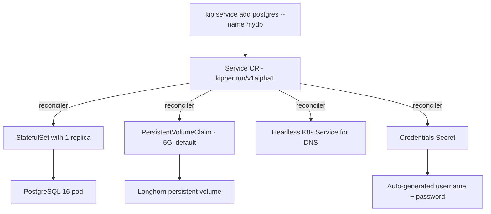

# Stateful Services

Kipper manages stateful services (databases, caches) separately from apps. Services use StatefulSets with persistent storage. They survive restarts and keep their data.

## Adding a service

```bash
kip service add postgres --name mydb
kip service add mysql --name mydb
kip service add mongodb --name mydb
kip service add redis --name cache
kip service add rabbitmq --name queue
kip service add opensearch --name search
kip service add minio --name storage
kip service add mailhog --name mailhog
```

Supported types: `postgres`, `mysql`, `mongodb`, `redis`, `rabbitmq`, `opensearch`, `minio`, `mailhog`

One name is refused: a service called `<app>-git`, where `<app>` is an app in the same project and environment that still keeps its git token under the older naming. Both would store their credentials in the same Secret, so Kipper asks you to pick another name for the service rather than let one read the other's.

### Per-environment services

Each environment can have its own database with separate credentials and storage:

```bash
kip service add postgres --name db --project blog --environment test --storage 1Gi
kip service add postgres --name db --project blog --environment acc --storage 2Gi
kip service add postgres --name db --project blog --environment prod --storage 10Gi
```

Each environment's database is fully isolated. Test data never touches production. Test and acc can use smaller storage allocations to save resources.

### What this creates



### Options

| Flag | Default | Description |
|---|---|---|
| `--name` | Required | Service name |
| `--project` | `default` | Project name |
| `--environment` | — | Target environment (e.g. test, acc, prod) |
| `--storage` | `5Gi` (postgres/mysql/mongodb/opensearch), `1Gi` (redis/rabbitmq), `10Gi` (minio) | Storage size |

## Connection details

After creating a service, the connection details are displayed:

```
  Host:     mydb.default.svc.cluster.local
  Port:     5432
  Username: kipper
  Password: a1b2c3d4e5f6...
  Database: app
```

Retrieve them later:

```bash
kip service info mydb
```

The hostname (`mydb.default.svc.cluster.local`) is a Kubernetes internal DNS name. Apps running on the same cluster can connect to it directly.

## MinIO (S3-compatible object storage)

MinIO provides S3-compatible object storage for file uploads, media, documents, and other binary data.

```bash
kip service add minio --name storage --project blog --environment test
```

```
  Connection details:
    Endpoint:   http://storage.blog-test.svc.cluster.local:9000
    Access Key: kipper
    Secret Key: a1b2c3d4e5f6...
```

Bind MinIO to your app to inject credentials automatically:

```bash
kip service bind storage api --project blog --environment test
```

This injects `S3_ENDPOINT`, `S3_ACCESS_KEY`, and `S3_SECRET_KEY` into the app. Use them with any S3-compatible SDK (AWS SDK, MinIO SDK, boto3). See the [Storage](/en/storage) page for mc CLI examples and SDK code samples.

### File explorer

MinIO services include a built-in file explorer in the web console. Navigate to **Storage** in the sidebar to browse buckets, upload and download files, delete objects, and generate share links (presigned URLs). See the [Storage](/en/storage) page for full details.

## Browser-based database console

Postgres and MySQL services have a built-in client in the web console: SQL editor with schema-aware autocomplete, table browser with inline row editing, visual table and index designer, AI assistant that knows your schema, and per-user query history. No desktop tool needed.

Click the code icon on a Postgres or MySQL service row in the Services list (or open the side panel and click the same icon next to AI Diagnose) to open it. See the [Database Console](/en/database-console) page for the full tour.

For other database types (MongoDB, Redis, OpenSearch, RabbitMQ), use a desktop client through `kip tunnel` as described below.

## Browseable service UIs

Some service types ship a web UI of their own. MailHog has an inbox viewer, RabbitMQ Management has a queue inspector, and so on. Kipper exposes these at `https://<service>-<namespace>.<cluster-domain>` once the service is running.

The hostname is gated by your console login. Open the URL and one of two things happens:

- If you're signed into the console, the console mints a one-time sign-in code for that host and the page loads with a session already in place. The Open UI button does this for you.
- If you're not signed in, the browser bounces to the console login. After you authenticate, it lands back on the service UI with a fresh session.

Each service UI gets its own session cookie, scoped to that one hostname (a `__Host-` cookie, so it never carries a domain and never travels to another host). No Dex token is ever placed in a cookie. Anonymous requests never reach the backend: the kipper user with their generated password sits on the inside of the auth gate, and a Kubernetes NetworkPolicy restricts the UI port to traffic from the cluster's ingress controller, so pods in the same cluster can't bypass the sign-in and read the UI directly.

The Open UI button on each service's detail page opens the right URL with a fresh sign-in code. From the CLI:

```bash
kip service info mailhog --project blog --environment test
# UI:  https://mailhog-blog-test.example.com
```

On a custom domain the console and every service UI are real subdomains of the cluster domain, so this sign-in works out of the box. On a free `*.kipper.run` cluster the hosts are flat sibling labels under the shared apex, so per-host service-UI sign-in is off there for now; use a share link (below) to hand out access.

Today's caveat: any user who can log into the console can open any service UI. There's no per-team RBAC yet; treat dev tools that have access to sensitive data accordingly (MailHog, for example, holds whatever mail your apps tried to send).

### How the session behaves

A service-UI session slides on a 30-minute idle window: every visit within that window keeps it alive, and the console re-mints the cookie in the background once less than 15 minutes remain. It caps out 12 hours after you first signed in, at which point you re-sign-in (silently, if your console session is still alive). Signing out of the console, or an admin removing your account, ends every service-UI session within about 30 seconds.

What a stolen session cookie grants, and nothing more: one service UI, as you, for up to the idle window (extendable by activity to the 12-hour cap), only while you still hold a role, and killed within about 30 seconds of a logout, an account removal, or a key reset. It opens no other UI (each cookie is pinned to a single host), and it fails the console API and the Kubernetes API outright.

Two behaviours worth knowing:

- If your browser is blocking cookies for a service-UI host, the sign-in can't complete and the console stops after a few attempts with a message naming the host to allow. Allow cookies for that host and reload.
- A UI that only talks to its backend through background requests (not full page loads) can freeze once its session lapses past the idle window. Reload the page and the sign-in re-runs.

### Revoking service-UI sessions

Three levers, in order of blast radius:

- **Sign out.** `kip auth logout` (or the console's sign-out) ends your own service-UI sessions along with the console session.
- **Remove the user.** Deleting a user from the console's Users screen ends their service-UI sessions within about 30 seconds, no other action needed.
- **Revoke everything.** After a suspected cookie or key compromise, rotate the signing key and drop every session at once:

  ```bash
  kip auth sessions revoke-all
  ```

  Every open service UI signs out within about 30 seconds and outstanding sign-in codes stop working. The console session is untouched; people just open their UIs again.

Break-glass, if the CLI is unavailable: delete the signing secret directly over the server-side admin kubeconfig.

```bash
kubectl delete secret kipper-ui-session-signing -n kipper-system
```

Every session dies within about 30 seconds and the next sign-in recreates the key automatically.

### Sharing a UI without a login

Sometimes you want to show a service UI to someone who should not have a Kipper account at all, like a client watching magic-link emails arrive during a demo. `kip service share` mints a signed link that opens one service UI for a set time, no login required:

```bash
kip service share mailhog --project blog --environment test --expires 72h --label "PO review"
```

```
  Share link for mailhog (valid until 18 Jul 2026 14:32):

  https://mailhog-blog-test.example.com/?kipper_share=eyJhbGci...

  Anyone with this link can open the UI until it expires.
  Revoke it:      kip service share mailhog --revoke 9f3c1a...
  Revoke all:     kip service share --revoke-all
```

The recipient clicks the link, their browser trades the token for a cookie scoped to that one hostname, and the UI opens. The link works only for that service's UI. It reaches nothing else: not the console, not the API, not any other service.

Treat the link like a password. It is a bearer capability, so anyone who gets hold of it can open the UI until it expires. Keep the expiry short, and remember that mail scanners and chat link previews may open a link the moment you send it. `--expires` accepts a Go duration (`24h`, `72h`); the maximum is `720h` (30 days). The optional `--label` is a note that shows up in the listing, so you can tell links apart later.

Each link is backed by a grant the cluster stores server-side, so you can list and revoke individual links:

```bash
kip service share mailhog --project blog --environment test --list
```

```
  Share links for mailhog:

  ID                                  EXPIRES               CREATED BY                LABEL
  9f3c1a2b4d5e6f7a8b9c0d1e2f3a4b5c    18 Jul 2026 14:32     alice@example.com         PO review
```

Revoke one link by its id. The recipient loses access immediately:

```bash
kip service share mailhog --project blog --environment test --revoke 9f3c1a2b4d5e6f7a8b9c0d1e2f3a4b5c
```

You can do all of this from the console too. Open a service with a browseable UI and pick the **Share** tab (admins only). It mints links, lists them with their labels and expiry, and revokes them, plus the emergency controls below.

Revocation takes effect within about 30 seconds (console-api caches the grant lookup that briefly). A freshly minted link can likewise take up to 30 seconds to start working right after the very first link on a cluster.

#### If a link leaks

A share link is a capability URL, so once it is out you can't un-send it. Two levers contain a leak:

```bash
# Pull every live share link in the cluster at once.
kip service share --revoke-all

# Retire the signing key so even links that dodged the sweep stop verifying.
# Run it twice — one rotation keeps old links alive until they expire, two
# rotations retire the key completely.
kip service share --rotate-key
kip service share --rotate-key
```

`--revoke-all` clears the grant store; `--rotate-key` is the guaranteed kill switch for a leaked or stolen signing key. For a full compromise, run both: revoke all, then rotate twice. The same two buttons live under **If a link leaked** in the console's Share tab.

### Ingress controller selector

The UI port is locked down with a NetworkPolicy that only lets the cluster's ingress controller talk to it. By default Kipper expects a stock Traefik install: pods labelled `app.kubernetes.io/name: traefik`, in any namespace. If your cluster ships Traefik under a non-standard label, or runs a different ingress controller (Nginx, HAProxy), create a ConfigMap to override:

```yaml
apiVersion: v1
kind: ConfigMap
metadata:
  name: ingress-controller
  namespace: kipper-system
data:
  # Pod label that identifies the ingress controller. Required.
  labelKey: app.kubernetes.io/name
  labelValue: traefik

  # Optional: restrict the policy to a specific namespace.
  # Leave unset to match the label in any namespace.
  namespace: traefik
```

Apply with `kubectl apply -f` and the next reconcile of any service-UI NetworkPolicy picks it up, with no console-api restart and no Kipper rebuild. If the ConfigMap is missing the defaults apply, so existing clusters keep working unchanged.

## Connecting from your machine

Services run inside the cluster and are not exposed to the internet. To connect with a desktop database client (DBeaver, TablePlus, pgAdmin, RedisInsight, or any other tool), use `kip tunnel` to open a secure connection from your machine to the service:

```bash
kip tunnel mydb
```

```
  ✔  Tunnel open: localhost:5432 → mydb (postgres)
  Press Ctrl+C to close
```

Open your database client and connect to `localhost:5432` with the credentials from `kip service info mydb`.

If the default port is already in use on your machine, pick a different one:

```bash
kip tunnel mydb --local-port 15432
```

For services in a specific environment:

```bash
kip tunnel db --project blog --environment staging
```

See [Team Access](/en/team-access) for the full tunnel documentation, including Redis examples and troubleshooting.

## Binding to apps and functions

Bind a service to inject its connection details as environment variables. Both apps and functions accept bindings; the same prefix scheme applies.

```bash
# To an app
kip service bind db domain-service --project blog --environment test

# To a function
kip function bind domain-sync db --project blog --environment test
```

### Per-app databases

For database services (PostgreSQL, MySQL, MongoDB), Kipper automatically creates a dedicated database for each app. The database name is derived from the app name and environment:

| App | Environment | Database name |
|---|---|---|
| `domain-service` | `test` | `domain_service_test` |
| `identity-service` | `prod` | `identity_service_prod` |
| `exchange-service` | `acc` | `exchange_service_acc` |
| `api` | *(none)* | `api` |

This means multiple microservices can share a single PostgreSQL instance while keeping their data completely isolated.

### Injected environment variables

The binding injects individual connection components with a type-based prefix. The prefix depends on the service type:

**Database services** (PostgreSQL, MySQL, MongoDB), prefix `DB_`:

| Variable | Example value |
|---|---|
| `DB_HOST` | `db.blog-test.svc.cluster.local` |
| `DB_PORT` | `5432` |
| `DB_USERNAME` | `kipper` |
| `DB_PASSWORD` | `a1b2c3d4e5f6...` |
| `DB_NAME` | `domain_service_test` |

**MinIO**, prefix `S3_`:

| Variable | Example value |
|---|---|
| `S3_ENDPOINT` | `http://storage.blog-test.svc.cluster.local:9000` |
| `S3_ACCESS_KEY` | `kipper` |
| `S3_SECRET_KEY` | `a1b2c3d4e5f6...` |

**Redis**, prefix `REDIS_`:

| Variable | Example value |
|---|---|
| `REDIS_HOST` | `cache.blog-test.svc.cluster.local` |
| `REDIS_PORT` | `6379` |

**OpenSearch**, prefix `OPENSEARCH_`:

| Variable | Example value |
|---|---|
| `OPENSEARCH_HOST` | `search.blog-test.svc.cluster.local` |
| `OPENSEARCH_PORT` | `9200` |

Redis and OpenSearch run without authentication, so their bindings carry an
address and nothing else. Redis starts with no `requirepass` and OpenSearch with
its security plugin off, which means a connection string holding a password
fails rather than being ignored: Redis answers `AUTH` with an error when no
password is set. Write `redis://${REDIS_HOST}:${REDIS_PORT}` and leave the
userinfo out.

Both are reachable by anything running in the same namespace. Treat them as
shared infrastructure for that project's environment rather than as a private
store, and keep anything sensitive in a database that does authenticate.

**RabbitMQ**, prefix `AMQP_`:

| Variable | Example value |
|---|---|
| `AMQP_HOST` | `rabbit.blog-test.svc.cluster.local` |
| `AMQP_PORT` | `5672` |
| `AMQP_USERNAME` | `kipper` |
| `AMQP_PASSWORD` | `a1b2c3d4e5f6...` |
| `AMQP_VHOST` | `orders` (the binding's vhost, or `/` if you took the default) |

Like databases for postgres/mysql, a RabbitMQ binding can either share the default vhost `/` with every other app or create its own. Pass `--database <name>` to `kip service bind` to provision a per-binding vhost. Kipper runs `rabbitmqctl add_vhost` on the running pod and grants the kipper user full access to it. Leave the flag off to share `/`.

In the console, the bind picker lists every existing vhost on the service (the default `/` is tagged) and also offers a Create new field. Picking an existing vhost reuses it; creating a new one is what most apps want.

### Where binding credentials come from

A binding that takes the service default draws on the service's own `<service>-credentials` Secret. A binding with its own database or vhost gets a Secret of its own, named for the service and the workload it belongs to: an app called `api` bound to `db` gets `db-app-api-credentials`, and a function called `api` in the same project gets `db-function-api-credentials`, so the two never read each other's database.

That Secret is derived, not a copy. The controller rebuilds it from the service's shared credentials on every reconcile, overriding only the database or vhost name, so rotating the service password reaches every binding without anyone re-binding. Anything you write into it by hand is overwritten on the next pass; change the service's credentials instead.

Neither Secret is read by your pods directly. The controller folds them into the workload's [published environment](/en/secrets#how-it-works-internally) along with everything else, which is what lets a connection string you composed from `${DB_PASSWORD}` stay in step with the password itself.

**Rotating a password restarts the workloads bound to it.** The new credentials are a new published environment, and a pod has to start to read one. Kipper rolls them for you, one pod at a time, so an app with more than one replica keeps serving throughout. This is the one environment change that does not wait for a restart you ask for, because the alternative is a workload still authenticating with a password the service has stopped accepting.

**MailHog** (test SMTP server), prefix `MAIL_`:

| Variable | Example value |
|---|---|
| `MAIL_HOST` | `mailhog.blog-test.svc.cluster.local` |
| `MAIL_PORT` | `1025` |

MailHog catches outgoing mail and serves a browseable inbox. The binding injects `MAIL_HOST` and `MAIL_PORT` and nothing else, since the image has no authentication and no TLS. Your app needs `spring.mail.smtp.auth=false` (or equivalent for your framework) and a plain SMTP transport to talk to it. Open the inbox at `https://mailhog-<namespace>--<cluster>.kipper.run` (or `mailhog-<namespace>.<your-domain>` on a custom domain) (the console's Open UI button on the service detail page links there), gated by your console sign-in.

Your app constructs a connection URL from these components in whatever format your framework needs:

- **Node.js / Python / Ruby / Go:** `postgres://${DB_USERNAME}:${DB_PASSWORD}@${DB_HOST}:${DB_PORT}/${DB_NAME}`
- **Java / Spring Boot (JDBC):** `jdbc:postgresql://${DB_HOST}:${DB_PORT}/${DB_NAME}`
- **S3 endpoint (MinIO):** `${S3_ENDPOINT}`

### Unbinding

Remove a binding from the console (env tab → click X on the service) or the CLI:

```bash
kip service unbind db domain-service --project blog --environment test
```

Deleting a service automatically unbinds it from all apps. The per-app databases are not dropped. They remain in the PostgreSQL instance for manual cleanup if needed.

The app restarts automatically when a binding is added or removed.

## Listing services

```bash
kip service list
```

```
  NAME       TYPE         STATUS     READY      STORAGE
  mydb       postgres     running    1/1        5Gi
  cache      redis        running    1/1        1Gi
```

Services also appear in the web console under the **Services** sidebar item, where you can view connection details with a masked URL and copy-to-clipboard.

## Checking that a service owns its credentials

Each service has a credentials Secret, and Kipper only injects those values into an app when the Secret belongs to that service. Ownership is the whole check, so a Secret that lost it leaves the service running normally while every app bound to it is refused the credentials it asked for.

That is rare, and worth checking in two situations: after restoring a backup, and before upgrading a cluster.

```bash
kip service credentials --project blog --environment test
```

```
  SERVICE                  SECRET                             STATE
  db                       db-credentials                     owned
  cache                    cache-credentials                  unowned
  -                        db-app-reports-credentials            unowned binding secret

  Run again with --repair to fix these.
```

`--repair` gives an unowned Secret back to its service and removes per-binding Secrets nothing owns, which the apps that need them render again for themselves:

```bash
kip service credentials --project blog --environment test --repair
```

```
  ✔  cache-credentials now belongs to service cache
  ✔  db-app-reports-credentials removed; nothing reads it and its workload renders a replacement it owns
```

A per-binding Secret that a running app still reads is left where it is and reported, because removing one an app points at would let its next restart come up with no credentials at all. Run the check again after the app has restarted and it will be cleared then.

Repair never touches the credentials themselves, so a database keeps the password it already has and the apps bound to it carry on with the values they are already using. A Secret that belongs to something else is reported rather than taken.

## Deleting a service

Deleting a service permanently destroys all data. Kipper requires an explicit flag to prevent accidents:

```bash
# This will be rejected
kip service delete mydb

# This works, data is permanently destroyed
kip service delete mydb --delete-data
```

::: danger
`--delete-data` is irreversible. The persistent volume and all data are permanently deleted. There is no undo.
:::

## Importing and exporting data

`kip service import` loads a database dump into a running service, and `kip service export` pulls one out. The dump streams through the Kubernetes API straight into the engine's own restore tool inside the service pod, so nothing is written to the server's disk and no extra port needs to be open. Supported engines: MongoDB, PostgreSQL, and MySQL.

```bash
kip service import mongodb --file backup.archive.gz --project supplemento --environment test
```

```
  Importing backup.archive.gz (48.2 MiB) into supplemento-test/mongodb...

  ... mongorestore progress ...

  ✔  Import complete
```

Accepted formats per engine:

| Engine | Import accepts | Export produces |
|---|---|---|
| mongodb | `mongodump --archive` (plain or gzipped) | gzipped archive (`.archive.gz`) |
| postgres | `pg_dump -F c` custom dumps or plain SQL (plain or gzipped) | custom-format dump (`.dump`) |
| mysql | SQL scripts (plain or gzipped) | gzipped SQL (`.sql.gz`) |

The format is detected from the file's content. Postgres and MySQL default to the service's own database; pass `--database` to target a different one. A MongoDB archive restores the databases it contains; add `--database` and `--source-database` together to rename on restore:

```bash
kip service import mongodb --file prod-backup.archive.gz --database supplemento --source-database prod
```

`--drop` replaces existing data instead of failing on it. For postgres it needs a custom-format dump (`pg_dump -F c`); a plain SQL script manages its own DROP statements.

Exports mirror the same shape:

```bash
kip service export mydb --file nightly.dump --database app
```

```
  Exporting blog-prod/mydb to nightly.dump...

  ✔  Exported nightly.dump (12.4 MiB)
  Restore with: kip service import mydb --file nightly.dump
```

While an import or export runs, the resource tuner is paused for that service. A saturation-triggered resource change would restart the database mid-restore. The pause is a short lease the CLI keeps renewing for as long as the transfer runs, so if the CLI dies the tuner resumes by itself within 15 minutes.

## Copying data between environments

When you copy an environment via the wizard, the new env's databases come up empty. To bring data over, open a service in the new env and switch to the **Migrate data** tab in the side panel. The tab lists every same-named, same-type service in other namespaces (e.g. the same `backend` postgres in your `test` env). Click **Copy data here** next to the source you want, type the service name to confirm, and the migration starts as a Kubernetes Job in the target namespace.

What it does, in postgres terms:

```
PGPASSWORD=$SOURCE pg_dump --clean --if-exists ... | PGPASSWORD=$TARGET psql --set ON_ERROR_STOP=1 ...
```

The `--clean --if-exists` makes re-runs safe. Every object is dropped before being recreated. The `ON_ERROR_STOP` setting fails the job loudly on any restore error rather than leaving you with a half-restored database.

A few things worth knowing:

- **The target database is wiped.** Tables, sequences, views, everything. The wizard's confirm modal asks you to type the service name on purpose.
- **Source credentials are mirrored, not exposed.** The job mounts a temporary copy of the source service's credentials secret in the target namespace. The mirror is owned by the job and gets garbage-collected when the job is cleaned up (one hour after completion).
- **No retries.** If the dump or restore fails, the job stops there. Re-run it after fixing the underlying issue. Re-runs overwrite cleanly.
- **Postgres only for now.** MySQL, MongoDB, Redis, MinIO, RabbitMQ and OpenSearch follow in upcoming releases.

The status panel polls every couple of seconds while a migration is running and tails the last 50 lines of pod logs so you can see `pg_dump` progress as it happens.

## Resource limits

Configure CPU and memory limits for your services from the **Resources** tab in the service detail panel. Click a service in the web console, switch to the **Resources** tab, and adjust the CPU and memory requests and limits.

Resource limits control how much CPU and memory the service pod is allowed to consume. Databases under heavy query load or caches handling high throughput may need higher limits than the defaults.

::: warning
Changing resource limits on a service triggers a pod restart. For databases (PostgreSQL, MySQL, MongoDB), this means a brief period of downtime while the pod restarts with the new limits. Plan resource changes during a maintenance window or low-traffic period.
:::

## How services differ from apps

| | Apps | Services |
|---|---|---|
| Kubernetes resource | Deployment | StatefulSet |
| Storage | None (stateless) | PersistentVolumeClaim |
| Restart | Rolling restart, safe | Warns, requires `--force` |
| Delete | Immediate | Requires `--delete-data` |
| Scaling | `kip app scale` | Single replica |
| External access | Via Ingress (public URL) | Internal only (cluster DNS) |
