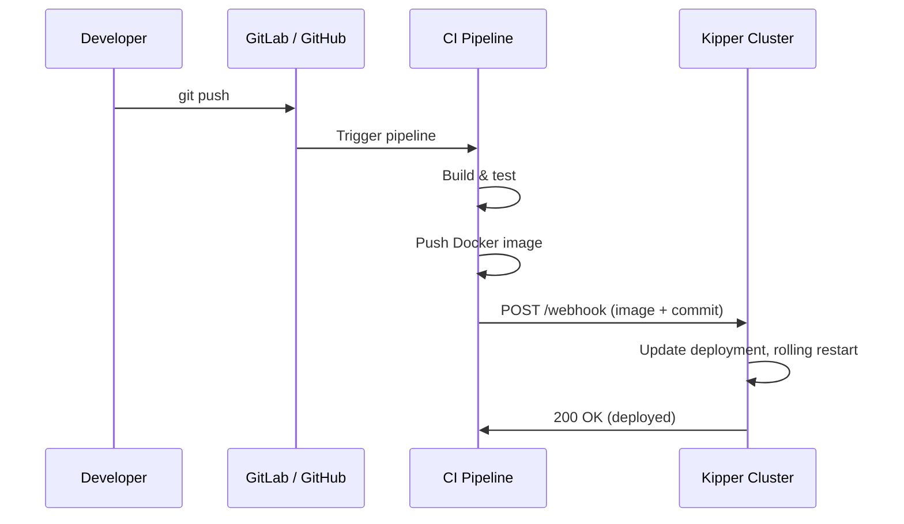

# Webhooks & CI/CD Integration

Kipper integrates with your existing CI/CD pipeline. Your CI system (GitLab CI, GitHub Actions) builds and tests your code. Kipper handles the deployment.

## How it works



## Setting up webhooks

### 1. Enable the webhook

```bash
kip app webhook enable api --project blog --environment test
```

```
  ✔  Webhook enabled for api

  Webhook URL:    https://console-api--203-0-113-12.kipper.run/api/v1/webhook/blog-test/api
  Secret token:   a3f8b2c4d5e6f7890123456789abcdef...

  GitLab CI snippet (.gitlab-ci.yml):

    deploy:
      stage: deploy
      script:
        - |
          curl -s -X POST https://console-api--<cluster>.kipper.run/api/v1/webhook/blog-test/api \
            -H "X-Kipper-Token: $KIPPER_WEBHOOK_TOKEN" \
            -H "Content-Type: application/json" \
            -d '{"image": "'$CI_REGISTRY_IMAGE:$CI_COMMIT_SHORT_SHA'", "commit": "'$CI_COMMIT_SHORT_SHA'"}'
```

### 2. Add the token to your CI settings

- **GitLab**: Settings → CI/CD → Variables → Add `KIPPER_WEBHOOK_TOKEN`
- **GitHub**: Settings → Secrets and variables → Actions → Add `KIPPER_WEBHOOK_TOKEN`

### 3. Add the deploy step to your pipeline

**GitLab CI (.gitlab-ci.yml):**

```yaml
deploy:
  stage: deploy
  script:
    - |
      curl -s -X POST $KIPPER_WEBHOOK_URL \
        -H "X-Kipper-Token: $KIPPER_WEBHOOK_TOKEN" \
        -H "Content-Type: application/json" \
        -d '{"image": "'$CI_REGISTRY_IMAGE:$CI_COMMIT_SHORT_SHA'", "commit": "'$CI_COMMIT_SHORT_SHA'"}'
  only:
    - main
```

**GitHub Actions:**

```yaml
- name: Deploy to Kipper
  run: |
    curl -s -X POST ${{ secrets.KIPPER_WEBHOOK_URL }} \
      -H "X-Kipper-Token: ${{ secrets.KIPPER_WEBHOOK_TOKEN }}" \
      -H "Content-Type: application/json" \
      -d '{"image": "ghcr.io/${{ github.repository }}:${{ github.sha }}", "commit": "${{ github.sha }}"}'
```

## Webhooks with `--git` apps

A Kipper webhook works alongside a git-source app, not as an alternative to it. With `--image` apps the webhook payload usually carries `"image": "..."` so Kipper just rolls out the new tag. With `--git` apps you can either let Kipper notice changes itself, or POST `"commit": "..."` from your CI to fire a rebuild from the configured git source.

One caveat: if you wire your git provider's own webhook (GitHub/GitLab pointing directly at Kipper) **and** point your CI at the Kipper webhook URL, the same `git push` fires twice, once via the provider, once via CI. Kipper serialises Build CRs per app so they don't race, but you'll see two builds in deploy history. Pick one trigger source.

## Webhook request format

```
POST /api/v1/webhook/{namespace}/{app}
Header: X-Kipper-Token: <token>
Content-Type: application/json

{
  "image": "registry.git.example.com/api:abc123f",
  "commit": "abc123f"
}
```

| Field | Required | Description |
|---|---|---|
| `image` | Yes | Full image reference including tag |
| `commit` | No | Git commit SHA (shown in deploy history) |

## Deploy history

Every deployment, whether triggered by webhook, manual update, promotion, or rollback, is recorded.

```bash
kip app history api --project blog --environment test
```

```
  #     IMAGE                                              COMMIT     TRIGGER      WHEN
  3     registry.git.example.com/api:abc123f                   abc123f    webhook      2 min ago (current)
  2     registry.git.example.com/api:def456a                   def456a    webhook      1 hour ago
  1     registry.git.example.com/api:ghi789b                   ghi789b    manual       3 hours ago
```

Deploy history is also visible in the web console under the **Deploys** tab in the app detail panel.

## Rollback

If a deployment breaks something, rollback to a previous version:

```bash
# Rollback to the previous version
kip app rollback api --project blog --environment test

# Rollback to a specific revision
kip app rollback api --revision 1 --project blog --environment test
```

```
  ✔  Rolled back api to revision #2 (registry.git.example.com/api:def456a)
```

Rollback is also available from the web console. Each entry in the deploy history has a **Rollback** button.

## Managing webhooks

```bash
# Check webhook status and token
kip app webhook status api --project blog --environment test

# Regenerate the token (invalidates the old one)
kip app webhook enable api --project blog --environment test

# Disable webhooks
kip app webhook disable api --project blog --environment test
```

## Security

- Each app has its own unique webhook token
- Tokens are stored as Kubernetes Secrets (encrypted at rest)
- The webhook endpoint verifies the token before making any changes
- GitHub HMAC signature verification (`X-Hub-Signature-256`) is also supported
- Webhook URLs are scoped to a specific namespace and app, so a token for one app cannot deploy another
